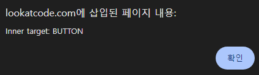
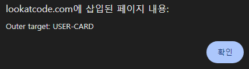
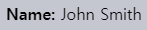

Shadow DOM 이벤트
================

#### 컴포넌트 내 발생 이벤트 <sub>(외부 핸들러 이벤트 처리)</sub>

##### 타겟 재조정 <sub>(브라우저 · 캡슐화 유지)</sub>
- 내부 이벤트 대상 요소 → 컴포넌트 자체
```html
<user-card></user-card>

<script>
customElements.define('user-card', class extends HTMLElement {
  connectedCallback() {
    this.attachShadow({mode: 'open'});
    this.shadowRoot.innerHTML = `
      <p>
        <button>Click me</button>
      </p>`
    ;

    this.shadowRoot.firstElementChild.onclick = function(e) {
      alert("Inner target: " + e.target.tagName);
    }
  }
});

document.onclick = function(e) {
  alert("Outer target: " + e.target.tagName);
}
</script>
```






##### 1. 내부 핸들러 <sub>(컴포넌트 · Shadow DOM)</sub>
- `Inner target: BUTTON`
- 이벤트 발생 요소 <sub>(타겟)</sub>

##### 2. 외부 핸들러 <sub>(문서 · Light DOM)</sub>
- `Outer target: USER-CARD`
- 컴포넌트 자체 <sub>(타겟 재조정)</sub>

##### 타겟 재조정 이점
- 컴포넌트 외부 <sub>(문서 · Light DOM)</sub>
  - 컴포넌트 내부 정보 처리 X

#### `slot` 내 렌더링 요소 <sub>(Light DOM)</sub>

##### 타겟 재조정 X
- 문서 <sub>(Light DOM)</sub> 내 위치

##### `<span slot="username">` 클릭 이벤트
- 문서 <sub>(Light DOM)</sub> 내 위치 <sub>(타겟 재조정 X)</sub>
  - 내 · 외부 핸들러 타겟 동일
```html
<user-card id="userCard">
  <span slot="username">John Smith</span>
</user-card>

<script>
customElements.define('user-card', class extends HTMLElement {
  connectedCallback() {
    this.attachShadow({mode: 'open'});
    this.shadowRoot.innerHTML = `
      <div>
        <b>Name:</b>
        <slot name="username"></slot>
      </div>`
    ;

    this.shadowRoot.firstElementChild.onclick = function(e) {
      alert("Inner target: " + e.target.tagName);
    }
  }
});

userCard.onclick = function(e) {
  alert(`Outer target: ${e.target.tagName}`);
}
</script>
```



### 버블링 · `event.composedPath()`

##### 평탄화 DOM
- 컴포넌트 내 발생 이벤트 처리 시 사용

##### `slot` 내 렌더링 요소 내 발생 이벤트 버블링 순서
- 타겟 → … → `<slot>` → … → 문서 최상위

##### `event.composedPath()` <sub>(메서드)</sub>
- 버블링 전체 경로 반환
- "합성" 작업 <sub>(평탄화 DOM)</sub> 후 경로
```html
<!-- 평탄화 DOM -->
<user-card id="userCard">
  #shadow-root
    <div>
      <b>Name:</b>
      <slot name="username">
        <span slot="username">John Smith</span>
      </slot>
    </div>
</user-card>
```
##### `<span slot="username">` 클릭 이벤트
- `event.composedPath()` <sub>(경로 배열 반환)</sub>
```javascript
[
  span,
  slot,
  div,
  shadow-root,
  user-card,
  body,
  html,
  document,
  window
]
```

<br />

 **`{ mode: … }` <sub>(옵션 · Shadow 트리 정보 접근 여부)</sub>**

##### `{ mode: 'closed' }` <sub>(옵션)</sub>
- Shadow 트리 정보 X
- `event.composedPath()` 경로
  - 컴포넌트 시작 <sub>(내부 요소 X)</sub>
    - ex\) `user-card` → …
- 기타 shadow DOM 관련 메서드
  - 유사 동작

<br />

### `event.composed` <sub>(프로퍼티)</sub>

##### 버블링 Shadow DOM 통과 여부
- `event.composed` <sub>(프로퍼티 · boolean)</sub> 결정
  - 대다수 이벤트 가능
  - 일부 이벤트 X

- `event.composed` <sub>(프로퍼티)</sub>
- 
This is governed by the `composed` event object property. If it's `true`, then the event does cross the boundary. Otherwise, it only can be caught from inside the shadow DOM.

If you take a look at [UI Events specification](https://www.w3.org/TR/uievents/), most events have `composed: true`:
- `blur`, `focus`, `focusin`, `focusout`,
- `click`, `dblclick`,
- `mousedown`, `mouseup` `mousemove`, `mouseout`, `mouseover`,
- `wheel`,
- `beforeinput`, `input`, `keydown`, `keyup`.

All touch events and pointer events also have `composed: true`.

There are some events that have `composed: false` though:
- `mouseenter`, `mouseleave` (they do not bubble at all),
- `load`, `unload`, `abort`, `error`,
- `select`,
- `slotchange`.

These events can be caught only on elements within the same DOM, where the event target resides.

### Custom events
When we dispatch custom events, we need to set both `bubbles` and `composed` properties to `true` for it to bubble up and out of the component.

For example, here we create `div#inner` in the shadow DOM of `div#outer` and trigger two events on it. Only the one with `composed: true` makes it outside to the document:
```html
<div id="outer"></div>

<script>
outer.attachShadow({mode: 'open'});

let inner = document.createElement('div');
outer.shadowRoot.append(inner);

/*
div(id=outer)
  #shadow-dom
    div(id=inner)
*/

document.addEventListener('test', event => alert(event.detail));

inner.dispatchEvent(new CustomEvent('test', {
  bubbles: true,
  composed: true,
  detail: "composed"
}));

inner.dispatchEvent(new CustomEvent('test', {
  bubbles: true,
  composed: false,
  detail: "not composed"
}));
</script>
```

<br />

## 요약
Events only cross shadow DOM boundaries if their `composed` flag is set to `true`.

Built-in events mostly have `composed: true`, as described in the relevant specifications:
- [UI Events](https://www.w3.org/TR/uievents)
- [Touch Events](https://w3c.github.io/touch-events)
- [Pointer Events](https://www.w3.org/TR/pointerevents)
- …And so on.

Some built-in events that have `composed: false`:
- `mouseenter`, `mouseleave` (also do not bubble),
- `load`, `unload`, `abort`, `error`,
- `select`,
- `slotchange`.

These events can be caught only on elements within the same DOM.

If we dispatch a `CustomEvent`, then we should explicitly set `composed: true`.

Please note that in case of nested components, one shadow DOM may be nested into another. In that case composed events bubble through all shadow DOM boundaries. So, if an event is intended only for the immediate enclosing component, we can also dispatch it on the shadow host and set `composed: false`. Then it's out of the component shadow DOM, but won't bubble up to higher-level DOM.
