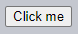
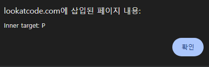
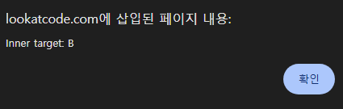
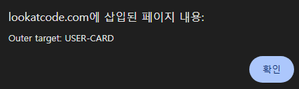
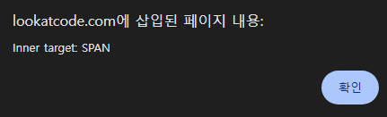
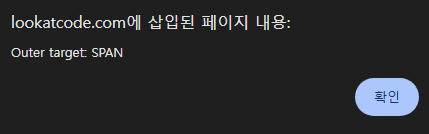

Shadow DOM 이벤트
====

#### 컴포넌트 내 발생 이벤트 <sub>(외부 핸들러 처리)</sub>

##### 타겟 재조정 <sub>(브라우저 · 캡슐화 유지)</sub>
- 내부 이벤트 발생 요소 → 컴포넌트 자체
```html
<user-card></user-card>

<script>
  customElements.define('user-card', class extends HTMLElement {
    connectedCallback() {
      this.attachShadow({ mode: 'open' });
      this.shadowRoot.innerHTML = `
        <p>
          <button>Click me</button>
        </p>
      `;

      // 내부 렌더링 요소 (이벤트 발생) 이름 출력
      this.shadowRoot.firstElementChild.onclick = function(e) {
        alert("Inner target: " + e.target.tagName);
      }
    }
  });

  // 컴포넌트명 출력
  document.onclick = function(e) {
    alert("Outer target: " + e.target.tagName);
  }
</script>
```







##### 1. 내부 핸들러 <sub>(컴포넌트 · Shadow DOM)</sub>
- 이벤트 발생 요소 <sub>(타겟)</sub>
- `Inner target: BUTTON`

##### 2. 외부 핸들러 <sub>(문서 · Light DOM)</sub>
- 컴포넌트 자체 <sub>(타겟 재조정)</sub>
- `Outer target: USER-CARD`

##### 타겟 재조정 이점
- 컴포넌트 외부 <sub>(문서 · Light DOM)</sub>
  - 컴포넌트 내부 정보 무관

#### `slot` 내부 렌더링 요소 <sub>(Light DOM)</sub>

##### 타겟 재조정 X
- 문서 <sub>(Light DOM)</sub> 내 위치
- 컴포넌트 <sub>(Shwdow DOM)</sub> 내 위치 X
  - 렌더링만 수행

##### `<span slot="username">` 클릭 이벤트
- 문서 <sub>(Light DOM)</sub> 내 위치 <sub>(타겟 재조정 X)</sub>
  - 내 · 외부 핸들러 타겟 동일
```html
<user-card id="userCard">
  <span slot="username">John Smith</span>
</user-card>

<script>
customElements.define('user-card', class extends HTMLElement {
  connectedCallback() {
    this.attachShadow({ mode: 'open' });
    this.shadowRoot.innerHTML = `
      <div>
        <b>Name:</b>
        <slot name="username"></slot>
      </div>
    `;

    this.shadowRoot.firstElementChild.onclick = function(e) {
      alert("Inner target: " + e.target.tagName);
    }
  }
});

userCard.onclick = function(e) {
  alert(`Outer target: ${e.target.tagName}`);
}
</script>
```


##### `<b>Name:</b>` 클릭




##### `<span slot="username">` 클릭




### 버블링 · `event.composedPath()`

##### 평탄화 DOM
- 컴포넌트 내 발생 이벤트 처리 시 사용

##### `slot` 내부 렌더링 요소 내 발생 이벤트 버블링 순서
- 타겟 → … → `<slot>` → … → 문서 최상위

##### `event.composedPath()` <sub>(메서드)</sub>
- 버블링 전체 경로 반환
- "합성" 작업 <sub>(평탄화 DOM)</sub> 후 경로
```html
<!-- 평탄화 DOM -->
<user-card id="userCard">
  #shadow-root
    <div>
      <b>Name:</b>
      <slot name="username">
        <span slot="username">John Smith</span>
      </slot>
    </div>
</user-card>
```
##### `<span slot="username">` 클릭 이벤트
- `event.composedPath()` <sub>(경로 배열 반환)</sub>
```javascript
[
  span,
  slot,
  div,
  shadow-root,
  user-card,
  body,
  html,
  document,
  window
]
```

<br />

 **`{ mode: … }` <sub>(옵션 · Shadow 트리 정보 접근 여부)</sub>**

##### `{ mode: 'closed' }` <sub>(옵션)</sub>
- Shadow 트리 정보 X
- `event.composedPath()` 경로
  - 컴포넌트 시작 <sub>(내부 요소 X)</sub>
    - ex\) `user-card` → …
- 기타 shadow DOM 관련 메서드
  - 유사 동작

<br />

### `event.composed` <sub>(프로퍼티)</sub>

##### 이벤트 버블링 Shadow DOM 통과 여부
- `event.composed` <sub>(프로퍼티 · boolean)</sub> 결정
  - 대다수 이벤트 가능
  - 일부 이벤트 X

##### `composed: false`
- Shadow DOM 내 발생 이벤트
  - Shadow DOM 내에서만 처리 가능

##### 대다수 [UI 이벤트](https://www.w3.org/TR/uievents/) <sub>(`composed: true`)</sub>
- `blur` · `focus[in·out]`
- `[dbl]click`
- `mouse[down·up·move·out·over]`
- `wheel`
- `[before]input` · `key[down·up]`
- 전체 터치 · 포인터 이벤트

##### 일부 UI 이벤트 <sub>(`composed: false`)</sub>
- `mouse[enter·leave]` <sub>(버블링 X)</sub>
- `[un]load` · `abort` · `error`
- `select`
- `slotchange`

### 커스텀 이벤트

##### 커스텀 이벤트 디스패치 옵션
- `bubbles: true`
  - 버블링 활성화
- `composed: true`
  - 버블링 Shadow DOM 통과

##### Shadow DOM 내 커스텀 이벤트 2개 발생
- `composed` <sub>(프로퍼티)</sub> 값
  - 각 `true` · `false`
```html
<div id="outer"></div>

<script>
outer.attachShadow({ mode: 'open' });

let inner = document.createElement('div');
outer.shadowRoot.append(inner);

/*
<div id="outer">
  #shadow-root
    <div id="inner">
 */

document.addEventListener('test', event => alert(event.detail));

inner.dispatchEvent(new CustomEvent('test', {
  bubbles: true,
  composed: true,
  detail: "composed"
}));

inner.dispatchEvent(new CustomEvent('test', {
  bubbles: true,
  composed: false,
  detail: "not composed"
}));
</script>
```

<br />

요약
====

##### 이벤트 버블링 Shadow DOM 통과 여부
- `composed` <sub>(프로퍼티 · boolean)</sub> 결정
  - `composed: true`
  - `composed: false`

##### 대다수 내장 이벤트 <sub>(`composed: true`)</sub>
- [UI 이벤트](https://www.w3.org/TR/uievents)
- [터치 이벤트](https://w3c.github.io/touch-events)
- [포인터 이벤트](https://www.w3.org/TR/pointerevents)
- 기타 등등

##### 일부 내장 이벤트 <sub>(`composed: false`)</sub>
- `mouse[enter·leave]` <sub>(버블링 X)</sub>
- `[un]load` · `abort` · `error`
- `select`
- `slotchange`

##### `composed: false`
- Shadow DOM 내 발생 이벤트
  - Shadow DOM 내에서만 처리 가능

##### 커스텀 이벤트 <sub>(`CustomEvent`)</sub> 디스패치
- `composed: true` <sub>(설정)</sub> 필요

##### 중첩 컴포넌트 <sub>(Shadow DOM)</sub>
- 내부 발생 이벤트 <sub>(`composed: true`)</sub>
  - 모든 중첩 Shadow DOM 통과
- 최근접 컴포넌트 대상 이벤트
  - `composed: false` 설정
