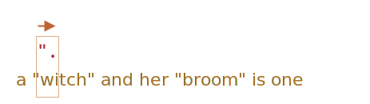

Greedy · lazy 수량자
===================

##### 수량자
- 생각보다 까다로움

#### `"…"` → `«…»`
- 주로 인쇄물 내 사용

|예시|언어|
|---|---|
|`«Hello, world»`|영어|
|`„Witam, świat!"`|폴란드어|
|`「你好，世界」`|중국어|
|…|…|

##### `/".+"/g`
- 부적절한 검색 결과
```javascript
let regexp = /".+"/g;
let str = 'a "witch" and her "broom" is one';

// "witch" and her "broom"
alert( str.match(regexp) );
```

##### _"greediness is the cause of all evil"_
- 목표 결과
  - `"witch"` · `"broom"`
- 실제 결과
  - `"witch" and her "broom"`

### Greedy 모드 <sub>(기본)</sub>

##### 정규 표현식 엔진 검색 기본 알고리즘
- 문자열 내 모든 각 위치
  - 해당 위치 패턴 일치 여부 검사
  - 실패 시 다음 위치 이동

#### 1. `"` <sub>(1번째 패턴 문자)</sub> 검색

##### 검색
- 1번째 위치
  - `a` <sub>(실패)</sub>
- 2번째 위치
  - ` ` <sub>(빈 문자열 · 실패)</sub>
- 3번째 위치
  - `"` <sub>(성공 · 검색 완료)</sub>


#### 2. `.` <sub>(2번째 패턴 문자)</sub> 검색

##### `.` <sub>(점 · 특수 문자)</sub>
- `\n` <sub>(줄 바꿈 문자)</sub> 외 모든 문자

##### 나머지 문자열 대상 검색 시작
- 4번째 위치 ~

##### 검색
- 4번째 위치
  - `w` <sub>(성공 · 검색 완료)</sub>



#### 3. `.+` <sub>(② 반복)</sub>

##### 검색 실패 조건
- `\n` <sub>(줄 바꿈 문자)</sub>
- 문자열 끝 도달

##### 검색
- 나머지 모든 위치
  - 성공 · 검색 완료 <sub>(문자열 끝 도달)</sub>


#### 4. `"` <sub>(3번째 패턴 문자)</sub> 검색

##### 나머지 문자열 대상 검색 시작
- 나머지 문자열 끝 도달
  - 검색 대상 문자열 無

##### 4.1 이전 패턴 <sub>(`.+`)</sub> 일치 결과 내 끝 문자 1개 되돌리기
- 문자열 끝 → 끝 문자 전
  - 나머지 패턴 <sub>(`"`)</sub> 검색 위치

##### 검색
- 끝 문자
  - `e` <sub>(실패)</sub>


##### 4.2 이전 패턴 <sub>(`.+`)</sub> 일치 결과 내 끝 문자 1개 되돌리기
- 끝 문자 전 → 끝 2번째 문자 전
  - 나머지 패턴 <sub>(`"`)</sub> 검색 위치

##### 검색
- 끝 2번째 문자
  - `n` <sub>(실패)</sub>


##### 4.3… 패턴 <sub>(`.+`)</sub> 일치 결과 내 끝 문자 1개 되돌리기
- 나머지 패턴 <sub>(`"`)</sub> 검색 성공 때까지 반복

##### 검색
- 끝 …8번째 문자
  - `"` <sub>(성공)</sub>


#### 5. 검색 종료

##### 첫 일치 결과
- `"witch" and her "broom"`

##### `g` <sub>(플래그)</sub> 有
- 나머지 문자열 <sub>(`is one`)</sub> 내 다음 검색 시작
  - 첫 일치 결과 다음 위치 <sub>(`i`)</sub>

##### 검색
- `i` ~ `e` <sub>(나머지 문자 위치)</sub>
  - `"` X <sub>(실패)</sub>
- 정규 표현식 검색 종료

#### greedy 모드

##### 기본 모드
- 수량자 가능한 많이 반복

##### ex\) `.+` 검색
1. 나머지 문자열 끝 도달
2. 다음 패턴 미일치 시
    - 결과 내 문자 1개씩 되돌리기

### Lazy 모드

##### greedy 모드 반대
- 수량자 가능한 적게 반복

##### 수량자 뒤 `?` <sub>(물음표)</sub> 추가
- `*?`
- `+?`
- `??`
- 기타 등등

##### `?` <sub>(물음표)</sub>
- 단일 사용
  - 수량자 <sub>(0 ~ 1개)</sub>
- 타 수량자 조합
  - 모드 변경 <sub>(greedy → lazy)</sub>

##### `/".+?"/g`
- 의도한 검색 결과 반환
  - `"witch"` · `"broom"`
```javascript
let regexp = /".+?"/g;
let str = 'a "witch" and her "broom" is one';

// witch, broom
alert( str.match(regexp) );
```

#### 1. `"` <sub>(1번째 패턴 문자)</sub> 검색

##### 검색
- 1번째 위치
  - `a` <sub>(실패)</sub>
- 2번째 위치
  - ` ` <sub>(빈 문자열 · 실패)</sub>
- 3번째 위치
  - `"` <sub>(성공 · 검색 완료)</sub>


#### 2. `.` <sub>(2번째 패턴 문자)</sub> 검색

##### `.` <sub>(점 · 특수 문자)</sub>
- `\n` <sub>(줄 바꿈 문자)</sub> 외 모든 문자

##### 나머지 문자열 대상 검색 시작
- 4번째 위치 ~


##### 검색
- 4번째 위치
  - `w` <sub>(성공 · 검색 완료)</sub>


#### 3. `"` <sub>(3번째 패턴 문자)</sub> 검색

##### 검색
- 5번째 위치
  - `i` <sub>(실패)</sub>


#### 4. `.+?` <sub>(② ~ ③ 반복)</sub>

##### 순서
1. 해당 위치
    - `.` 검색
2. 다음 위치
    - `"` 검색

##### 검색
- 5번째 위치 <sub>(`.`)</sub>
  - `i` <sub>(성공)</sub>
- 6번째 위치 <sub>(`"`)</sub>
  - `t` <sub>(실패)</sub>
- …


#### 5. 1번째 검색 완료

##### 검색
- 8번째 위치 <sub>(`.`)</sub>
  - `h` <sub>(성공)</sub>
- 9번째 위치 <sub>(`"`)</sub>
  - `"` <sub>(성공)</sub>

##### 다음 위치 새 검색 시작
- 10번째 위치 <sub>(`"`)</sub>
  - ` ` <sub>(빈 문자열 · 실패)</sub>
- …


#### 6. 2번째 검색 완료


##### 기타 lazy 수량자 <sub>(`*?` · `??` 등)</sub>
- 작동 방식 유사

##### lazy 모드 활성화
- 수량자 뒤 `?` 추가 필수
```javascript
// 123 4
alert( "123 456".match(/\d+ \d+?/) );
```

##### 1. `\d+` <sub>(greedy 모드)</sub>
- 가능한 많은 숫자 검색 반복
1. 1 ~ 3번째 위치
    - `123` <sub>(성공)</sub>
2. 4번째 위치
    - ` ` <sub>(빈 문자열 · 실패)</sub>

##### 2. ` ` <sub>(빈 문자열)</sub> 1개
1. 4번째 위치
    - ` ` <sub>(빈 문자열 · 성공)</sub>

##### 3. `\d+?` <sub>(lazy 모드)</sub>
- 숫자 검색 성공 시
  1. 다음 패턴 문자 검색
      - 다음 패턴 X
  3. 검색 종료
1. 5번째 위치
    - `4` <sub>(성공)</sub>
2. 6번째 위치
    - `5` <sub>(다음 패턴 X · 실패)</sub>
3. 검색 종료
    - `123 4` <sub>(결과)</sub>

<br />

 **최적화**

#### 현대 정규 표현식 엔진

##### 내부 알고리즘 최적화 <sub>(속도 ↑)</sub>
- 작동 방식 다소 상이 가능
  - 코딩 시 상이 여부 무관

##### 복잡한 정규 표현식
- 최적화 적용 다소 어려움
  - 보통 위 설명대로 동작

<br />

### Alternative approach
With regexps, there's often more than one way to do the same thing.

In our case we can find quoted strings without lazy mode using the regexp `"[^"]+"`:
```javascript
let regexp = /"[^"]+"/g;

let str = 'a "witch" and her "broom" is one';

alert( str.match(regexp) ); // witch, broom
```

The regexp `"[^"]+"` gives correct results, because it looks for a quote `'"'` followed by one or more non-quotes `[^"]`, and then the closing quote.

When the regexp engine looks for `[^"]+` it stops the repetitions when it meets the closing quote, and we're done.

Please note, that this logic does not replace lazy quantifiers!

It is just different. There are times when we need one or another.

**Let's see an example where lazy quantifiers fail and this variant works right.**

For instance, we want to find links of the form `<a href="..." class="doc">`, with any `href`.

Which regular expression to use?

The first idea might be: `/<a href=".*" class="doc">/g`.

Let's check it:
```javascript
let str = '...<a href="link" class="doc">...';
let regexp = /<a href=".*" class="doc">/g;

// Works!
alert( str.match(regexp) ); // <a href="link" class="doc">
```

It worked. But let's see what happens if there are many links in the text?
```javascript
let str = '...<a href="link1" class="doc">... <a href="link2" class="doc">...';
let regexp = /<a href=".*" class="doc">/g;

// Whoops! Two links in one match!
alert( str.match(regexp) ); // <a href="link1" class="doc">... <a href="link2" class="doc">
```

Now the result is wrong for the same reason as our "witches" example. The quantifier `.*` took too many characters.

The match looks like this:
```javascript
<a href="....................................." class="doc">
<a href="link1" class="doc">... <a href="link2" class="doc">
```

Let's modify the pattern by making the quantifier `.*?` lazy:
```javascript
let str = '...<a href="link1" class="doc">... <a href="link2" class="doc">...';
let regexp = /<a href=".*?" class="doc">/g;

// Works!
alert( str.match(regexp) ); // <a href="link1" class="doc">, <a href="link2" class="doc">
```

Now it seems to work, there are two matches:
```javascript
<a href="....." class="doc">    <a href="....." class="doc">
<a href="link1" class="doc">... <a href="link2" class="doc">
```

…But let's test it on one more text input:
```javascript
let str = '...<a href="link1" class="wrong">... <p style="" class="doc">...';
let regexp = /<a href=".*?" class="doc">/g;

// Wrong match!
alert( str.match(regexp) ); // <a href="link1" class="wrong">... <p style="" class="doc">
```

Now it fails. The match includes not just a link, but also a lot of text after it, including `<p...>`.

Why?

That's what's going on:
1. First the regexp finds a link start `<a href="`.
2. Then it looks for `.*?`: takes one character (lazily!), check if there's a match for `" class="doc">` (none).
3. Then takes another character into `.*?`, and so on… until it finally reaches `" class="doc">`.

But the problem is: that's already beyond the link `<a...>`, in another tag `<p>`. Not what we want.

Here's the picture of the match aligned with the text:
```javascript
<a href="..................................." class="doc">
<a href="link1" class="wrong">... <p style="" class="doc">
```

So, we need the pattern to look for `<a href="...something..." class="doc">`, but both greedy and lazy variants have problems.

The correct variant can be: `href="[^"]*"`. It will take all characters inside the `href` attribute till the nearest quote, just what we need.

A working example:
```javascript
let str1 = '...<a href="link1" class="wrong">... <p style="" class="doc">...';
let str2 = '...<a href="link1" class="doc">... <a href="link2" class="doc">...';
let regexp = /<a href="[^"]*" class="doc">/g;

// Works!
alert( str1.match(regexp) ); // null, no matches, that's correct
alert( str2.match(regexp) ); // <a href="link1" class="doc">, <a href="link2" class="doc">
```

<br />

## 요약
Quantifiers have two modes of work:

##### Greedy
By default the regular expression engine tries to repeat the quantifier as many times as possible. For instance, `\d+` consumes all possible digits. When it becomes impossible to consume more (no more digits or string end), then it continues to match the rest of the pattern. If there's no match then it decreases the number of repetitions (backtracks) and tries again.

##### Lazy
Enabled by the question mark `?` after the quantifier. The regexp engine tries to match the rest of the pattern before each repetition of the quantifier.

As we've seen, the lazy mode is not a "panacea" from the greedy search. An alternative is a "fine-tuned" greedy search, with exclusions, as in the pattern `"[^"]+"`.

<br />

##  과제

### A match for `/d+? d+?/`
What's the match here?
```javascript
"123 456".match(/\d+? \d+?/g); // ?
```

<br />


The result is: `123 4`.

First the lazy `\d+?` tries to take as little digits as it can, but it has to reach the space, so it takes `123`.

Then the second `\d+?` takes only one digit, because that's enough.

<hr />

### Find HTML comments
Find all HTML comments in the text:
```javascript
let regexp = /your regexp/g;

let str = `... <!-- My -- comment
 test --> ..  <!----> ..
`;

alert( str.match(regexp) ); // '<!-- My -- comment \n test -->', '<!---->'
```

<br />


We need to find the beginning of the comment `<!--`, then everything till the end of `-->`.

An acceptable variant is `<!--.*?-->` – the lazy quantifier makes the dot stop right before `-->`. We also need to add flag `s` for the dot to include newlines.

Otherwise multiline comments won't be found:
```javascript
let regexp = /<!--.*?-->/gs;

let str = `... <!-- My -- comment
 test --> ..  <!----> ..
`;

alert( str.match(regexp) ); // '<!-- My -- comment \n test -->', '<!---->'
```

<hr />

### Find HTML tags
Create a regular expression to find all (opening and closing) HTML tags with their attributes.

An example of use:
```javascript
let regexp = /your regexp/g;

let str = '<> <a href="/"> <input type="radio" checked> <b>';

alert( str.match(regexp) ); // '<a href="/">', '<input type="radio" checked>', '<b>'
```

Here we assume that tag attributes may not contain `<` and `>` (inside squotes too), that simplifies things a bit.

<br />


The solution is `<[^<>]+>`.
```javascript
let regexp = /<[^<>]+>/g;

let str = '<> <a href="/"> <input type="radio" checked> <b>';

alert( str.match(regexp) ); // '<a href="/">', '<input type="radio" checked>', '<b>'
```
