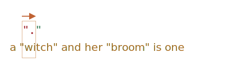

Greedy · Lazy 수량자
====

##### 수량자
- 생각보다 까다로운 동작 방식

#### `"…"` <sub>(따옴표)</sub> → `«…»` <sub>(guillemet)</sub> 치환
- 주로 인쇄물 내 사용

|예시|언어|
|---|---|
|`«Hello, world»`|영어|
|`„Witam, świat!"`|폴란드어|
|`「你好，世界」`|중국어|
|…|…|

##### `/".+"/g`
- 부적절한 검색 결과
```javascript
let str = 'a "witch" and her "broom" is one';
let regexp = /".+"/g;

str.match(regexp); // "witch" and her "broom"
```

##### _"Greediness is the cause of all evil"_
- 목표 결과
  - `"witch"` · `"broom"`
- 실제 결과
  - `"witch" and her "broom"`

### Greedy 모드

##### 기본 모드
- 수량자 가능한 많이 반복

#### 1. `"` <sub>(1번째 패턴 문자)</sub> 검색

##### 검색
- 1번째
  - `a` <sub>(실패)</sub>
- 2번째
  - ` ` <sub>(빈 문자열 · 실패)</sub>
- 3번째
  - `"` <sub>(성공 · 검색 완료)</sub>


#### 2. `.` <sub>(2번째 패턴 문자)</sub> 검색

##### `.` <sub>(점 · 특수문자)</sub>
- `\n` <sub>(줄 바꿈 문자)</sub> 외 아무 문자

##### 나머지 문자열 대상 검색 시작
- 4번째 ~

##### 검색
- 4번째
  - `w` <sub>(성공 · 검색 완료)</sub>


#### 3. `.+` <sub>(② 반복)</sub>

##### 검색 실패 조건
- `\n` <sub>(줄 바꿈 문자)</sub>
- 문자열 끝 도달

##### 검색
- 나머지 모든 위치
  - 성공 · 검색 완료 <sub>(문자열 끝 도달)</sub>


#### 4. `"` <sub>(3번째 패턴 문자)</sub> 검색

##### 나머지 문자열 대상 검색 시작
- 나머지 문자열 끝 도달
  - 검색 대상 문자열 無

##### 4.1 이전 패턴 <sub>(`.+`)</sub> 검색 결과 내 끝 문자 1개 되돌리기

##### 검색
- 문자열 끝
  - `e` <sub>(실패)</sub>


##### 4.2 이전 패턴 <sub>(`.+`)</sub> 검색 결과 내 끝 문자 1개 되돌리기

##### 검색
- 문자열 끝 2번째
  - `n` <sub>(실패)</sub>


##### 4.n 이전 패턴 <sub>(`.+`)</sub> 검색 결과 내 끝 문자 1개 되돌리기

##### 검색
- 문자열 끝 n번째
  - `…` <sub>(실패)</sub>
- …
- 문자열 끝 8번째
  - `"` <sub>(성공)</sub>


##### 1번째 검색 결과
- `"witch" and her "broom"`

##### `g` <sub>(플래그)</sub> 有
- 나머지 문자열 내 다음 검색 시작
  - ` is one`
- 1번째 검색 결과 다음 위치
  - 문자열 끝 7번째 <sub>(` ` 빈 문자열)</sub>

##### 새 검색 시작
- 나머지 문자열 <sub>(` is one`)</sub>
  - `"` 無 <sub>(실패)</sub>

#### 5. 검색 종료

### Lazy 모드

##### Greedy 모드 반대
- 수량자 가능한 적게 반복

##### 수량자 뒤 `?` <sub>(물음표)</sub> 추가
- `*?`
- `+?`
- `??`

##### `?` <sub>(물음표)</sub>
- 단일 사용
  - 수량자 <sub>(0 ~ 1개)</sub>
- 타 수량자 조합
  - 모드 변경 <sub>(greedy → lazy)</sub>

##### `/".+?"/g` <sub>(lazy 모드)</sub>
- 의도한 검색 결과 반환
  - `"witch"` · `"broom"`
```javascript
let str = 'a "witch" and her "broom" is one';
let regexp = /".+?"/g;

str.match(regexp); // witch, broom
```

#### 1. `"` <sub>(1번째 패턴 문자)</sub> 검색

##### 검색
- 1번째
  - `a` <sub>(실패)</sub>
- 2번째
  - ` ` <sub>(빈 문자열 · 실패)</sub>
- 3번째
  - `"` <sub>(성공 · 검색 완료)</sub>


#### 2. `.` <sub>(2번째 패턴 문자)</sub> 검색

##### `.` <sub>(점 · 특수문자)</sub>
- `\n` <sub>(줄 바꿈 문자)</sub> 외 아무 문자

##### 나머지 문자열 대상 검색 시작
- 4번째 ~

##### 검색
- 4번째
  - `w` <sub>(성공 · 검색 완료)</sub>


#### 3. `"` <sub>(3번째 패턴 문자)</sub> 검색

##### 검색
- 5번째
  - `i` <sub>(실패)</sub>



#### 4. `.+?\"` <sub>(② ~ ③ 반복)</sub>

##### 검색 순서
1. 해당 위치
   - `.` <sub>(`\n` 외 아무 문자)</sub> 검색
2. 다음 위치
   - `"` 검색

##### 검색
- 5번째
  - 5번째 <sub>(`.`)</sub>
    - `i` <sub>(성공)</sub>
  - 6번째 <sub>(`"`)</sub>
    - `t` <sub>(실패)</sub>
- …
- n번째
  - n번째 <sub>(`.`)</sub>
    - `…` <sub>(성공)</sub>
  - n + 1번째 <sub>(`"`)</sub>
    - `…` <sub>(실패)</sub>
- …


##### 4.1 1번째 검색 완료
- 8번째
  - 8번째 <sub>(`.`)</sub>
    - `h` <sub>(성공)</sub>
  - 9번째 <sub>(`"`)</sub>
    - `"` <sub>(성공)</sub>

##### 1번째 검색 결과
- `"witch"`


##### `g` <sub>(플래그)</sub> 有
- 나머지 문자열 내 다음 검색 시작
  - ` and her "broom" is one`
- 1번째 검색 결과 다음 위치
  - 10번째 <sub>(` ` 빈 문자열)</sub>

##### 새 검색 시작
- 10번째 <sub>(`"`)</sub>
  - ` ` <sub>(빈 문자열 · 실패)</sub>
- …

##### 4.2 2번째 검색 완료
- 8번째
  - 8번째 <sub>(`.`)</sub>
    - `m` <sub>(성공)</sub>
  - 9번째 <sub>(`"`)</sub>
    - `"` <sub>(성공)</sub>

##### 2번째 검색 결과
- `"broom"`


##### `g` <sub>(플래그)</sub> 有
- 나머지 문자열 내 다음 검색 시작
  - ` is one`
- 2번째 검색 결과 다음 위치
  - 문자열 끝 7번째 <sub>(` ` 빈 문자열)</sub>

##### 새 검색 시작
- 나머지 문자열 <sub>(` is one`)</sub>
  - `"` 無 <sub>(실패)</sub>

#### 5. 검색 종료

##### 기타 lazy 수량자 <sub>(`*?` · `??` 등)</sub>
- 작동 방식 유사

#### Lazy 모드 활성화

##### 수량자 뒤 `?` <sub>(물음표)</sub> 추가 필수
```javascript
"123 456".match(/\d+ \d+?/); // 123 4
```

##### 1. `\d+` <sub>(greedy 모드)</sub>
- 가능한 많은 숫자 검색 반복
1. 1 ~ 3번째
   - `123` <sub>(성공)</sub>
2. 4번째
   - ` ` <sub>(빈 문자열 · 실패 · 검색 완료)</sub>

##### 2. ` ` <sub>(빈 문자열)</sub> 1개
1. 4번째
   - ` ` <sub>(빈 문자열 · 성공 · 검색 완료)</sub>

##### 3. `\d+?` <sub>(lazy 모드)</sub>
- 가능한 적은 숫자 검색 반복
- 숫자 검색 성공 시
  1. 다음 패턴 검색
     - 다음 패턴 無
  2. 검색 종료
1. 5번째
   - `4` <sub>(성공)</sub>
2. 6번째
   - `5` <sub>(다음 패턴 無 · 실패 · 검색 완료)</sub>

##### 4. 검색 종료
- 검색 결과
  - `123 4`

<br />

 **최적화**

#### 현대 정규표현식 엔진

##### 내부 알고리즘 최적화 <sub>(속도 ↑)</sub>
- 작동 방식 다소 상이 가능
  - 코딩 시 상이 여부 무관

##### 복잡한 정규표현식
- 최적화 적용 다소 어려움
  - 보통 위 설명대로 동작

<br />

### 대안 접근법

##### 정규표현식
- 동일 동작
  - 다양한 접근법 有

##### `"[^"]+"` <sub>(greedy 모드)</sub>
- `"` + `"` 외 문자 1개 이상 + `"`
```javascript
let str = 'a "witch" and her "broom" is one';
let regexp = /"[^"]+"/g;

str.match(regexp); // witch, broom
```

### Lazy 모드 검색 실패 가능성

##### 링크 태그 검색
```html
<a href="…" class="doc">
```

#### 1. `/<a href=".*" class="doc">/g`
- Greedy 모드

##### 단일 `<a>` <sub>(태그)</sub>
- 검색 성공
```javascript
let str = '… <a href="link" class="doc"> …';
let regexp = /<a href=".*" class="doc">/g;

// <a href="link" class="doc">
str.match(regexp);
```

##### 다수 `<a>` <sub>(태그)</sub>
- 검색 실패
```javascript
let str = '… <a href="link1" class="doc"> … <a href="link2" class="doc"> …';
let regexp = /<a href=".*" class="doc">/g;

// <a href="link1" class="doc"> … <a href="link2" class="doc">
str.match(regexp);
```

##### `href=".*"` <sub>(greedy 모드)</sub>
- 가능한 많이 검색
```
<a href="...................................." class="doc">
<a href="link1" class="doc"> … <a href="link2" class="doc">
```

#### 2. `/<a href=".*?" class="doc">/g`
- Lazy 모드

##### 다수 `<a>` <sub>(태그)</sub>
- 검색 성공
```javascript
let str = '… <a href="link1" class="doc"> … <a href="link2" class="doc"> …';
let regexp = /<a href=".*?" class="doc">/g;

// <a href="link1" class="doc">, <a href="link2" class="doc">
str.match(regexp);
```

##### `href=".*?"` <sub>(lazy 모드)</sub>
- 가능한 적게 검색
```
<a href="....." class="doc">   <a href="....." class="doc">
<a href="link1" class="doc"> … <a href="link2" class="doc">
```

##### 동일 클래스 보유 `<p>` <sub>(태그)</sub>
- 검색 실패
```javascript
let str = '… <a href="link1" class="wrong"> … <p style="" class="doc"> …';
let regexp = /<a href=".*?" class="doc">/g;

// <a href="link1" class="wrong"> … <p style="" class="doc">
str.match(regexp);
```

##### 1. `<a href="` 검색
- 성공

##### 2. `.*?` 검색 <sub>(lazy 모드)</sub>
- 한 글자 검색당 매번 `" class="doc">` 검색
  - n - 1번째 <sub>(`.`)</sub>
  - n번째 <sub>(`" class="doc">`)</sub>

##### 3. `"class="doc">` 검색
- 성공 <sub>(`<p>` 태그)</sub>
```
<a href=".................................." class="doc">
<a href="link1" class="wrong"> … <p style="" class="doc">
```

##### `href="[^"]*"`
- `"` + `"` 외 문자 0개 이상 + `"`
```javascript
let str1 = '… <a href="link1" class="wrong"> … <p style="" class="doc"> …';
let str2 = '… <a href="link1" class="doc"> … <a href="link2" class="doc"> …';
let regexp = /<a href="[^"]*" class="doc">/g;

// null (불일치)
str1.match(regexp);

// <a href="link1" class="doc">, <a href="link2" class="doc">
str2.match(regexp);
```

<br />

요약
====

##### 수량자 모드 <sub>(2가지)</sub>
- Greedy
- Lazy

#### Greedy 모드 <sub>(기본)</sub>
- 가능한 많이 검색

##### ex\) `\d+`
1. 가능한 많은 숫자 검색
2. 더 이상 검색 불가능
   - 숫자 無
   - 문자열 끝 도달
3. 나머지 패턴 검색 시작
4. 나머지 패턴 검색 실패
   - 기존 검색 결과 문자 하나씩 되돌리기

#### Lazy 모드 <sub>(`…?`)</sub>
- 가능한 적게 검색

##### 모드 활성화
- 수량자 뒤 `?` <sub>(물음표)</sub> 추가

##### 검색 동작 방식
- 수량자 반복 시
  - 나머지 패턴 매번 검색

#### 대안 접근법

##### 정교한 greedy 모드 검색
- ex\) `"[^"]+"` 등

<br />

##  과제

### `/d+? d+?/`

##### 정규표현식 검색 결과 예측
```javascript
"123 456".match(/\d+? \d+?/g); // ?
```

<br />


##### `123 4`
1. `\d+?` <sub>(숫자 1개 이상 · lazy 모드)</sub>
    - `123`
2. ` ` <sub>(빈 문자열)</sub>
    - `123 `
3. `\d+?` <sub>(숫자 1개 이상 · lazy 모드)</sub>
    - `123 4` <sub>(다음 패턴 無)</sub>

<hr />

### HTML 주석 검색

##### 정규표현식 작성
- 텍스트 내 모든 HTML 주석 검색
```javascript
let str = `… <!-- My -- comment
 test --> … <!----> …
`;
let regexp = /…/g;

// '<!-- My -- comment \n test -->', '<!---->'
str.match(regexp);
```

<br />


##### `/<!--.*?-->/gs` <sub>(lazy 모드)</sub>
1. `<!--`
2. `.*?` <sub>(lazy 모드)</sub>
   - 나머지 패턴 <sub>(`-->`)</sub> 매번 검색
3. `-->`

##### `s` <sub>(플래그)</sub>
- `.` <sub>(`\n` 외 아무 문자)</sub> 내 `\n` <sub>(줄 바꿈 문자)</sub> 포함
```javascript
let str = `… <!-- My -- comment
 test --> … <!----> …
`;
let regexp = /<!--.*?-->/gs;

// '<!-- My -- comment \n test -->', '<!---->'
str.match(regexp);
```

<hr />

### HTML 태그 검색

##### 정규표현식 작성
- 모든 HTML 태그 검색
  - 열린 · 닫힌 태그
  - 속성 <sub>(`<` · `>` 無)</sub>
```javascript
let str = '<> <a href="/"> <input type="radio" checked> <b>';
let regexp = /…/g;

// '<a href="/">', '<input type="radio" checked>', '<b>'
str.match(regexp);
```

<br />


##### `/<[^<>]+>/g`
```javascript
let str = '<> <a href="/"> <input type="radio" checked> <b>';
let regexp = /<[^<>]+>/g;

// '<a href="/">', '<input type="radio" checked>', '<b>'
str.match(regexp);
```
