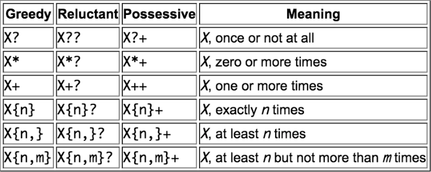

재앙적인 일치 문자 되돌리기
====

##### 일부 정규표현식
- 초장시간 실행
  - JS 엔진 멈춤 현상 발생

##### 전형적인 증상
- 특정 문자열 대상 정상 · 비정상 동작 혼재
  - CPU 자원 100% 소모 등

### 예제

#### `^(\w+\s?)*$`

##### 정상 동작
```javascript
let str1 = "A good string";
let str2 = "Bad characters: $@#";
let regexp = /^(\w+\s?)*$/;

regexp.test(str1); // true
regexp.test(str2); // false
```

##### 비정상 동작
- CPU 자원 100% 소모
- JS · 브라우저 멈춤 현상 발생
- 일정 시간 후 페이지 다시 로드 제안 표시
- 대다수 정규표현식 엔진 처리 불가능
```javascript
let str = "An input string that takes a long time or even makes this regexp to hang!";
let regexp = /^(\w+\s?)*$/;

regexp.test(str); // 장시간 검색 수행
```

### 예제 단순화

#### `^(\d+)*$`
```javascript
let str = "012345678901234567890123456789!";
let regexp = /^(\d+)*$/;

regexp.test(str); // 장시간 검색 수행
```

##### `(\d+)*`
- 다소 이상한 형태
  - `*` <sub>(0개 이상)</sub> 불필요

### 검색 과정

#### 1.

##### 1.1 `\d+` <sub>(greedy 모드)</sub>
- 모든 숫자 검색 성공
```
\d+........
(123456789)!
```

##### 1.2 `(\d+)*` <sub>(0개 이상)</sub>
- 잔여 숫자 無
  - 0개 검색 성공

##### 1.3 `$` <sub>(문자열 끝)</sub>
- `!` <sub>(느낌표 · 잔여 문자)</sub>
  - 문자열 끝 검색 실패
```
           X
\d+........$
(123456789)!
```

#### 2.

##### 2.1 `\d+` <sub>(greedy 모드)</sub>
- 검색 결과 내 문자 1개 되돌리기

##### 2.2 `\d+` 검색 일치 결과 상태
- 마지막 숫자 <sub>(`9`)</sub> 외 모든 숫자 검색 성공
```
\d+.......
(12345678)9!
```

#### 3.

##### 3.1 `(\d+)*`
- 새 위치 <sub>(`9`)</sub> 검색 이어 시작
  - `*` <sub>(0개 이상)</sub>
    - `9`
```
\d+.......\d+
(12345678)(9)!
```

##### 3.2 `$` <sub>(문자열 끝)</sub>
- `!` <sub>(느낌표 · 잔여 문자)</sub>
  - 문자열 끝 검색 실패
```
             X
\d+.......\d+$
(12345678)(9)!
```

#### 4. 검색 결과 내 문자 1개 되돌리기 계속 진행

##### 문자 되돌리기 진행 방식
1. 마지막 greedy 모드 수량자
   - 가능할 때까지 되돌리기 진행
2. 마지막 2번째 greedy 모드 수량자
   - 가능할 때까지 되돌리기 진행
3. 마지막 3번째 …
4. …
5. 마지막 n번째 …

##### 가능한 모든 되돌리기 조합 진행
```
             X
\d+......\d+ $
(1234567)(89)!
```
```
               X
\d+......\d+\d+$
(1234567)(8)(9)!
```
```
             X
\d+..... \d+ $
(123456)(789)!
```
```
               X
\d+.....\d+ \d+$
(123456)(78)(9)!
```
```
…
…
…
```

##### `123456789` <sub>(문자열)</sub> 조합 가능 경우의 수
- 2<sup>n</sup> - 1
  - n <sub>(숫자 길이)</sub>

##### lazy 모드
- greedy 모드 조합 순서만 변경
- 조합 가능 경우의 수 동일

##### 일부 정규표현식 엔진
- 일부 특정 상황 해결 방법 구비
  - 모든 상황 해결 불가능
  - 대다수 엔진 불가능

### `^(\w+\s?)*$`

##### 단어 1개
- 수많은 `\w+` <sub>(단어 구성 문자)</sub> 조합 발생
```
(input)
(inpu)(t)
(inp)(u)(t)
(in)(p)(ut)
…
```

##### 정규표현식 엔진
- 모든 가능한 조합 검색
  - 장시간 검색 수행

##### 해결 <sub>(2가지)</sub>
1. 가능 조합 수 ↓
2. 수량자 일치 문자 되돌리기 방지

### 1. 가능 조합 수 ↓

##### `^(\w+\s)*\w*`
1. `(\w+\s)*`
   - ( 단어 <sub>(1개)</sub> + 공백 <sub>(1개)</sub> ) 0개 이상
2. `\w*`
   - 단어 <sub>(0 ~ 1개)</sub>
- 동일 검색 결과 <sub>(정상 동작)</sub>
```javascript
let str = "An input string that takes a long time or even makes this regex to hang!";
let regexp = /^(\w+\s)*\w*$/;

regexp.test(str); // false
```

##### `(\w+\s?)*` → `(\w+\s)*` <sub>(`\s?` → `\s`)</sub>
- 단어 1개당 다수 `\w+` 조합 방지
  - `\w+`
  - `\w+\s`
  - `\w+\w+`
  - `\w+\w+\s`
  - 기타 등등
```
\w+\w+
string
```
- 단어 1개당 `\w+\s` <sub>(가능 조합 수 ↓)</sub>
  - `\w+\s`
  - `\w+\s\w+\s`
  - 기타 등등

### 2. 수량자 일치 문자 되돌리기 방지

#### 2.1 Possessive 모드 <sub>(JS 미지원)</sub>
- greedy 모드 유사
- 검색 결과 내 문자 되돌리기 X
- 수량자 뒤 `+` 추가
  - `(\d+)*$` → `(\d++)*$`
  - `^(\w+\s?)*$` → `^(\w++\s?)*$`

#### 2.2 원자성 <sub>(atomic)</sub> 그룹 <sub>(JS 미지원)</sub>
- `(…)` <sub>(괄호 내용)</sub> 일치 문자 되돌리기 방지

#### 2.3 전방 탐색

##### `(\w+\s?)*` → `(?=(\w+))\1`
1. `(?=…)` <sub>(전방 탐색)</sub>
   - 현재 위치 단어 유무 여부 검사
2. `(?=(…))` <sub>(전방 탐색 내용 그룹화)</sub>
   - 전방 탐색 내용 캡처
3. `\1`
   - 검색 패턴 내 전방 탐색 내용 참조
- `++` <sub>(`+` 수량자 · possessive 모드)</sub> 기능 동일
  - 단어 1개 전체 캡처 <sub>(가능 조합 검색 X)</sub>

#### `JavaScript` <sub>(문자열)</sub>
```javascript
let str = "JavaScript";
let regexp1 = /\w+Script/;
let regexp2 = /(?=(\w+))\1Script/;

str.match(regexp1); // JavaScript
str.match(regexp2); // null (불일치)
```

##### `\w+Script` <sub>(greedy 모드)</sub>
1. `\w+`
   - `JavaScript` <sub>(검색 성공)</sub>
2. `\w+` 검색 결과 내 일치 문자 1개씩 되돌리기
   - 잔여 패턴 <sub>(`Script`)</sub> 검색
     - `JavaScript`
     - `JavaScrip`
     - `JavaScri`
     - `JavaScr`
     - `JavaSc`
     - `JavaS`
     - `Java`
3. `Java` 도달
    - 잔여 패턴 <sub>(`Script`)</sub> 검색 성공

##### `(?=(\w+))1Script` <sub>(전방 탐색)</sub>
1. 앞쪽 `\w+` <sub>(단어 구성 문자 · 1개 이상)</sub> 검사
   - `JavaScript`
2. `\1` <sub>(`(?=(…))` 전방 탐색 내 `(…)` 캡처링 그룹)</sub>
   - `JavaScript`
3. `\1Script`
   - `JavaScriptScript` <sub>(검색 실패)</sub>

<br />

 **주의**

##### Possessive · 전방 탐색 <sub>(관계)</sub>
- [Regex: Emulate Atomic Grouping (and Possessive Quantifiers) with LookAhead](https://instanceof.me/post/52245507631/regex-emulate-atomic-grouping-with-lookahead)
- [Mimicking Atomic Groups](https://blog.stevenlevithan.com/archives/mimic-atomic-groups)

<br />

#### `^(\w+\s?)*1` <sub>(첫 예제)</sub> 개선

##### 전방 탐색 사용
- 일치 문자 되돌리기 방지

##### `^((?=(\w+))\2\s?)*$`
- 캡처링 그룹
  - `\1` <sub>(외부 전체 `(…)` 괄호 내용)</sub>
  - `\2` <sub>(내부 전방 탐색 내용)</sub>
```javascript
let str1 = "A good string";
let str2 = "An input string that takes a long time or even makes this regex to hang!";
let regexp = /^((?=(\w+))\2\s?)*$/;

regexp.test(str1); // true

// 정상 동작 (장시간 검색 X)
regexp.test(str2); // false
```

##### `^((?=(?<word>\w+))\k<word>\s?)*$`
- `(?<word>\w+)` <sub>(기명 캡처링 그룹)</sub>
  - 내부 전방 탐색 내용
- `k<word>`
  - 기명 캡처링 그룹 패턴 내 참조
```javascript
let str1 = "A good string";
let str2 = "An input string that takes a long time or even makes this regex to hang!";

// ?<word> (기명 캡처링 그룹)
// - \k<word> (패턴 내 참조)
let regexp = /^((?=(?<word>\w+))\k<word>\s?)*$/;

regexp.test(str1); // true

// 정상 동작 (장시간 검색 X)
regexp.test(str2); // false
```

요약
====

##### 재앙적인 일치 문자 되돌리기
- 모든 가능 조합 검색 수행

##### 해결
1. 가능 조합 수 ↓
2. 일치 문자 되돌리기 방지
   1. Possessive 모드 <sub>(JS 미지원)</sub>
   2. 원자성 <sub>(atomic)</sub> 그룹 <sub>(JS 미지원)</sub>
   3. 전방 탐색


