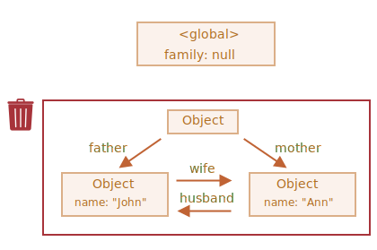

객체
====

자료형
- 원시형
- 객체형
  - 프로퍼티 보유
    - 키 : 문자형 · 심볼형
    - 값 : 모든 자료형
- 빈 객체 생성 방법
```javascript
let user = new Object(); // 객체 생성자
let user = {};           // 객체 리터럴, 주로 사용
```

### 리터럴과 프로퍼티
- `{ … }` <sub>(중괄호)</sub> 안 선언
  - '키 : 값' 쌍 프로퍼티
```javascript
let user = {    // 객체
  name: "John", // 키: "name", 값: "John"
  age: 30       // 키: "age" , 값: 30
};
```
- 프로퍼티 키
  - 프로퍼티 이름
  - 식별자
- `.` <sub>(점)</sub> 표기법
  - 프로퍼티 값 읽음
```javascript
alert( user.name ); // John
alert( user.age );  // 30
```
- 프로퍼티 추가
  - 프로퍼티 값 모든 자료형 가능
```javascript
user.isAdmin = true;
```
- 프로퍼티 삭제
  - `delete` 연산자
```javascript
delete user.age;
```
- 복수 단어 조합 프로퍼티 이름
  - 따옴표로 묶기
```javascript
let user = {
  name: "John",
  age: 30,
  "likes birds": true // 복수 단어 따옴표
};
```
- 마지막 프로퍼티 끝
  - 쉼표 사용 가능
    - trailing <sub>(길게 늘어지는)</sub> 쉼표
    - hanging <sub>(매달리는)</sub> 쉼표
    - 모든 프로퍼티 유사 형태
      - 프로퍼티 추가 · 삭제 · 이동 용이
```javascript
let user = {
  name: "John",
  age: 30,
}
```

 **상수 객체 수정될 수 있음**

- `const` 선언 객체 수정 가능
  - 할당된 객체 고정
  - 할당된 객체 내용 고정 X

```javascript
const user = {
  name: "John"
};
user.name = "Pete";
alert(user.name); // Pete
```

### `{ … }` <sub>(대괄호)</sub> 표기법
- 복수 단어 조합 프로퍼티 키
  - `.` <sub>(점)</sub> 표기법 불가능
- `.` <sub>(점)</sub> 표기법 규칙
  - '유효한 변수 식별자'
    - 공백 X
    - 숫자 시작 X
    - 특수 문자 X <sub>(`$` · `_` 제외)</sub>
  ```javascript
  // 문법 에러 발생
  user.likes birds = true; // 공백
  user.likes.1irds = true; // 숫자 시작
  user.likes.bi#ds = true; // 특수 문자 ('$' · '_' 제외)
  ```
- `{ … }` <sub>(대괄호)</sub> 표기법
  - 키에 어떤 문자열 존재 상관없이 동작
  - 따옴표 묶기 <sub>(`"` · `'`)</sub>
```javascript
let user = {};
user["likes birds"] = true; // set
alert(user["likes birds"]); // get
delete user["likes birds"]; // delete
```
- 모든 표현식 평가 결과 키로 사용 가능
```javascript
let key = "likes birds";

// user["likes birds"] = true;
user[key] = true;
```
- 프로퍼티 키 변수 런타임 평가
  - 사용자 입력값 변경 등에 따라 값 변경
  - 평가 종료 이후의 결과
  - 응용하여 코드 유연하게 작성
```javascript
let user = {
  name: "John",
  age: 30
};
let key = prompt("사용자의 어떤 정보를 얻고 싶으신가요?", "name");

// 변수로 접근
alert( user[key] ); // John, 프롬프트 창 "name" 입력한 경우
```
- `.` <sub>(점)</sub> 표기법은 불가능
```javascript
let user = {
  name: "John",
  age: 30
};
let key = "name";
alert( user.key ) // undefined
```

#### 계산된 프로퍼티
- 객체 생성 시 객체 리터럴 안 `{ … }` <sub>(대괄호)</sub>
  -  계산된 프로퍼티
```javascript
let fruit = prompt("어떤 과일을 구매하시겠습니까?", "apple");
let bag = {
  [fruit]: 5,       // 변수 fruit 에서 프로퍼티 이름 동적으로 받아옴
// apple : 5,       // fruit == 'apple'
};
alert( bag.apple ); //  5, fruit 변수에 'apple' 문자열 할당

// 동일

let fruit = prompt("어떤 과일을 구매하시겠습니까?", "apple");
let bag = {};
bag[fruit] = 5;     // 변수 fruit 사용해 프로퍼티 이름 생성
/*
bag.fruit  = 5;
*/
```
- `{ … }` <sub>(대괄호)</sub> 안 복잡한 표현식 가능
```javascript
let fruit = 'apple';
let bag = {
  [fruit + 'Computers']: 5 // bag.appleComputers = 5
};
```
- 프로퍼티 이름 · 값 제약 제거
  - `.` <sub>(점)</sub> 표기법 보다 강력
  - 작성 번거로움

<br />

- `.` <sub>(점)</sub> 표기법
  - 이름 확정
  - 단순한 이름
- `{ … }` <sub>(대괄호)</sub> 표기법
  - 복잡한 상황

### 단축 프로퍼티
- 프로퍼티 · 변수 이름 동일 시
  - 프로퍼티 값 단축 구문 사용
```javascript
function makeUser(name, age) {
  return {
    name: name,
    age: age,
  };
}

↓↓↓

function makeUser(name, age) {
  return {
    name, // name: name
    age,  // age : age
  };
}
```
- 일반 · 단축 프로퍼티 함께 사용
```javascript
let user = {
  name,  // name: name
  age: 30
};
```

### 프로퍼티 이름 제약사항
- 특별한 제약 X
  - 문자형
  - 심볼형
  - 예약어
  - 기타 등등
```javascript
// 예약어 키
let obj = {
  for: 1,
  let: 2,
  return: 3
};
alert( obj.for + obj.let + obj.return );  // 6
```
- 문자형 · 심볼형 외 자료형
  - 문자열 자동 형 변환
```javascript
let obj = {
  0: "test"        // "0": "test"
};
alert( obj["0"] ); // test
alert( obj[0] );   // test, 0 → "0" 자동 형 변환
```
- 특별 대우 프로퍼티 이름 <sub>(역사적인 이유)</sub>
  - `__proto__`
```javascript
let obj = {};
obj.__proto__ = 5;    // 숫자 할당
alert(obj.__proto__); // [object Object], 할당 무시
```

### `in` 연산자 : 프로퍼티 존재 여부 확인
- 미존재 프로퍼티 접근 시
  - 에러 X
  - `undefined` 반환
```javascript
let user = {};
alert( user.noSuchProperty === undefined );
```
- `in` 왼쪽 반드시 프로퍼티 이름
  - 보통 따옴표 감싼 문자열
```javascript
"key" in object
```
```javascript
let user = {
  name: "John",
  age: 30
};
alert( "age" in user );    // true
alert( "blabla" in user ); // false
```
- 따옴표 생략 시 엉뚱한 변수 조사 위험
```javascript
let user = { age: 30 };
let key = "age";
alert( key in user ); // true
                      // 변수 key 값 "age" 사용해 프로퍼티 존재 여부 확인
```
- `in` 연산자 존재 이유
  - 가끔 `=== undefined` 실패
```javascript
let obj = {
  test: undefined
};

// 프로퍼티 'test' 존재
// - 값 : `undefined`
alert( obj.test );      // undefined

// `in`
// - 프로퍼티 유무 제대로 확인
alert( "test" in obj ); // true
```

### `for…in` <sub>(반복문)</sub>
- 객체 모든 키 순회
```javascript
for (key in object) {
  // 각 프로퍼티 키 이용하여 본문 실행
}
```
```javascript
let user = {
  name: "John",
  age: 30,
  isAdmin: true
};

// 객체 user 의 모든 프로퍼티 출력
// 반복 변수 선언 (let key)
// 반복 변수명 자유롭게 지정
for (let key in user) {
  alert( key );       // name, age, isAdmin
  alert( user[key] ); // John, 30 , true
}
```

### 객체 정렬 방식
- 특별한 정렬 방식
- 정수 프로퍼티
  - 자동 정렬
```javascript
let codes = {
  "49": "독일",
  "41": "스위스",
  "44": "영국",
  "1": "미국"
};

for (let code in codes) {
  alert(code); // 1, 41, 44, 49, 정수 프로퍼티 자동 정렬
}
```

 **정수 프로퍼티**

- 변형 없이 정수 형 변환 가능 문자열

|문자열|정수|변형|정수<br />프로퍼티|
|---|:---:|:---:|:---:|
|`"49"`|49|X|O|
|`+49`|49|O|X|
|`1.2`|1|O|X|

```javascript
// 함수 Math.trunc
// - 소수점 아래 버리고 숫자 정수부만 반환
alert( String(Math.trunc(Number("49"))) );  // '49' ==  49 → 정수 프로퍼티
alert( String(Math.trunc(Number("+49"))) ); // '49' != +49 → 정수 프로퍼티 X
alert( String(Math.trunc(Number("1.2"))) ); // '1'  != 1.2 → 정수 프로퍼티 X
```

<br />

- 그 외 프로퍼티
  - 객체 추가 순서 그대로 정렬
```javascript
let user = {
  name: "John",
  surname: "Smith"
};
user.age = 25;   // 프로퍼티 1개 추가

// 추가 순서대로 나열
for (let prop in user) {
  alert( prop ); // name, surname, age
}
```
- 정수 프로퍼티 자동 정렬 방지 트릭
  - 프로퍼티 앞 `+`
```javascript
let codes = {
  "+49": "독일",
  "+41": "스위스",
  "+44": "영국",
  "+1": "미국"
};

for (let code in codes) {
  alert( +code ); // 49, 41, 44, 1
}
```

<br />

참조에 의한 객체 복사
===================

- 원시값
  - '값 그대로' 저장 · 할당 · 복사
```javascript
// 두 개 독립된 변수 각각 문자열 "Hello!" 저장
let message = "Hello!";
let phrase = message;
```
- 객체
  - '참조에 의해' 저장 · 복사
  - 변수에 '객체에 대한 참조 값' <sub>(객체 저장 메모리 주소)</sub> 저장
```javascript
/*
 객체
 - 메모리 내 어딘가 저장
 변수 user
 - 객체 '참조'할 수 있는 값 저장
 */
let user = {
  name: "John"
};
```
- 객체 할당된 변수 복사 시
  - 객체 참조 값 복사
  - 객체 복사 X
```javascript
// 변수 2개
// - 각 변수 동일 '객체에 대한 참조 값' 저장
let user = { name: "John" };
let admin = user; // 참조값 복사
```
- 객체 접근 · 조작 시 여러 변수 사용 가능
```javascript
let user = { name: 'John' }; // 객체
let admin = user;            // 객체 참조 값 복사
admin.name = 'Pete';         // 'admin' 참조 값에 의해 변경
alert(user.name);            // 'Pete'
```

#### 참조에 의한 비교
- 객체 비교 시
  - `==` · `===` <sub>(동등 · 일치 연산자)</sub> 동일 동작
  - 두 변수 동일 객체 참조 값
    - 참
  - 두 변수 다른 객체 참조 값
    - 거짓
```javascript
let a = {};
let b = a;        // 참조에 의한 복사
alert( a == b );  // true, 두 변수 동일 객체 참조
alert( a === b ); // true
```
```javascript
// 두 객체 모두 비어있음
// 독립된 두 객체
let a = {};
let b = {};      // 두 변수 참조 값 상이
alert( a == b ); // false
```

### 객체 복사 · 병합과 `Object.assign`

- JS 객체 복제 내장 메서드 지원 X
- 객체 복제 할 일 거의 없음
- 객체 생성 후 프로퍼티 순회해 원시 수준까지 프로퍼티 복사
```javascript
let user = {
  name: "John",
  age: 30
};
let clone = {}; // 새 빈 객체

// 빈 객체에 user 프로퍼티 전부 복사
for (let key in user) {
  clone[key] = user[key];
}

// 완전히 독립적인 복제본
clone.name = "Pete"; // clone 데이터 변경
alert( user.name );  // "John" (기존 객체)
```
- `Object.assign`
```javascript
Object.assign(dest, [src1, src2, src3...]);
```
  - `dest`
    - 목표 객체
  - `src1, src2, src3...`
    - 복사 대상 객체
  1. 객체 `src1, src2, src3...`
      - `dest` <sub>(프로퍼티)</sub> 에 복사
  2. `dest` 반환
```javascript
let user = { name: "John" };
let permissions1 = { canView: true };
let permissions2 = { canEdit: true };

// permissions1 · permissions2 프로퍼티 user 로 복사
Object.assign(user, permissions1, permissions2);
// user == { name: "John", canView: true, canEdit: true };
```
- 동일 이름 프로퍼티
  - 기존 값 덮어씌워짐
```javascript
let user = { name: "John" };
Object.assign(user, { name: "Pete" });
alert(user.name); // user == { name: "Pete" }
```
- 간단 객체 복사 <sub>(반복문 X)</sub>
```javascript
let user = {
  name: "John",
  age: 30
};

let clone = Object.assign({}, user);
```

### 중첩 객체 복사
- 객체 복제 시
  - 객체 프로퍼티 복제 X · 공유
```javascript
let user = {
  name: "John",
  sizes: {
    height: 182,
    width: 50
  }
};
let clone = Object.assign({}, user);
alert( user.sizes === clone.sizes ); // true, 같은 객체

// user · clone
// - sizes 프로퍼티 공유
user.sizes.width++;
alert(clone.sizes.width); // 51
```
- 깊은 복사
  - 프로퍼티 객체 경우 객체 구조 복사 반복문 사용
- 깊은 복사 표준 알고리즘
  - Structured cloning algorithm
- JS 라이브러리 lodash
  - `_.cloneDeep(obj)`

<br />

가비지 컬렉션
============
- JS 보이지 않는 곳에서 메모리 관리 수행

### 가비지 컬렉션 기준
- JS '도달 가능성' 개념 사용해 메모리 관리 수행
- '도달 가능한' 값
  - 어떻게든 접근 · 사용 가능 값
  - 도달 가능한 값 메모리에서 삭제 X
  1. 루트
      - 현재 함수의 지역 변수 · 매개변수
      - 중첩 함수 체인에 있는 함수에서 사용되는 변수 · 매개변수
      - 전역 변수
      - 기타 등등
  2. 루트가 참조하는 값 · 체이닝으로 루트에서 참조할 수 있는 값
      -  ex&#41; 전역 변수 객체 프로퍼티 또 다른 객체 참조<br /><sub>(이 객체가 참조하는 다른 모든 것들 : 도달 가능 간주)</sub>
- JS 엔진 내 '가비지 컬렉터' 끊임없이 동작
- 모든 객체 모니터
- 도달할 수 없는 객체 삭제
```javascript
// user 에 객체 참조 값 저장
let user = {
  name: "John"
};

// user 값 다른 값으로 덮어씀
// - 참조 사라짐
user = null;
/*
 { name: "John" }
 - 도달할 수 없는 상태
 접근 방법 · 참조 모두 없어짐
 가비지 컬렉터
  - { name: "John" } 저장 데이터 삭제 후 메모리에서 삭제
 */
```

### 참조 2개
```javascript
// user 에 객체 참조 값 저장
let user = {
  name: "John"
};

let admin = user;

// user 값 다른 값으로 덮어씀
// - 'admin' 아직 참조
user = null;

/*
 admin 통해 여전히 객체 접근 가능
 { name: "John" } 메모리에서 삭제 X
 admin 다른 값(null 등)으로 덮어쓰면 { name: "John" } 메모리에서 삭제
 */
```

### 연결된 객체
```javascript
function marry(man, woman) {
  // 두 객체 서로 참조
  woman.husband = man;
  man.wife = woman;

  return {
    father: man,
    mother: woman
  }
}

let family = marry({
  name: "John"
}, {
  name: "Ann"
});
```


- 참조 2개 삭제
```javascript
delete family.father;
delete family.mother.husband;
```


- "John"
  - 도달 가능한 상태 X
    - 메모리에서 제거
    - "John" 저장 데이터 <sub>(프로퍼티)</sub> 메모리에서 제거
- 외부로 나가는 참조
  - 도달 가능한 상태 영향 X
- 외부에서 들어오는 참조
  - 도달 가능한 상태 영향


- 가비지 컬렉션 후


### 도달할 수 없는 섬
- 도달할 방법 없는 경우
  - 섬 구성 객체 전부 메모리에서 삭제
- 근원 객체 family 참조 제거
```javascript
family = null;
```


### 내부 알고리즘
- 'mark-and-sweep'
  - 가비지 컬렉션 기본 알고리즘
- 진행 단계
  1. 루트 <sub>(root)</sub> 정보 수집 후 mark <sub>(기억)</sub>


  2. 루트가 참조하고 있는 모든 객체 방문 후 mark


  3. mark 된 모든 객체 방문 후 그 객체들이 참조하는 객체 mark
      - 한번 방문한 객체 전부 mark
      - 같은 객체 재방문 X


  4. 루트에서 도달 가능한 모든 객체 방문할 때까지 위 과정 반복


  5. mark 되지 않은 모든 객체 메모리에서 삭제


#### 최적화 기법
- JS 엔진 실행 영향 미치지 않으면서 가비지 컬렉션 더 빠르게 하는 다양한 최적화 기법 적용

##### generational collection <sub>(세대별 수집)</sub>
1. 객체 분리
    - '새로운 객체'
    - '오래된 객체'
2. 객체 상당수 생성 이후 제 역할 빠르게 수행 후 금방 쓸모 없어짐
    - '새로운 객체' 분류
3. 가비지 컬렉터 '새로운 객체' 공격적으로 메모리에서 제거
4. 일정 시간 이상 살아남은 객체
    - '오래된 객체' 분류
    - 가비지 컬렉터 덜 감시

##### incremental collection <sub>(점진적 수집)</sub>
1. 가비지 컬렉션 여러 부분 분리
2. 각 부분 별도 수행
- 작업 분리 · 변경 사항 추적에 추가 작업 필요
  - 긴 지연 → 짧은 지연 여러 개로 분산

#####  idle-time collection <sub>(유휴 시간 수집)</sub>
- CPU 유휴 상태 때만 가비지 컬렉션 실행
  - 실행에 영향 최소화

<br />

메서드와 `this`
============

- 객체 프로퍼티에 함수 할당

### 메서드 만들기
```javascript
let user = {
  name: "John",
  age: 30
};
user.sayHi1 = function() {
  alert("안녕하세요!");
};
user.sayHi1();        // 안녕하세요!

// 함수 선언
function sayHi2() {
  alert("안녕하세요!");
};
user.sayHi2 = sayHi2; // 선언된 함수 메서드 등록
user.sayHi2();        // 안녕하세요!
```

 **객체 지향 프로그래밍**

- object-oriented programming <sub>(OOP)</sub>
- 객체 사용하여 개체 표현
  - 올바른 개체 선택 방법
  - 개체 사이 상호작용 표현 방법
  - 기타 등등
- 추천 도서
  - 'GoF의 디자인 패턴' - _에릭 감마_
  - 'UML을 활용한 객체지향 분석 설계' - _그래디 부치_

#### 메서드 단축 구문
- 객체 상속 관련 미묘한 차이
```javascript
user = {
  sayHi1: function() {
    alert("Hello");
  },

  // 단축 구문
  sayHi2() {
    alert("Hello");
  },
};
```

### 메서드와 `this`
- 객체에 저장된 정보 접근
- 메서드 내부 `this` <sub>(키워드)</sub>
  - 객체 접근
```javascript
let user = {
  name: "John",
  age: 30,
  sayHi() {
    alert(this.name); // this : 현재 객체
  }
};
user.sayHi();         // John, 메서드 실행 동안 this → user 참조
```
- 외부 변수 사용해 객체 접근
  - `this` 사용 X
```javascript
let user = {
  name: "John",
  age: 30,
  sayHi() {
    alert( user.name ); // this 대신 user 변수명
  }
};
```
- 외부 변수 사용해 객체 참조 시 예상치 못한 에러 발생 가능
```javascript
let user = {
  name: "John",
  age: 30,
  sayHi() {
    alert( user.name );
  }
};
let admin = user;
user = null;   // user → null
admin.sayHi(); // sayHi() 엉뚱한 객체 참고 · 에러 발생 (null.name)
               // Error: Cannot read property 'name' of null
```

### 자유로운 `this`
- 모든 함수 `this` 사용 가능
```javascript
function sayHi() {
  alert( this.name );
}
```
- `this` 값 런타임에 결정
  - 컨텍스트 따라 상이
- 동일 함수 다른 객체에서 호출 시 `this` 참조 값 상이
```javascript
let user = { name: "John" };
let admin = { name: "Admin" };
function sayHi() {
  alert( this.name );
}

// 별개 객체 동일 함수 사용
user.f = sayHi;
admin.f = sayHi;

// this
// - '점(.) 앞' 객체 참조
// - this 값 달라짐
user.f();     // John , this == user
admin.f();    // Admin, this == admin
admin['f'](); // Admin, 점 · 대괄호 동일 동작
```

 **객체 없이 호출하기 : `this` == `undefined`**

- 객체 없이 함수 호출 가능
```javascript
function sayHi() {
  alert(this);
}
sayHi(); // undefined
```
- 엄격 모드
  - `this` → `undefined` 할당
  - `this.name` 접근 시 에러 발생
- 엄격 모드 X
  - `this` → 전역 객체 참조
    - `window` 전역 객체 <sub>(브라우저 환경)</sub>
    - `"use strict"` 도입 배경
- 대개 실수로 작성된 경우 多
- 함수 본문에 `this` 존재 시
  - 객체 컨텍스트 내 함수 호출 예상


 **자유로운 `this` 가 만드는 결과**

- _'bound this'_
  - `this` 항상 메서드 정의된 객체 참조
- JS `this`
  - 런타임에 결정
  - 메서드 정의 위치 상관 X
  - '`.` <sub>(점)</sub> 앞' 객체 따라 '자유롭게' 결정
- 장점
  - 함수 <sub>(메서드)</sub> 하나만 생성 후 여러 객체 재사용
- 단점
  - 유연함 → 실수

### `this` 없는 화살표 함수
- 고유한 `this` 소유 X
  - 별개 `this` 생성 X
- 화살표 함수 `this` 참조 시
  - 평범한 외부 함수 `this` 값 가져옴
  - 외부 컨텍스트 `this` 이용

```javascript
let user = {
  firstName: "보라",
  sayHi() {

    // this → 메서드 user.sayHi() 의 this (user)
    let arrow = () => alert(this.firstName);
    arrow();
  }
};
user.sayHi(); // 보라
```

<br />

`new` 연산자와 생성자 함수
======================

- 유사 객체 여러 개 생성 시 유용

### 생성자 함수
- 생성자 · 일반 함수 기술적 차이 X
- 관례
  - 함수 이름 첫 글자 대문자
  - 반드시 `new` 연산자 붙여 실행
- 생성자 함수 실행 알고리즘
  1. 빈 객체 생성 후 `this` 에 할당
  2. 함수 본문 실행
      - `this` 에 새 프로퍼티 추가해 `this` 수정
  3. `this` 반환
```javascript
function User(name) {
  this.name = name;
  this.isAdmin = false;
}

↓↓↓

function User(name) {

  // 빈 객체 암시적으로 생성
  // this = {};

  // 새 프로퍼티 this 에 추가
  this.name = name;
  this.isAdmin = false;

  // this 암시적으로 반환
  // return this;
}

let user = new User("보라");

↓↓↓

let user = {
  name: "보라",
  isAdmin: false
};

alert(user.name);    // 보라
alert(user.isAdmin); // false
```
- 재사용 객체 생성 코드
```javascript
let user 1 = new User("호진");
let user 2 = new User("지민");
```
- 모든 함수
  - 생성자 함수 가능 <sub>(기술적 차이 X)</sub>
  - `new` 붙여 실행 시 생성자 함수 알고리즘 실행
- 첫 글자 대문자 함수
  - 반드시 `new` 붙여 실행

 **`new function() { … }`**

- 익명 생성자
  - 재사용 필요 없는 복잡한 객체에 사용
  - 익명 함수 <sub>(어디에도 저장 X)</sub>
  - 단 한 번만 호출 <sub>(재사용 불가능)</sub>
  - 코드 캡슐화
```javascript
 // 익명 생성자 함수
let user = new function() {
  this.name = "John";
  this.isAdmin = false;
  …
};
```

 **심화 학습**

### `new.target` 과 생성자 함수


- `new.target` <sub>(프로퍼티)</sub>
  - 함수 `new` 함께 호출 여부 확인
  - 일반적인 함수 호출 시
    - `undefined` 반환
  - `new` 함께 함수 호출 시
    - 함수 자체 반환
```javascript
function User() {
  alert(new.target);
}

// 'new' 없이 호출 (일반적인 호출)
User();     // undefined

// 'new' 붙여 호출 (생성자 호출)
new User(); // function User { … }
```
- '일반적인 호출' == '`new` 함께 호출' 트릭
```javascript
function User(name) {
  if (!new.target) {       // new 없이 호출하면
    return new User(name); // new 추가
  }
  this.name = name;
}

let bora = User("보라");   // 'new User("보라")' 같이 바꿈
alert(bora.name);          // 보라
```
- `new` 유무 상관없이 동일 동작
  - 좀 더 유연하게 코드 작성
- `new` 있으면 새 객체 생성 누구나 알 수 있음
  - `new` 없이 객체 생성 남발 X

### 생성자와 `return` 문
- `return` 문 존재 시
  - 객체 반환
    - `this` 대신 객체 반환
  - 원시형 반환
    - 무시 · `this` 반환
```javascript
function BigUser() {
  this.name = "원숭이";
  return { name: "고릴라" };    // this 아닌 새 객체 반환
}
alert( new BigUser().name );   // 고릴라

function SmallUser() {
  this.name = "원숭이";
  return;                      // 무시 · this 반환
}
alert( new SmallUser().name ); // 원숭이
```
- `return` 문 있는 생성자 함수 거의 없음

 **괄호 생략하기**

- 인수 없는 생성자
  - 괄호 없이 호출 가능 <sub>(명세서 내 정의)</sub>
  - 좋은 코딩 스타일 X
```javascript
let user1 = new User;   // 괄호 X
let user2 = new User();
```

### 생성자 내 메서드
- 생성자 함수 사용 시
  - 매개변수 이용해 객체 내부 자유롭게 구성
    - 엄청난 유연성 확보
- `this` 에 메서드 추가
```javascript
function User(name) {
  this.name = name;
  this.sayHi = function() {
    alert( "제 이름은 " + this.name + "입니다." );
  };
}

let bora1 = new User("이보라");
bora1.sayHi(); // 제 이름은 이보라입니다.

// 객체 리터럴
bora2 = {
   name: "이보라",
   sayHi: function() { … }
}
```

<br />

옵셔널 체이닝 `?.`
=================

 **최근 추가됨**

- 구식 브라우저 폴리필 필요

<br />

- 프로퍼티 없는 중첩 객체 에러 없이 안전하게 접근

### 옵셔널 체이닝 필요 이유
- 없는 정보 접근 시 에러 발생
```javascript
let user = {}; // 주소 정보 없는 사용자
alert(user.address.street); // TypeError: Cannot read property 'street' of undefined
```
- 페이지 미존재 요소 정보 접근 시 에러 발생

```javascript
// querySelector( … ) 호출 결과 null인 경우 에러 발생
let html = document.querySelector('.my-element').innerHTML;
```
- 명세서 `?.`<sub>(옵셔널 체이닝)</sub> 등장 전
  - `&&` <sub>(AND 연산자)</sub> 사용해 문제 해결
  - 실제 해당 객체 · 프로퍼티 있는지 확인
  - 코드 길어짐
```javascript
let user = {}; // 주소 정보 없는 사용자
alert( user && user.address && user.address.street ); // undefined, 에러 발생 X
```

### `?.`<sub>(옵셔널 체이닝)</sub> 등장
- '앞' 평가 대상 `undefined` · `null`
  - 평가 중단 · `undefined` 반환
- '앞' 평가 대상에만 동작 · 확장 X
```javascript
let user = {};                  // 주소 정보 없는 사용자
alert( user?.address?.street ); // undefined, 에러 발생 X
```
- 객체 미존재 시 에러 발생 X
```javascript
let user = null;

/*
 user?.
 - null · undefined 만 처리
 user.address 프로퍼티 미존재 시
 - 2번째 점 연산자 에러 발생
 */
alert( user?.address );        // undefined
alert( user?.address.street ); // undefined
```

 **`?.`<sub>(옵셔널 체이닝)</sub> 남용 X**

- 존재하지 않아도 괜찮은 대상에만 사용
- 논리상 필수값에 사용 X
```javascript
// 논리상 user 필수값
// 논리상 address 필수값 X
// - ?. 사용
user.address?.street;

// 실수로 인해 user 값 미할당 시 바로 알아낼 수 있도록 에러 발생
// - 그렇지 않으면 에러 초기 발견 X (디버깅 난이도 ↑)
```

 **`?.`<sub>(옵셔널 체이닝)</sub> 앞 변수 반드시 선언**

```javascript
/*
 변수 user 미선언 시 평가 때 에러 발생
 - 선언 완료 변수 대상으로만 동작
 let · const · var 사용해 변수 user 정의
 */
user?.address; // ReferenceError: user is not defined
```

### 단락 평가
- 왼쪽 평가대상 값 없으면 즉시 평가 중단
  - 오른쪽 동작도 중단
```javascript
let user = null;
let x = 0;
user?.sayHi(x++); // 아무 일도 일어나지 않음
alert(x);         // 0 (증가 X)
```

### `?.()` vs `?.[]`
- `?.`<sub>(옵셔널 체이닝)</sub> ≠ 연산자
  - 함수 · 대괄호 함께 동작하는 특별한 문법 구조체
- 존재 여부 불확실한 함수 호출
```javascript
let user1 = {
  admin() {
    alert("관리자 계정입니다.");
  }
}
let user2 = {};  // admin 메서드 X
user1.admin?.(); // admin 메서드 호출
user2.admin?.(); // 에러 없이 평가 중단
```
- `[]` <sub>(대괄호)</sub> 프로퍼티 접근
  - `?.prop` → `?.[key]`
- 존재 여부 불확실한 프로퍼티 안전하게 접근

```javascript
let user1 = {
  firstName: "Violet"
};
let user2 = null;
let key = "firstName";
alert( user1?.[key] ); // Violet
alert( user2?.[key] ); // undefined
alert( user1?.[key]?.something?.not?.existing); // undefined
```
- `?.`<sub>(옵셔널 체이닝)</sub> · `delete` 조합
```javascript
delete user?.name; // user 존재 시 user.name 삭제
```

 **`?.`<sub>(옵셔널 체이닝)</sub> : 읽기 · 삭제 가능 (쓰기 X)**

- 할당 연산자 왼쪽에 사용 X
```javascript
// undefined = "Violet"
user?.name = "Violet"; // SyntaxError: Invalid left-hand side in assignment
```

<br />

심볼형
=====

- 객체 프로퍼티 키
  - 문자형 · 심볼형 허용
  - 숫자형 · 불린형 X

### 심볼
- 유일한 식별자
- `Symbol()`
  - 심볼값 생성
```javascript
let id = Symbol();
```
- 심볼 생성 시 설명 <sub>(심볼 이름)</sub> 추가
  - 디버깅 시 유용
```javascript
let id = Symbol("id"); // "id" 설명 (심볼 이름)
```
- 유일성 보장 자료형
- 설명 동일한 심볼 다수 생성 시
  - 각 심볼값 전부 다름
  - 설명 <sub>(심볼 이름)</sub>
    - 어떤 것에도 영향 X
    - 단순 이름표 역할
```javascript
let id1 = Symbol("id");
let id2 = Symbol("id");
alert( id1 == id2 ); // false
```

 **심볼 → 문자형 자동 형 변환 X**

- JS 문자형 암시적 형 변환
  - 비교적 자유롭게 발생
    - `alert` 함수 거의 모든 값 인자 가능
- 심볼형 값
  - 타 자료형 암시적 <sub>(자동)</sub> 형 변환 X
```javascript
let id = Symbol("id");
alert(id); // TypeError: Cannot convert a Symbol value to a string
```
- 문자열 · 심볼
  - 근본 다름
  - 우연히라도 서로의 타입으로 변환되면 안됨
  - JS '언어 차원의 보호장치'
    - 심볼형 → 타 자료형 변환 방지
- 심볼 출력
  - `.toString()` <sub>(메서드)</sub> 명시적으로 호출
```javascript
let id = Symbol("id");
alert(id.toString()); // Symbol(id)
```
- `symbol.description` <sub>(프로퍼티)</sub>
  - 설명에만 접근
```javascript
let id = Symbol("id");
alert(id.description); // id
```

### '숨김' 프로퍼티
- 심볼 이용
- 외부 코드
  - 접근 불가능
  - 값 덮어쓸 수 없음
```javascript
let user = { // 서드파티 코드 객체
  name: "John"
};
let id = Symbol("id");
user[id] = 1;
alert( user[id] ); // 심볼 키로 데이터 접근
```
- 서드파티 코드 객체
  - 함부로 새 프로퍼티 추가 X
- 서드파티 코드에서 심볼 접근 X
  - 서드파티 코드 모르게 식별자 부여
- ex&#41; 각자 서로 코드 모른 채 user 식별해야 하는 상황
  - 서드파티 코드
  - 현재 작성 스크립트
  - 제3 스크립트
    - `Symbol("id")` 전용 식별자 사용
```javascript
let id = Symbol("id");
user[id] = "제3 스크립트 id 값";
```
- 심볼 유일성 보장
  - 이름 같아도 식별자 충돌 X
- 문자열 `"id"` 식별자
  - 충돌 발생 가능
```javascript
let user = { name: "John" };

// 문자열 "id" 식별자 생성
user.id = "id 값";

// 제3 스크립트 동일한 문자열 "id" 식별자 생성
// - 의도치 않게 값 덮어쓰여 식별자 무의미
user.id = "제3 스크립트 id 값"
```

#### `{ … }` <sub>(객체 리터럴)</sub> 안 심볼
- `{ … }` <sub>(객체 리터럴)</sub> 로 객체 생성 시
  - `[]` <sub>(대괄호)</sub> 사용해 심볼형 키 추가
```javascript
let id = Symbol("id");
let user = {
  name: "John",
  [id]: 123     // 문자열 X
//"id": 123     // X
};
```

#### 심볼 `for…in` 에서 배제
- `for…in` <sub>(반복문)</sub> · `Object.keys(user)`
  - 심볼 키 프로퍼티 배제
```javascript
let id = Symbol("id");
let user = {
  name: "John",
  age: 30,
  [id]: 123
};
for (let key in user) alert(key); // name, age
alert( "직접 접근한 값: " + user[id] );
```
- '심볼형 프로퍼티 숨기기' 원칙
  - 외부 스크립트 · 라이브러리
    - 심볼형 키 프로퍼티 접근 X
- `Object.assign`
  - 객체 내 모든 프로퍼티 <sub>(심볼 키 포함)</sub> 복사
  - 객체 복사 · 병합 시
    - 프로퍼티 전부 사용 예상하여 설계
      - ex&#41; `id` 심볼 등
```javascript
let id = Symbol("id");
let user = {
  [id]: 123
};
let clone = Object.assign({}, user);
alert( clone[id] ); // 123
```

### 전역 심볼
1. 전역 심볼 레지스트리 내부 심볼 생성
2. 해당 심볼 접근 시 이름 같으면 항상 동일 심볼 반환
- `Symbol.for(key)`
  - 레지스트리 내부 심볼 읽기 · 생성
  - 호출 시 `key` 이름 심볼 반환
  - 조건 맞는 심볼 미존재 시
    1. 새 `key` 심볼 생성
    2. 레지스트리 내부 저장
    3. 반환
- 어플리케이션 내부 광범위 사용 심볼
```javascript
// 전역 레지스트리 내부 심볼 읽기
// 심볼 미존재 시 새 심볼 생성 · 저장 · 반환
let id = Symbol.for("id");

// 동일 이름으로 심볼 다시 읽기
let idAgain = Symbol.for("id");

// 두 심볼 동일
alert( id === idAgain ); // true
```
#### `Symbol.keyFor`
- 전역 심볼 이름 얻음
```javascript
// 이름 이용해 심볼 찾음
let sym1 = Symbol.for("name");
let sym2 = Symbol.for("id");

// 심볼 이용해 이름 얻음
alert( Symbol.keyFor(sym1) ); // name
alert( Symbol.keyFor(sym2) ); // id
```
- 전역 심볼 레지스트리 내부 해당 심볼 이름 가져옴
- 검색 범위
  - 전역 심볼 레지스트리
- 일반 심볼에 사용 시
  - `undefined` 반환
    - `description` <sub>(프로퍼티)</sub> 사용
```javascript
let globalSymbol = Symbol.for("name");
let localSymbol = Symbol("name");

alert( Symbol.keyFor(globalSymbol) ); // name     , 전역 심볼
alert( Symbol.keyFor(localSymbol) );  // undefined, 일반 심볼
alert( localSymbol.description );     // name
```

### 시스템 심볼
- JS 내부 사용 심볼
- 시스템 심볼 활용해 객체 미세 조정
  - `Symbol.hasInstance`
  - `Symbol.isConcatSpreadable`
  - `Symbol.iterator`
  - `Symbol.toPrimitive`
  - 기타 등등

<br />

객체를 원시형으로 변환하기
========================

- 논리형 형 변환
  - 항상 `true` 반환 <sub>(예외 X)</sub>
- 숫자형 형 변환
  - 객체 간 수학 관련 함수 적용 시
  - ex&#41; `Date` 객체
    - `date1 - date2`
      - 두 날짜 시간 차이 반환
- 문자형 형 변환
  - 대개 객체 출력 시

### `toPrimitive`
- 숫자형 · 문자형 형 변환 조절 가능
- 객체 형 변환 구분 기준
  - 'hint' 값 <sub>(목표 자료형)</sub>
#### string <sub>(hint : 'string')</sub>
  - 문자열 기대 연산 수행 시
```javascript
// 출력
alert(obj);

// 프로퍼티 키로 사용
anotherObj[obj] = 123;
```
#### number <sub>(hint : 'number')</sub>
- 수학 연산 적용 시
```javascript
// 명시적 형 변환
let num = Number(obj);

// 수학 연산 (이항 덧셈 연산 제외)
let n = +obj; // 단항 덧셈 연산
let delta = date1 - date2;

// 크기 비교
let greater = user1 > user2;
```
#### default <sub>(hint : 'default')</sub>
- 연산자 기대 자료형 불확실
- 드물게 발생
- `+` <sub>(이항 덧셈 연산자)</sub>
  - 피연산자 자료형 따라 상이
    |자료형|연산|
    |:---:|---|
    |문자열|합치기|
    |숫자|숫자 더하기|
    |객체|hint : 'default'|
- `==` <sub>(동등 연산자)</sub>
  - 객체 · 문자 · 숫자 · 심볼형 비교 시
    - 객체 어떤 자료형으로 변환 확신 X
    - hint : 'default'
```javascript
// 이항 덧셈 연산         , hint : 'default'
let total = obj1 + obj2;

// obj == number 동등 연산, hint : 'default'
if (user == 1) { … };
```
- `<` · `>` <sub>(비교 연산자)</sub>
  - 피연산자에 문자형 · 숫자형 둘 다 허용
  - hint : 'number' <sub>(하위 호환성)</sub>
- `Date` 객체 제외 모든 내장 객체
  - _**hint 'number' · 'default' 동일 처리**_

 **boolean : hint 미존재</sub>**

- 모든 객체 `true` 평가<br />

#### ※ 사실상 형 변환 가짓수 : 2가지
- string
- number

#### 객체 형 변환 알고리즘
1. 객체 `obj[Symbol.toPrimitive](hint)` <sub>(메서드)</sub> 존재 시 호출
    - `Symbol.toPrimitive`
      - 시스템 심볼
      - 심볼형 키
2. ① 미해당 · hint : 'string'
    - `obj.toString()` · `obj.valueOf()` 호출 <sub>(존재 메서드만 실행)</sub>
3. ① · ② 미해당 · hint : 'number' · 'default'
    - `obj.valueOf()` · `obj.toString()` 호출 <sub>(존재 메서드만 실행)</sub>

#### `Symbol.toPrimitive`
- hint <sub>(목표 자료형)</sub> 명명
```javascript
obj[Symbol.toPrimitive] = function(hint) {
  // 반드시 원시값 반환
  // hint
  // - 'string' · 'number'· 'default' 중 하나
};
```
- `obj[Symbol.toPrimitive]`
  - 메서드 하나로 모든 종류 형 변환 가능
```javascript
let user = {
  name: "John",
  money: 1000,
  [Symbol.toPrimitive](hint) {
    alert(`hint: ${hint}`);
    if (hint == 'string') {
      return `{name: "${this.name}"}`;
    } else {
      return this.money;
    }
  }
};
alert(user);       // hint: 'string'  → { name: "John" }
alert(+user);      // hint: 'number'  → 1000
alert(user + 500); // hint: 'default' → 1500
```

#### `toString` · `valueOf`
- '평범한' 메서드
- 구식 형 변환 메서드
- 객체 `Symbol.toPrimitive` <sub>(메서드)</sub> 미존재 시 호출
  - hint : 'string'
    - `toString` → `valueOf` 순
  - hint : 'numver' · 'default'
    - `valueOf` → `toString` 순
- 반드시 원시값 반환
  - 객체 반환 시 결과 무시
- 일반 객체 `toString` · `valueOf` 기본 규칙
  - `toString`
    - 문자열 `"[object Object]"` 반환
  - `valueOf`
    - 객체 자신 반환 <sub>(결과 무시)</sub>
      - 역사적 이유
      - 없는 거나 마찬가지
```javascript
let user = { name: "John" };

alert(user); // [object Object]
alert(user.valueOf() === user); // true
```
- `obj[Symbol.toPrimitive]` 예제 동일 기능 구현
```javascript
let user = {
  name: "John",
  money: 1000,

  // hint : 'string'
  toString() {
    return `{name: "${this.name}"}`;
  },

  // hint : 'number' · 'default'
  valueOf() {
    return this.money;
  }

};

alert(user);       // toString() → { name: "John" }
alert(+user);      // valueOf()  → 1000
alert(user + 500); // valueOf()  → 1500
```
- 한 곳에서 모든 형 변환 처리 필요 시
  - `toString` 만 구현
- `Symbol.toPrimitive` · `valueOf` 미존재 시
  - `toString` 모든 형 변환 처리
```javascript
let user = {
  name: "John",

  toString() {
    return this.name;
  }
};

alert(user);       // toString() → John
alert(user + 500); // toString() → John500
```

### 반환 타입
- hint 명시 자료형으로 형 변환 보장 X
  - `toString()`
    - 항상 문자열 반환 보장 X
  - `Symbol.toPrimitive('number')`
    - 항상 숫자형 반환 보장 X
- 확실
  - 객체 아닌 원시값 반환

 **과거의 잔재**

- `toString` · `valueOf`
  - 객체 반환 시 에러 X
    - 반환 값 무시
    - 메서드 자체 존재하지 않았던 것처럼 동작
      - 과거 JS '에러' 개념 정립 부족
- `Symbol.toPrimitive`
  - 무조건 원시 자료 반환
  - 미반환 시 에러 발생

### 추가 형 변환
- 상당수 연산자 · 함수
  -  피연산자 형 변환 실행
  - 객체 피연산자
    1. 객체 원시형 변환
    2. 변환 후 원시값 원하는 형 아니면 다시 형 변환
```javascript
let obj = {
  // 다른 메서드 미존재 시 toString 모든 형 변환 처리
  toString() {
    return "2";
  }
};

// 객체 → 문자열 "2" → 곱셈 연산 {(문자열 "2" → 숫자 2) * 숫자 2} → 숫자 4
alert(obj * 2); // 4

// 객체 → 문자열 "2" → 덧셈 연산 (문자열 "2" + 숫자 2) → 문자열 "22"
alert(obj + 2); // 22
