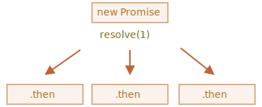

콜백
====

 **브라우저 메서드 사용**

- 예시 메서드
  - 브라우저 전용 메서드 사용

<br />

##### 비동기 동작 스케줄링
- 원하는 때에 동작 시작
- 호스트 환경 제공 여러 함수 사용
  - ex&#41; `setTimeout`

##### 실무 비동기 동작
- 아주 다양
  - 스크립트 · 모듈 로딩
  - 기타 등등
- `loadScript(src)` <sub>(함수)</sub>
  - `src` 내 스크립트 읽어옴
```javascript
function loadScript(src) {
  /*
   <script> 태그 생성 후
   - 페이지에 태그 추가 후
     - src 내 스크립트 로딩 · 실행
   */
  let script = document.createElement('script');
  script.src = src;
  document.head.append(script);
}
```

##### `loadScript(src)` <sub>(함수)</sub>
- `<script src="…">`
  - 동적 생성 후 문서에 추가
- 브라우저
  - 자동으로 태그 내 스크립트 불러옴
    - 로딩 완료 시 스크립트 실행
- `loadScript(src)` 사용법
```javascript
// 해당 경로 스크립트 불러오기 · 실행
loadScript('/my/script.js');
```

##### 스크립트
- '비동기적으로' 실행
  - 로딩
    - 바로 시작
  - 실행
    - 함수 끝난 후 시작
- `loadScript( … )` 아래 코드들
  - 스크립트 로딩 종료 때까지 대기 X
```javascript
loadScript('/my/script.js');
// loadScript 아래 코드
// - 스크립트 로딩 끝날 때까지 대기 X
// …
```
- 로딩 끝나자마자
  - 스크립트 사용해 무언가 동작 원함
- 스크립트 내
  - 다양한 함수 정의
    - 함수 실행 원함
- `loadScript( … )` 호출 후
  - 바로 내부 함수 호출 시
    - 원하는 대로 작동 X
```javascript
// script.js
// - "function newFunction() { … }" 함수 정의
loadScript('/my/script.js');

newFunction(); // 에러, 함수 존재 X
```
##### 브라우저
- 스크립트 읽어올 수 있는 충분한 시간 X
- `loadScript` <sub>(함수)</sub>
  - 스크립트 로딩 종료 여부 알 수 없음
- 스크립트 내 함수 · 변수 사용
  - 스크립트 로딩 종료 여부 알아야 함

##### `loadScript` 2번째 인수
- 스크립트 로딩 종료 후 실행 함수
  - 콜백 <sub>(callback)</sub> 함수 추가
    - 나중에 호출할 함수
```javascript
function loadScript(src, callback) {
  let script = document.createElement('script');
  script.src = src;

  script.onload = () => callback(script);

  document.head.append(script);
}
```

##### 새롭게 불러온 스크립트 함수
- 콜백 함수 안에서 호출 시
  - 외부 스크립트 내 함수 사용 가능
```javascript
loadScript('/my/script.js', function() {
  // 콜백 함수
  // = 스크립트 로드 종료 후 실행
  newFunction(); // 함수 호출 정상 동작
  …
});
```

##### 2번째 인수 전달 함수 <sub>(대개 익명 함수)</sub>
- 원하는 동작 완료 후 실행
  - ex&#41; 스크립트 불러오기
```javascript
function loadScript(src, callback) {
  let script = document.createElement('script');
  script.src = src;
  script.onload = () => callback(script);
  document.head.append(script);
}

loadScript('https://cdnjs.cloudflare.com/ajax/libs/lodash.js/3.2.0/lodash.js', script => {
  alert(`${script.src}가 로드되었습니다.`);
  alert( _ ); // 스크립트 내 정의 함수
});
```

##### '콜백 기반' 비동기 프로그래밍
- '비동기' 수행 함수
  - 콜백 인수 반드시 제공
- 콜백 함수
  - 함수 내 동작 모두 처리된 후 실행

### 콜백 속 콜백
- 스크립트 2개 존재 시
  - 두 스크립트 순차적 로딩
    1. 1번째 스크립트 로딩
    2. 2번째 스크립트 로딩
- 가장 자연스러운 해결 방법
  - 콜백 함수 안
    - 2번째 `loadScript` 호출
```javascript
loadScript('/my/script.js', function(script) {

  alert(`${script.src}을 로딩했습니다. 이젠, 다음 스크립트를 로딩합시다.`);

  loadScript('/my/script2.js', function(script) {
    alert(`두 번째 스크립트를 성공적으로 로딩했습니다.`);
  });
});
```

##### 중첩 콜백
1. 바깥 `loadScript` 완료 후
2. 안쪽 `loadScript` 실행
- 3중첩 콜백
```javascript
loadScript('/my/script.js', function(script) {

  loadScript('/my/script2.js', function(script) {

    loadScript('/my/script3.js', function(script) {
      // 세 스크립트 로딩 후 실행
    });

  })

});
```

##### 중첩 콜백
- 적은 수행 동작
  - 괜찮음
- 많은 수행 동작
  - 좋지 않음

### 에러 핸들링
- 콜백 에러
  - 스크립트 로딩 실패
  - 기타 등등
```javascript
function loadScript(src, callback) {
  let script = document.createElement('script');
  script.src = src;

  script.onload = () => callback(null, script);
  script.onerror = () => callback(new Error(`${src}를 불러오는 도중에 에러가 발생했습니다.`));

  document.head.append(script);
}
```
- 로딩 성공
  - `callback(null, script)`
- 로딩 실패
  - `callback(error)`
- 개선된 `loadScript` 사용법
```javascript
loadScript('/my/script.js', function(error, script) {
  if (error) {
    // 에러 처리
  } else {
    // 스크립트 로딩 성공
  }
});
```
##### 오류 우선 콜백 <sub>(error-first callback)</sub>
- 흔한 에러 처리 패턴

##### 오류 우선 콜백 관례
- 1번째 인수
  - 에러 위해 남겨둠
  - 에러 발생 시 인수 이용
    - `callback(err)` 호출
- 2번째 인수 <sub>(더 추가 가능)</sub>
  - 에러 미발생 시 위해 남겨둠
  - 원하는 동작 성공 시 호출
    - `callback(null, cb1, cb2 …)`

##### 오류 우선 콜백 스타일 사용 시
- 단일 콜백 함수 내
  - 에러 · 성공 케이스 모두 처리

### 멸망의 피라미드
- 콜백 기반 비동기 처리
  - 꽤 쓸만해 보임
  - 실제로도 꽤 쓸만함
- 1 ~ 2 개 중첩 호출 시
  - 보기에 나쁘지 않음

- 꼬리에 꼬리 무는 비동기 동작 多
```javascript
loadScript('1.js', function(error, script) {

  if (error) {
    handleError(error);
  } else {

    // …

    loadScript('2.js', function(error, script) {
      if (error) {
        handleError(error);
      } else {

        // …

        loadScript('3.js', function(error, script) {
          if (error) {
            handleError(error);
          } else {

            // 모든 스크립트 로딩 후 실행 흐름 이어
          }
        });
      }
    })
  }
});
```

##### 위 코드 동작 순서
1. 1.js 로드, 그 후 에러 미발생 시
2. 2.js 로드, 그 후 에러 미발생 시
3. 3.js 로드, 그 후 에러 미발생 시
4. 또 다른 작업 수행
- 호출 계속 중첩되면서 코드 깊어짐
  - 본문 중간중간 반복문 · 조건문
    - 관리 어려워짐

##### '콜백 지옥' · '멸망의 피라미드'
- 깊은 중첩 코드 패턴


- 비동기 동작 하나씩 추가
  - 피라미드 우측 점점 커짐
    - 코딩 방식 좋지 않음
- 각 동작
  - 독립적인 함수
```javascript
loadScript('1.js', step1);

function step1(error, script) {
  if (error) {
    handleError(error);
  } else {
    // ...
    loadScript('2.js', step2);
  }
}

function step2(error, script) {
  if (error) {
    handleError(error);
  } else {
    // ...
    loadScript('3.js', step3);
  }
}

function step3(error, script) {
  if (error) {
    handleError(error);
  } else {
    // 모든 스크립트 로딩 후 다른 동작 수행
  }
};
```
- 각 동작 분리
  - → 최상위 레벨 함수
  - 깊은 중첩 X
  - 콜백 기반 스타일 코드 동일 동작
- 찢어진 종잇조각 같아 보임
  - 가독성 ↓
- 여기저기 코드 읽어야 함
  - 익숙지 않을 시
    - 더욱더 불편
- `step` 명명 함수들
  - '멸망의 피라미드' 피하기 용도
    - 재사용 X
    - 네임스페이스 복잡성 ↑
- '멸망의 피라미드' 피하기
  - 프라미스 <sub>(promise)</sub>
  - 가장 좋은 방법 중 하나

###  과제
<hr />

### 움직이는 원 <sub>(콜백 이용)</sub>
- Animated circle <sub>(앞선 과제)</sub>
  - 점점 커지는 원
- 추가 사항
  - 원 안 메시지 표시
- 메시지 표시 시점
  - 애니메이션 다 끝난 후<br />(원 완전히 커지고 난 후)
- `showCircle(cx, cy, radius)` <sub>(함수)</sub>
  - Animated circle 해답
  - 원 그려줌
  - 애니메이션 종료 여부 확인 X
- 콜백 인수 추가
  - 애니메이션 종료 시
    - 콜백 실행
  - 원 대응 `<div>` 인수
    - 반드시 필요
- 완성된 함수 사용법 형태
```javascript
showCircle(150, 150, 100, div => {
  div.classList.add('message-ball');
  div.append("안녕하세요!");
});
```


<br />

- [코드](https://plnkr.co/edit/cbR8Y1l11SL5Sdmo?p=preview&preview)

<br />

프라미스
=======

- 문법
  - `promise` 객체 생성
```javascript
let promise = new Promise(function(resolve, reject) {
  // executor (제작 코드, 'a')
});
```

##### `executor` <sub>(실행자 · 실행 함수)</sub>
- `new Promise` 전달 함수
- `new Promise` 생성 시 자동 실행
- 최종적으로 결과 만들어내는 제작 코드 포함

##### `resolve` · `reject` <sub>(executor 인수)</sub>
- JS 자체 제공 콜백
- 코드 작성 시
  - `resolve` · `reject` 신경 X
  - `executor` 안 코드만 작성
- 인수 전달 콜백 중 하나 반드시 호출
  - `executor` 결과 언제 얻든 상관 X
- `resolve(value)`
  - 성공적으로 끝난 경우
    - `value` <sub>(결과)</sub> 함께 호출
- `reject(error)`
  - 에러 발생 시
    - `error` <sub>(에러 객체)</sub> 함께 호출

##### 요약
- `executor` 자동 실행
  - 원하는 일 처리
- 처리 종료 시
  - 처리 성공 여부 따라
    - 성공 : `resolve` 호출
    - 실패 : `reject` 호출

<br />

##### `promise` 객체
- `new Promise` 생성자 반환
- 내부 프로퍼티

||처음|`resolve(value)`|`reject(error)`|
|:---:|---|---|---|
|`state`|`pending` <sub>(보류)</sub>|`fulfilled`|`rejected`|
|`result`|`undefined`|`value`|`error`|

- `promise` 상태 → `state` · `result`
  - `executor` 의해


##### 예시
- `promise` 생성자
- 간단한 `executor` <sub>(함수)</sub>
  - 약간의 시간 걸리도록 구현
    - `setTimeout` 이용
```javascript
let promise = new Promise(function(resolve, reject) {
  /*
   프라미스 생성 후
   - executor 함수 자동 실행
   1초 후
   - 일 성공적으로 끝났다는 신호 전달
   - result → '완료'
   */
  setTimeout(() => resolve("완료"), 1000);
});
```
1. `executor`
    - 자동 · 즉시 호출
      - `new Promise` 에 의해
2. `executor` 인자
    - `resolve` · `reject` <sub>(함수)</sub>
      - JS 엔진 미리 정의
        - 따로 만들 필요 X
      - 둘 중 하나 반드시 호출

<br />

- `executor` 처리 시작 1초 후
  - `resolve("완료")` 호출
    - 결과 생성
- `promise` 객체 상태 변화


- 성공적으로 처리
  - 'fulfilled promise'
- 약속한 작업 거부 경우 <sub>(에러 함께)</sub>
```javascript
let promise = new Promise(function(resolve, reject) {

  // 1초 후 실행 종료 신호 (에러 함께)
  setTimeout(() => reject(new Error("에러 발생!")), 1000);
});
```
- 1초 후 `reject( … )` 호출 시
  - `promise` 상태 → `"rejected"`


##### 요약
- `executor`
  - 보통 시간 걸리는 작업 수행
  - 작업 종료 시
    - `resolve` · `reject` <sub>(함수)</sub> 호출
    - 프라미스 객체 상태 변화
- 처리된 <sub>(settled)</sub> 상태
  - 이행 <sub>(resolved)</sub>
  - 거부 <sub>(rejected)</sub>
- 대기 <sub>(pending)</sub> 상태
  - 미처리 상태

 **프라미스 : 성공 · 실패만 수행**

- `executor`
  - 둘 중 하나 반드시 호출
    - `resolve`
    - `reject`
- 변경된 상태
  - 더 이상 변경 X
- 처리 끝난 프라미스
  - `resolve` · `reject` 호출 시
    - 무시
```javascript
let promise = new Promise(function(resolve, reject) {
  resolve("완료");

  reject(new Error("…"));         // 무시
  setTimeout(() => resolve("…")); // 무시
});
```
- `executor` 의해 처리 끝난 일
  - 결과 · 에러만 가짐
- `resolve` · `reject`
  - 인수 0 ~ 1개만 받음
  - 이외 인수 무시

 **`Error` <sub>(객체)</sub> 함께 거부하기**

##### 무언가 잘못된 경우
- `executor`
  - `reject` 호출
- 인수
  -  모든 타입 가능
  - `resolve` 동일
- 권장 인수
  - `Error` <sub>(객체)</sub>
  - `Error` 상속 객체


 **`resolve` · `reject` <sub>(함수)</sub> 즉시 호출하기**

##### `executor`
- 대개 비동기 수행
- `resolve` · `reject` <sub>(함수)</sub>
  - 약간의 시간 후 호출
  - 즉시 호출도 가능
```javascript
let promise = new Promise(function(resolve, reject) {

  // 일 완료에 시간 소모 X
  resolve(123); // 결과 (123) : 즉시 resolve 전달
});
```
- 어떤 일 시작 후
  - 이미 끝나 저장까지 완료 시
    - 즉시 호출 가능
- 프라미스 상태
  - 즉시 이행

 **`state` · `result` : 내부에 존재**

##### `state` · `result` <sub>(프로퍼티)</sub>
- 내부 프로퍼티
  - 직접 접근 X
- 직접 접근 <sub>(메서드)</sub>
  - `.then` · `.catch` · `.finally`

### 소비자 : `then` · `catch` · `finally`
- 프라미스 객체
  - `executor` · 소비 함수 연결
- 소비 함수
  - 결과 · 에러 받음
  - 등록 · 구독 <sub>(메서드)</sub>
    - `.then`
    - `.catch`
    - `.finally`

#### `then`
- 가장 중요 · 기본
- 문법
```javascript
promise.then(
  function(result) { /* 결과 (result) 처리 */ },
  function(error)  { /* 에러 (error)  처리 */ }
);
```
- 1번째 인수 <sub>(함수)</sub>
  - 프라미스 이행 시 실행
  - 실행 결과 받음
- 2번째 인수 <sub>(함수)</sub>
  - 프라미스 거부 시 실행
  - 에러 받음
- 성공적으로 이행된 프라미스
```javascript
let promise = new Promise(function(resolve, reject) {
  setTimeout(() => resolve("완료!"), 1000);
});

// resolve 함수
// - 1번째 함수 (인수) 실행
promise.then(
  result => alert(result), // 1초 후 "완료!" 출력
  error  => alert(error)   // 실행 X
```
- 거부된 프라미스
```javascript
let promise = new Promise(function(resolve, reject) {
  setTimeout(() => reject(new Error("에러 발생!")), 1000);
});

// reject 함수
// - 2번째 함수 실행
promise.then(
  result => alert(result), // 실행 X
  error  => alert(error)   // 1초 후 "Error: 에러 발생!" 출력
);
```
- 성공적인 이행만 처리 시
  - 인수 하나만 전달
```javascript
let promise = new Promise(resolve => {
  setTimeout(() => resolve("완료!"), 1000);
});

promise.then(alert); // 1초 후 "완료!" 출력
```

### `catch`

##### 에러 발생 경우만 처리 시
- 1번째 인수 `null` 전달
  - `.then(null, func)`
  - `catch(func)` <sub>(동일)</sub>
```javascript
let promise = new Promise((resolve, reject) => {
  setTimeout(() => reject(new Error("에러 발생!")), 1000);
});

// .catch(f)
// - .then(null, f) 동일
promise.catch(alert); // 1초 후 "Error: 에러 발생!" 출력
```
- `.catch(f)`
  - 문법 간결
  - `.then(null, f)`완벽 동일

### `finally`
- 프라미스 처리 <sub>(이행 · 거부)</sub> 후
  - `f` 항상 실행
- `.finally(f)`
  - `.then(f, f)` 유사
- 마무리 필요 시 유용
  - 결과 관계 X
  - ex&#41; 쓸모 없어진 로딩 인디케이터 중단
```javascript
new Promise((resolve, reject) => {

  // 시간 걸리는 어떤 일 수행 후
  // - resolve · reject 호출

})

  // 프라미스 처리 후 실행
  // 성공 · 실패 여부 상관 X
  .finally(() => /* 로딩 인디케이터 중지 */)
  .then(result => /* result · err 표시 */ => /* error 표시 */)
```

##### `finally` · `.then(f, f)`차이점
1. `finally` <sub>(핸들러)</sub>
  - 인수 X
  - 프라미스 이행 · 거부 여부 모름
  - '보편적' 동작 <sub>(절차 마무리)</sub> 수행
    - 성공 · 실패 여부 몰라도 OK
2. 결과 · 에러
  - 다음 핸들러 자동 전달
```javascript
/* result 전달 */
new Promise((resolve, reject) => {
  setTimeout(() => resolve("결과"), 2000)
})
  .finally(() => alert("프라미스가 준비되었습니다."))
  .then(result => alert(result)); // .then : result 처리
```
```javascript
/* error 전달 */
new Promise((resolve, reject) => {
  throw new Error("에러 발생!");
})
  .finally(() => alert("프라미스가 준비되었습니다."))
  .catch(err => alert(err)); // .catch : 에러 객체 처리
```
- 프라미스 결과
  - `finally` 처리 X
  - `finally` 통과
3. `.finally(f)`
    - `f` <sub>(함수)</sub> 중복 X
    - `.then(f, f)` 보다 편리
      - 문법 측면

 **처리된 프라미스 핸들러 : 즉각 실행**

- 핸들러 <sub>(`.then` · `.catch` · .`finally`)</sub>
  - 프라미스 대기 상태
    - 처리 대기
  - 프라미스 처리 완료 상태
    - 즉각 실행
```javascript
// 생성 · 이행
// - 동시 실행
let promise = new Promise(resolve => resolve("완료!"));

promise.then(alert); // "완료!" 바로 출력
```
- 결과 나와 있는 상태
  - 핸들러 등록 시
    - 결과 바로 받음

### 예시 : `loadScript`

##### 콜백 기반 함수
```javascript
function loadScript(src, callback) {
  let script = document.createElement('script');
  script.src = src;

  script.onload  = () => callback(null, script);
  script.onerror = () => callback(new Error(`${src} 로딩 중 에러 발생`));

  document.head.append(script);
}
```

##### 프라미스 함수
- 프라미스 <sub>(객체)</sub> 생성 후 · 반환
  - 객체 : 스크립트 로딩 후 이행
- 외부 코드 : `.then`
  - 핸들러 <sub>(구독 함수)</sub> 추가
```javascript
function loadScript(src) {
  return new Promise(function(resolve, reject) {
    let script = document.createElement('script');
    script.src = src;

    script.onload  = () => resolve(script);
    script.onerror = () => reject(new Error(`${src} 로딩 중 에러 발생`));

    document.head.append(script);
  });
}
```
- 사용법
```javascript
let promise = loadScript("https://cdnjs.cloudflare.com/ajax/libs/lodash.js/4.17.11/lodash.js");

promise.then(
  script => alert(`${script.src}을 불러왔습니다!`),
  error  => alert(`Error: ${error.message}`)
);

promise.then(script => alert('또다른 핸들러...'));
```

|프라미스|콜백|
|---|---|
|자연스러운 흐름|`callback` <sub>(함수 · 함께 호출)</sub> 준비 필수|
|결과 따라 다음 <sub>(`.then`)</sub> 동작 코드 작성|결과 후 동작 미리 알고 있어야 함|
|원하는 만큼 `.then` 호출 가능<br />|콜백 하나만 가능|

###  과제
<hr />

### 두 번 resolve 하기?
- 아래 코드 실행 결과 예측
```javascript
let promise = new Promise(function(resolve, reject) {
  resolve(1);
  setTimeout(() => resolve(2), 1000);
});

promise.then(alert);
```


<br />

- `1` 출력
- 고려 대상
  - 1번째 `resolve` · `reject` 호출
  - 2번째 무시

<hr />

### 프라미스로 지연 만들기
- `setTimeout` <sub>(내장 함수)</sub>
  - 콜백 사용

##### 동일 기능 함수 <sub>(프라미스 기반)</sub> 만들기
- `delay(ms)` <sub>(함수)</sub>
- 프라미스 반환
  - `? ms` 이후 이행
    - `.then` 붙일 수 있도록
```javascript
function delay(ms) {
  /* 여기에 코드 작성 */
}

delay(3000).then(() => alert('3초후 실행'));
```


<br />

```javascript
function delay(ms) {
  return new Promise(resolve => setTimeout(resolve, ms));
}

delay(3000).then(() => alert('3초후 실행'));
```
- `resolve`
  - 인수 없이 호출
- `delay` <sub>(함수)</sub>
  - 지연 확인용
    - 반환 값 필요 X

###  과제
<hr />

### 프라미스로 애니메이션 적용 원 만들기
- `showCircle` <sub>(함수)</sub> 재작성
  - 기존 움직이는 원에서 작성
    - 콜백 이용
- 콜백 받기 X
- 프라미스 반환
- 함수 사용법 형태
```javascript
showCircle(150, 150, 100).then(div => {
  div.classList.add('message-ball');
  div.append("Hello, world!");
});
```
- 움직이는 원 <sub>(콜백 이용)</sub> 참고
  - 콜백 기반 답안


<br />

- [코드](https://plnkr.co/edit/eAP9wNrKyu2LvWLZ?p=preview)

<br />

프라미스 체이닝
==============

- 비동기 작업 여러 개
  - 순차적으로 처리
- 프라미스 체이닝
  - 비동기 처리
- 형태
```javascript
new Promise(function(resolve, reject) {

  setTimeout(() => resolve(1), 1000); // 1.

}).then(function(result) {            // 2.

  alert(result); // 1
  return result * 2;

}).then(function(result) {            // 3.

  alert(result); // 2
  return result * 2;

}).then(function(result) {

  alert(result); // 4
  return result * 2;

});
```
##### 순서
1. 1초 후 최초 프라미스 이행
2. 1번째 `.then` <sub>(핸들러)</sub> 호출
3. ② 반환 값 → 다음 `.then` <sub>(핸들러)</sub> 전달
4. 과정 반복
- `result`
  - 핸들러 체인 따라 전달


##### 프라미스 체이닝 가능한 이유
- `promise.then` 호출 시
  - 프라미스 반환
    - `.then` 호출 가능
- 핸들러 값 반환 시
  - 값 → 프라미스 `result`
  - 다음 `.then`
    - 값 이용해 호출
- 프라미스 1개
  - `.then` 여러 개 추가
    - 체이닝 X
```javascript
let promise = new Promise(function(resolve, reject) {
  setTimeout(() => resolve(1), 1000);
});

promise.then(function(result) {
  alert(result); // 1
  return result * 2;
});

promise.then(function(result) {
  alert(result); // 1
  return result * 2;
});

promise.then(function(result) {
  alert(result); // 1
  return result * 2;
});
```
- 프라미스 1개
  - 등록 핸들러 여러 개
    - `result` 순차적 전달 X
    - 독립적 처리



- 동일 프라미스 등록 `.then`
  - 모두 동일 결과 <sub>(`result`)</sub> 받음
    - 모두 `1` 출력
- 한 프라미스
  - 여러 개 핸들러 등록
    - 드물게 사용
  - 주로 체이닝 이용

### 프라미스 반환하기
- `.then(handler)` 에 사용된 핸들러
  - 프라미스 생성 · 반환 가능
- 다음 핸들러
  - 프라미스 처리 대기
    - 처리 완료 시 그 결과 받음
```javascript
new Promise(function(resolve, reject) {

  setTimeout(() => resolve(1), 1000);

}).then(function(result) {

  alert(result); // 1

  return new Promise((resolve, reject) => { // 1번째 `.then`
                                            // `new Promise( … )` 반환
    setTimeout(() => resolve(result * 2), 1000);
  });

}).then(function(result) { // 2번째 `.then`
                           // - 이전 이행 결과 받음

  alert(result); // 2

  return new Promise((resolve, reject) => {
    setTimeout(() => resolve(result * 2), 1000);
  });

}).then(function(result) {

  alert(result); // 4

});
```
1. 1번째 `.then`
    - `1` 출력 후 `new Promise( … )` 반환
    - 1초 후 프라미스 이행
2. 2번째 `.then`
    - 이전 이행 결과 받음
      - `resolve` 인수 <sub>(result * 2)</sub>
    - `2` 출력 후 동일 과정 반복
- 얼럿 창 사이
  - 1초 딜레이 생김

### `loadScript` 예시 개선하기
```javascript
function loadScript(src) {
  return new Promise(function(resolve, reject) {
    let script = document.createElement('script');
    script.src = src;

    script.onload  = () => resolve(script);
    script.onerror = () => reject(new Error(`${src} 로딩 중 에러 발생`));

    document.head.append(script);
  });
}
```
```javascript
loadScript("/article/promise-chaining/one.js")
  .then(function(script) {
    return loadScript("/article/promise-chaining/two.js");
  })
  .then(function(script) {
    return loadScript("/article/promise-chaining/three.js");
  })
  .then(function(script) {
    // 스크립트들 정상 로드 확인
    // - 로드된 스크립트 내 정의 함수 호출
    one();
    two();
    three();
  });
```
- 화살표 함수
  - 간결성 ↑
```javascript
loadScript("/article/promise-chaining/one.js")
  .then(script => loadScript("/article/promise-chaining/two.js"))
  .then(script => loadScript("/article/promise-chaining/three.js"))
  .then(script => {
    one();
    two();
    three();
  });
```
1. `loadScript` 호출 때마다
    - 프라미스 반환
2. 다음 `.then`
    - 이전 프라미스 이행 후 실행
3. 이후 초기화 진행
    - 다음 스크립트 로딩 준비

##### 더 많은 비동기 동작 추가 가능
- 코드 증가 방향
  - 아래
  - 오른쪽 <sub>('멸망의 피라미드')</sub> X
- 각 `loadScript`
  - `.then` 바로 붙이기 가능
```javascript
loadScript("/article/promise-chaining/one.js").then(script1 => {
  loadScript("/article/promise-chaining/two.js").then(script2 => {
    loadScript("/article/promise-chaining/three.js").then(script3 => {
      one();
      two();
      three();
    });
  });
});
```

##### `.then` 바로 붙이기
- 체이닝 동일 동작 수행
- 코드 증가 방향
  - '오른쪽'
    - 콜백 동일 문제
    - '멸망의 피라미드'
- 중첩 함수
  - 외부 스코프 접근 가능
    - 가끔 유용
- 가장 깊은 중첩 콜백
  - 모든 변수 접근 가능
    - `script1`
    - `script2`
    - `script3`

 **`thenable`**

##### 핸들러 반환 값
- 프라미스 <sub>(객체)</sub>
- `thenable` <sub>(객체)</sub>
  - `.then` <sub>(메서드)</sub> 보유 객체
  - 프라미스 동일 방식 처리

##### `thenable` <sub>(객체)</sub> 아이디어
- 서드파티 라이브러리
  - 자체 객체 구현 가능
- 자체 객체 <sub>(프라미스 호환)</sub>
  - 자체 확장 메서드 구현
  - `.then` <sub>(메서드)</sub> 보유
    - 네이티브 프라미스 호환
```javascript
class Thenable {
  constructor(num) {
    this.num = num;
  }
  then(resolve, reject) {
    alert(resolve); // function() { 네이티브 코드 }

    // 1초 후
    // - this.num * 2 (함께 이행)
    setTimeout(() => resolve(this.num * 2), 1000); // (**)
  }
}

new Promise(resolve => resolve(1))
  .then(result => {

    // .then 메서드 존재 여부 확인
    // - 1번째 then 이행 후 호출 대기
    //   - `resolve` · `reject`
    return new Thenable(result);
  })
  .then(alert); // 1000밀리 초 후 2 표시
```
1. `.then` <sub>(핸들러)</sub> 반환 객체 확인
2. 호출 가능 `then` <sub>(메서드)</sub> 존재 시
    - `then` 호출
3. `then` : 네이티브 함수 인수 받음
    - `resolve` · `reject`
      - `executor` 유사
4. 둘 중 하나 호출 때까지 대기
    - `resolve(2)` <sub>(위 예시)</sub>
      - 1초 후 호출
    - 호출 후 결과
      - 체인 따라 아래 전달
- 커스텀 객체
  - 프라미스 체이닝 구현
    - `Promise` 상속 X

### `fetch` · 체이닝 함께 응용하기
- 프론트 단
  - 네트워크 요청 시
    - 프라미스 자주 사용

- fetch <sub>(메서드)</sub>
  - 원격 서버에서 사용자 정보 가져오기
  - 다양한 선택 매개변수 보유
```javascript
let promise = fetch(url);
```
1. `url` : 네트워크 요청 보낸 후
    - 프라미스 반환
2. 원격 서버
    - 응답 <sub>(with 헤더)</sub> 보냄
3. 프라미스
    - `response` <sub>(객체)</sub> 함께 이행
    - `response` 전체 완전 다운로드 전
      - 이행 상태 되어버림
3. 응답 완전히 종료 후
    - 응답 전체 읽기
      - `response.text()` 호출
- `response.text()` <sub>(메서드)</sub>
  - 텍스트 전체 <sub>(from 원격 서버)</sub> 다운로드 후
    - 이행된 프라미스 반환
      - `result` 값 : 텍스트 전체
- `user.json` 요청 전송
  - 서버에서 해당 텍스트 불러옴
```javascript
fetch('/article/promise-chaining/user.json')

  // 원격 서버 응답 시
  // - .then 인수 함수 실행
  .then(function(response) {

    // response.text()
    // - 응답 텍스트 전체 다운로드 후
    //   - 응답 텍스트 → 새 이행 프라미스 생성 · 반환
    return response.text();
  })
  .then(function(text) {

    // 원격에서 받아온 파일 내용
    alert(text); // {"name": "Violet-Bora-Lee", "isAdmin": true}
  });
```
- `response.json()` <sub>(메서드)</sub>
  - 원격에서 받아온 데이터
    - 읽은 후 `JSON` 파싱
```javascript
fetch('/article/promise-chaining/user.json')
  .then(response => response.json())
  .then(user => alert(user.name)); // Violet-Bora-Lee, 이름만 성공적으로 가져옴
```
- 어떤 동작 더 실행
  - with 불러온 사용자 정보
- GitHub 요청 전송 후
  - 사용자 프로필 불러오기
  - 아바타 출력
```javascript
// user.json 요청 전송
fetch('/article/promise-chaining/user.json')

  // 응답 내용
  // - json 형태 불러오기
  .then(response => response.json())

  // GitHub 요청 전송
  .then(user => fetch(`https://api.github.com/users/${user.name}`))

  // 응답 내용
  // - json 형태 불러오기
  .then(response => response.json())

  // 3초간 아바타 이미지 표시
  // - githubUser.avatar_url
  .then(githubUser => {
    let img = document.createElement('img');
    img.src = githubUser.avatar_url;
    img.className = "promise-avatar-example";
    document.body.append(img);

    // 아바타 3초 표시
    setTimeout(() => img.remove(), 3000);
  });
```
- 아바타 3초 표시 후 사라진 다음
  - 무언가 하고 싶을 때
    - ex&#41; 사용자 정보 수정 폼 표시 등
- 체인 확장
  - 아바타 사라질 때
    - 이행 프라미스 반환
```javascript
fetch('/article/promise-chaining/user.json')
  .then(response => response.json())
  .then(user => fetch(`https://api.github.com/users/${user.name}`))
  .then(response => response.json())

  /*
   .then (핸들러)
   - new Promise 반환
     - setTimeout 안 resolve(githubUser) 호출 시만 → 처리 상태
   다음 .then
   - 이전 결과 대기
   */
  .then(githubUser => new Promise(function(resolve, reject) { // (*)
    let img = document.createElement('img');
    img.src = githubUser.avatar_url;
    img.className = "promise-avatar-example";
    document.body.append(img);


    setTimeout(() => {
      img.remove();
      resolve(githubUser); // (**)
    }, 3000);
  }))

  // 3초 후 동작
  .then(githubUser => alert(`${githubUser.name}의 이미지를 성공적으로 출력하였습니다.`));
```
- 비동기 동작
  - 항상 프라미스 반환 구현
- 추후 체인 확장 필요 시
  - 손쉽게 체인 확장
- 재사용 가능한 함수 단위 분리
```javascript
function loadJson(url) {
  return fetch(url)
    .then(response => response.json());
}

function loadGithubUser(name) {
  return fetch(`https://api.github.com/users/${name}`)
    .then(response => response.json());
}

function showAvatar(githubUser) {
  return new Promise(function(resolve, reject) {
    let img = document.createElement('img');
    img.src = githubUser.avatar_url;
    img.className = "promise-avatar-example";
    document.body.append(img);

    setTimeout(() => {
      img.remove();
      resolve(githubUser);
    }, 3000);
  });
}

// 함수 이용
// - 다시 동일 작업 수행
loadJson('/article/promise-chaining/user.json')
  .then(user => loadGithubUser(user.name))
  .then(showAvatar)
  .then(githubUser => alert(`Finished showing ${githubUser.name}`));
  // …
```


###  과제
<hr />

### 프라미스: `then` vs `.catch`
- 아래 두 코드 비교
  - 동일 동작 여부 확인
```javascript
promise.then(f1).catch(f2);
```
```javascript
promise.then(f1, f2);
```


<br />

- 두 코드 동작 상이

##### `f1` 에러 발생 시
- 에러 처리 가능 코드
  - `.catch`
```javascript
promise
  .then(f1)
  .catch(f2);
```
- 에러 처리 X 코드
```javascript
promise
  .then(f1, f2);
```

##### 2번째 코드 `.then` <sub>(핸들러)</sub>
- `f1` 아래 이어지는 체인 X
- 결과 · 에러 발생 시
  - 다음 `.then` · `.catch` 전달
- 1번째 코드
  - `.catch` 존재
- 2번째 코드
  - 이어지는 체인 X
    - 에러 발생 시 처리 X

<br />

프라미스와 에러 핸들링
====================

- 프라미스 거부 시 제어 흐름
  - 가장 가까운 rejection <sub>(핸들러)</sub>
- 프라미스 체인
  - 에러 쉽게 처리
    - 실무 아주 유용
- 미존재 주소
  - `fetch` 전달
    - `.catch` 에러 처리
```javascript
fetch('https://no-such-server.blabla') // 거부
  .then(response => response.json())
  .catch(err => alert(err)) // TypeError: failed to fetch
                            // - 출력 내용 다를 수 있음
```
- `.catch`
  - 1번째 핸들러일 필요 X
  - 1 ~ n개 `.then`
    - 뒤에 올 수 있음
- 사이트 문제 X
- 응답 JSON 형식 잘못된 경우
  - 가장 쉬운 에러 처리 방법
    - 체인 끝 `.catch` 추가
```javascript
fetch('/article/promise-chaining/user.json')
  .then(response => response.json())
  .then(user => fetch(`https://api.github.com/users/${user.name}`))
  .then(response => response.json())
  .then(githubUser => new Promise((resolve, reject) => {
    let img = document.createElement('img');
    img.src = githubUser.avatar_url;
    img.className = "promise-avatar-example";
    document.body.append(img);

    setTimeout(() => {
      img.remove();
      resolve(githubUser);
    }, 3000);
  }))
  .catch(error => alert(error.message));
```
- 정상적인 경우
  - `.catch` 트리거 X
- 문제 발생
  - 네트워크 문제
  - 잘못된 JSON 형식
  - 기타 등등
- 위쪽 프라미스 중 하나라도 거부 시
  - `.catch` 에러 잡음

### 암시적 `try…catch`
- `executor` · 핸들러 코드 주위
  - '보이지 않는 <sub>(암시적)</sub>' `try…catch` 존재
- 예외 발생 시
  - 암시적 `try…catch`
    - 예외 잡음
    - `reject` 처럼 처리
```javascript
new Promise((resolve, reject) => {
  throw new Error("에러 발생!");
}).catch(alert); // Error: 에러 발생!

↓↓↓ // 동일 동작

new Promise((resolve, reject) => {
  reject(new Error("에러 발생!"));
}).catch(alert); // Error: 에러 발생!
```

##### `executor`
- 스스로 에러 잡음
- 에러
  - → 거부 상태 프라미스 변경

##### 핸들러
- `.then` <sub>(핸들러)</sub> 내
  - 에러 던질 시 <sub>(`throw`)</sub>
    - 이 자체 == 거부된 프라미스
- 제어 흐름
  - → 가장 가까운 에러 핸들러
```javascript
new Promise((resolve, reject) => {
  resolve("OK");
}).then((result) => {
  throw new Error("에러 발생!"); // 프라미스 거부됨
}).catch(alert);                // Error: 에러 발생!
```
- 암시적 `try…catch`
  - 모든 종류 에러 처리
```javascript
new Promise((resolve, reject) => {
  resolve("OK");
}).then((result) => {
  blabla(); // 존재하지 않는 함수
}).catch(alert); // ReferenceError: blabla is not defined
```
- `.catch`
  - 명시적인 거부 잡음
  - 핸들러 위쪽 비정상 에러 또한 잡음

### 다시 던지기

##### 체인 마지막 `.catch`
- `try·catch` 유사 역할
- 마지막 `.catch` 하나 추가
  - `.then` <sub>(핸들러)</sub>
    - 원하는 만큼 사용
    - 발생 모든 에러 처리

##### 일반 `try·catch`
- 에러 분석
- 처리 불가 판단 시
  - 다시 던지기
    - 프라미스 유사 동작

##### 프라미스 에러 처리 제어 흐름
- `.catch` 내 `throw` 사용 시
  - → 가장 가까운 에러 핸들러
- 에러 처리 성공 시
  - 가장 가까운 `.then` <sub>(핸들러)</sub>
    - 실행 이어짐
- `.catch`
  - 에러 처리 성공
```javascript
// 실행 순서
// - catch → then
new Promise((resolve, reject) => {

  throw new Error("에러 발생!");

}).catch(function(error) {

  alert("에러가 잘 처리되었습니다. 정상적으로 실행이 이어집니다.");

}).then(() => alert("다음 핸들러가 실행됩니다."));
```
- `.catch` 블록 정상 종료
- `.then` <sub>(다음 성공 핸들러)</sub> 호출
- `.catch` 활용 다른 사례
  - 핸들러 : 에러 잡은 후
    - 다시 던짐 <sub>(처리 불가)</sub>
```javascript
// 실행 순서
// - catch → catch
new Promise((resolve, reject) => {

  throw new Error("에러 발생!");

// 에러 잡음
}).catch(function(error) {

  if (error instanceof URIError) {
    /* 에러 처리 */
  } else {
    alert("처리할 수 없는 에러");

    // 다시 던짐
    // - 에러 처리 불가
    throw error; // 다시 던지기
  }

}).then(function() {
  /* 실행 X */

// 실행 흐름
// - 1번째 .catch → 다음 .catch
}).catch(error => {

  alert(`알 수 없는 에러가 발생함: ${error}`);
  // 반환값 X
  // - 실행 이어짐

});
```

### 처리되지 못한 거부
- 에러 처리 불가능 시
  - ex&#41; 체인 끝에 `.catch` 추가 X
```javascript
new Promise(function() {

  // 미존재 함수 호출
  // - 에러 발생
  noSuchFunction();
}).then(() => {

    // 성공 상태 프라미스 처리 핸들러
    // - 1 ~ n개 존재
  }); // 끝에 .catch X
```

##### 에러 발생 시
- 프라미스
  - 거부 상태
- 실행 흐름
  - → 가장 가까운 rejection <sub>(핸들러)</sub>
- 예외 처리 핸들러 X <sub>(에러 처리 코드 X)</sub>
  - 에러 '갇혀버림'
- 코드 내 미처리 에러 잔존 시
  - 실무 끔찍한 일 발생
- 일반적인 에러 발생 후
  - `try…catch` 처리 불가능 시
    - 스크립트 중단
    - 콘솔 창 메시지 출력
- 거부된 프라미스 처리 불가능 시
  - 유사 동작 발생
- JS 엔진 : 프라미스 거부 추적 중
  - 미처리 거부된 프라미스 발견 시
    - 전역 에러 생성
- `unhandledrejection` <sub>(이벤트)</sub> 처리
  - 콘솔창 확인 <sub>(브라우저 환경)</sub>
  - 표준 이벤트 <sub>(HTML 명세서 정의)</sub>
```javascript
window.addEventListener('unhandledrejection', function(event) {

  // unhandledrejection (이벤트)
  // - 특수 프로퍼티 2개
  alert(event.promise); // [object Promise]
                        // - 에러 생성 프라미스
  alert(event.reason);  // Error: 에러 발생!
                        // - 처리 못한 에러 객체
});

new Promise(function() {
  throw new Error("에러 발생!");
}); // 에러 처리 .catch (핸들러) X
```

##### 브라우저 환경
- 에러 발생 시 `.catch` X
  - `unhandledrejection` <sub>(핸들러)</sub> 트리거
    - `event` <sub>(객체 with 에러 정보)</sub> 받음
    - 핸들러 내 원하는 작업 수행
- 대개 이런 에러 회복 X
- 최선의 방법
  - 사용자에게 문제 상황 알리기
  - 서버에 에러 정보 전송 <sub>(가능 시)</sub>
- 기타 호스트 환경 <sub>(Node.js 등)</sub>
  - 미처리 에러 다루는 방법
    - 여러 가지 제공

###  과제
<hr />

### setTimeout 내 에러
- `.catch` 트리거 발생 여부?
```javascript
new Promise(function(resolve, reject) {
  setTimeout(() => {
    throw new Error("에러 발생!");
  }, 1000);
}).catch(alert);
```

<br />

- `.catch` 트리거 X
```javascript
new Promise(function(resolve, reject) {
  setTimeout(() => {
    throw new Error("에러 발생!");
  }, 1000);
}).catch(alert);
```

##### '암시적' `try…catch`
- 함수 코드 감싸고 있음
  - 모든 동기적 에러 처리

##### 과제 에러 발생 시점
- `executor` <sub>(실행자 · 실행 함수)</sub> 실행 중 X
- 나중
  - 프라미스 에러 처리 X
