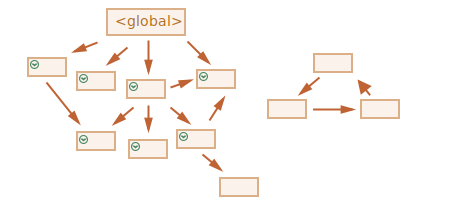

가비지 컬렉션
============
- JS : 보이지 않는 곳에서 메모리 관리 수행

### 가비지 컬렉션 기준
- 메모리 관리 수행 시
  - '도달 가능성' 개념 사용

##### '도달 가능한' 값
- 어떻게든 접근 · 사용 가능한 값
- '도달 가능한' 값
  - 메모리에서 삭제 X
1. 루트
    - 현재 함수 내
      - 지역 변수 · 매개변수
    - 중첩 함수 체인 상 함수 내
      - 사용 변수 · 매개변수
    - 전역 변수
    - 기타 등등
2. 루트가 참조하는 값<br />체이닝으로 루트에서 참조할 수 있는 값
    - ex&#41; 전역 변수 내 객체 프로퍼티
      - → 또 다른 객체 참조
      - 이 객체가 참조하는 모든 것들
        - '도달 가능' 간주
- JS 엔진 내 가비지 컬렉터
  - 끊임없이 동작
  - 모든 객체 모니터
  - '도달 불가능' 객체 삭제
```javascript
// user (변수)
// - 객체 참조 값 저장
let user = {
  name: "John"
};

// user (변수) 값
// - 다른 값으로 덮어씀
//   - 참조 사라짐
user = null;
/*
 { name: "John" } (객체)
 - '도달 불가능' 상태
 - 접근 방법 · 참조 모두 없어짐
 가비지 컬렉터
  - 객체 저장 데이터 삭제 후 메모리에서 삭제
 */
```

### 참조 2개
```javascript
// user (변수)
// - 객체 참조 값 저장
let user = {
  name: "John"
};

// admin (변수)
// - 객체 참조 값 복사
let admin = user;

// user (변수) 값
// - 다른 값으로 덮어씀
// admin (변수)
// - 아직 해당 객체 참조
user = null;

/*
 { name: "John" } (객체)
   - admin (변수) 통해 여전히 접근 가능
     - 메모리에서 삭제 X
   - admin (변수) 값
     - 다른 값 (null 등) 으로 덮어쓰면
       - 메모리에서 삭제
 */
```

### 연결된 객체
```javascript
function marry(man, woman) {
  // 두 객체 서로 참조
  woman.husband = man;
  man.wife = woman;

  return {
    father: man,
    mother: woman
  }
}

let family = marry({
  name: "John"
}, {
  name: "Ann"
});
```


- 참조 2개 삭제
```javascript
delete family.father;
delete family.mother.husband;
```


- "John"
  - 도달 가능한 상태 X
    - 메모리에서 제거
    - "John" 저장 데이터 <sub>(프로퍼티)</sub> 메모리에서 제거
- 외부로 나가는 참조
  - 도달 가능한 상태 영향 X
- 외부에서 들어오는 참조
  - 도달 가능한 상태 영향


- 가비지 컬렉션 후


### 도달할 수 없는 섬
- 도달할 방법 없는 경우
  - 섬 구성 객체 전부 메모리에서 삭제
- 근원 객체 family 참조 제거
```javascript
family = null;
```


### 내부 알고리즘
- 'mark-and-sweep'
  - 가비지 컬렉션 기본 알고리즘
- 진행 단계
  1. 루트 <sub>(root)</sub> 정보 수집 후 mark <sub>(기억)</sub>


  2. 루트가 참조하고 있는 모든 객체 방문 후 mark


  3. mark 된 모든 객체 방문 후 그 객체들이 참조하는 객체 mark
      - 한번 방문한 객체 전부 mark
      - 같은 객체 재방문 X



  4. 루트에서 도달 가능한 모든 객체 방문할 때까지 위 과정 반복


  5. mark 되지 않은 모든 객체 메모리에서 삭제


#### 최적화 기법
- JS 엔진 실행 영향 미치지 않으면서 가비지 컬렉션 더 빠르게 하는 다양한 최적화 기법 적용

##### generational collection <sub>(세대별 수집)</sub>
1. 객체 분리
    - '새로운 객체'
    - '오래된 객체'
2. 객체 상당수 생성 이후 제 역할 빠르게 수행 후 금방 쓸모 없어짐
    - '새로운 객체' 분류
3. 가비지 컬렉터 '새로운 객체' 공격적으로 메모리에서 제거
4. 일정 시간 이상 살아남은 객체
    - '오래된 객체' 분류
    - 가비지 컬렉터 덜 감시

##### incremental collection <sub>(점진적 수집)</sub>
1. 가비지 컬렉션 여러 부분 분리
2. 각 부분 별도 수행
- 작업 분리 · 변경 사항 추적에 추가 작업 필요
  - 긴 지연 → 짧은 지연 여러 개로 분산

#####  idle-time collection <sub>(유휴 시간 수집)</sub>
- CPU 유휴 상태 때만 가비지 컬렉션 실행
  - 실행에 영향 최소화
