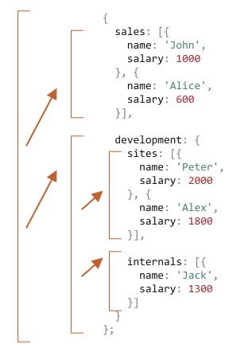
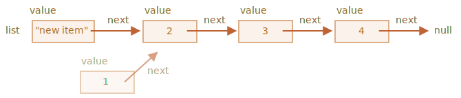

재귀와 스택
==========

- 큰 목표 작업 → 동일 목표 간단 작업들
- 함수 자기 자신 호출

### 두 가지 사고방식
  - 반복
  - 재귀
```javascript
// 거듭제곱
pow(2, 2) = 4
pow(2, 3) = 8
pow(2, 4) = 16
```
```javascript
/* 반복적인 사고 */
// for (반복문)
function pow(x, n) {
  let result = 1;

  // 반복문 돌면서 x를 n번 곱함
  for (let i = 0; i < n; i++) {
    result *= x;
  }

  return result;
}

alert( pow(2, 3) ); // 8

/* 재귀적인 사고 */
// - 작업 단순화
// - 자기 자신 호출
function pow(x, n) {
  if (n == 1) {
    return x;
  } else {
    return x * pow(x, n - 1);
  }
}

alert( pow(2, 3) ); // 8
```
- `pow (x, n)` 호출 시
  - 두 갈래 나뉘어 코드 실행
```javascript
              if n == 1  = x
             /
pow(x, n) =
             \
              else       = x * pow(x, n - 1)
```

##### `n == 1`
- 재귀 베이스 <sub>(base)</sub>
- 모든 절차 간단해짐
- 명확한 결과 값 즉시 도출
- `pow(x, 1) == x`

##### `n != 1`
- 재귀 단계 <sub>(recursive step)</sub>
- `pow(x, n)` → `x * pow(x, n - 1)`
  - x<sup>n</sup> = x * x<sup>(n-1)</sup>
- 목표 작업 <sub>(`pow(x, n)`)</sub> 분할
  - 간단한 동작 <sub>(x 곱하기)</sub>
  - 목표 작업 변형 <sub>(`pow(x, n - 1)`)</sub>
  - `n == 1` 될 때까지 계속 진행


- `pow (2, 4)`
  1. `pow(2, 4)` = `2 * pow(2, 3)`
  2. `pow(2, 3)` = `2 * pow(2, 2)`
  3. `pow(2, 2)` = `2 * pow(2, 1)`
  4. `pow(2, 1)` = `2`

 **재귀 사용 코드 : 짧음**

- 반복적 사고 코드보다 대개 짧음
- `if` <sub>(문)</sub> → `?` <sub>(조건부 연산자)</sub>
  - 간결성 · 가독성 ↑
```javascript
function pow(x, n) {
  return (n == 1) ? x : (x * pow(x, n - 1));
}
```

<br />

##### 재귀 깊이
- 중첩 호출 최대 개수 <sub>(첫 호출 포함)</sub>
- `pow(x, n)` 재귀 깊이 == n

##### 최대 재귀 깊이 제한 <sub>(JS 엔진)</sub>
- 만개 정도까지 확실히 허용
- 엔진 따라 더 많은 깊이 가능
  - 대다수 엔진 십만까지는 X

##### tail calls optimization
- 엔진 내부 자동 최적화 수행 <sub>(제한 완화)</sub>
- 모든 경우 적용 X
  - 간단한 경우만 적용

##### 재귀 깊이 제한
- 실제 적용 시 부담
- 그럼에도 광범위하게 사용
  - 간결성 ↑
  - 유지보수 난이도 ↓

### 실행 컨텍스트 · 스택

##### 실행 중인 함수 실행 절차 정보
- 해당 함수 실행 컨텍스트에 저장

##### 실행 컨텍스트
- 함수 실행 세부 정보 보유 <sub>(내부 데이터 구조)</sub>
  - 제어 흐름 현재 위치
  - 변수 현재 값
  - `this` 값
  - 기타 등등
- 함수 호출 1회
  - 실행 컨텍스트 1개 생성

##### 함수 내부 중첩 호출 절차
1. 현재 함수 실행 일시 중지
2. 실행 컨텍스트 스택에 저장
    - 실행 컨텍스트 <sub>(일시 중지 함수)</sub> push
3. 중첩 호출 실행
4. 중첩 호출 실행 종료
    1. 실행 컨텍스트 스택에서 제거
        - 실행 컨텍스트 <sub>(일시 중지 함수)</sub> pop
    2. 일시 중지 함수 실행 재개

#### `pow(2, 3)`

##### 실행 컨텍스트에 정보 저장
- 변수
  - `x = 2, n = 3`
- 실행 흐름
  - 함수 1번째 줄 위치
```javascript
Context: { x: 2, n: 3, 1번째 줄 } call: pow(2, 3)
```

##### `n == 1` <sub>(조건)</sub> 만족 X
- 실행 흐름
  - `if` <sub>(문)</sub> 2번째 분기 진행
```javascript
function pow(x, n) {
  if (n == 1) {
    return x;
  } else {      // ←
    return x * pow(x, n - 1);
  }
}
alert( pow(2, 3) );
```

##### 변수 동일 · 실행 흐름 위치 변경
- 실행 컨텍스트 정보 변경
```javascript
Context: { x: 2, n: 3, 5번째 줄 } call: pow(2, 3) // 줄 정보 변경
```

##### `x * pow (x, n - 1)` 계산 시
- `pow (2, 2)` <sub>(서브 호출)</sub> 생성

#### `pow(2, 2)`

##### 중첩 호출 발생 시
- 현재 실행 컨텍스트
  - 실행 컨텍스트 스택에 저장 <sub>(push)</sub>

##### 프로세스
1. 스택 최상단 : 현재 컨텍스트
2. 새 컨텍스트 <sub>(서브 호출)</sub> 생성
    - 스택에 서브 호출 컨텍스트 push
3. 서브 호출 완료 시
    - 스택에서 서브 호출 컨텍스트 pop
    - 기존 컨텍스트 실행 재개
      - 스택 pop

##### `pow (2, 2)` <sub>(서브 호출)</sub> 시작 시 스택
```javascript
Context: { x: 2, n: 2, 1번째 줄 } call: pow(2, 2) // new context
Context: { x: 2, n: 3, 5번째 줄 } call: pow(2, 3) // old context
```
- 이전 컨텍스트에 저장된 정보
  - 변수 정보
  - 코드 일시 중단된 줄
- 서브 호출 종료 후
  - 이전 컨텍스트 문제없이 다시 시작

 **주의**

##### 한 줄에 복수 서브 호출 가능
- `pow( … ) + pow( … ) + some( … )`
- 서브 호출 바로 직후 실행 시작

#### `pow(2, 1)`
- 동일한 과정 다시 반복
- 5번째 줄 : 새 서브 호출 생성
  - 변수 <sub>(`x = 2, n = 1`)</sub>
- 새 실행 컨텍스트 생성 후
  - 스택에 실행 컨텍스트 push <sub>(스택 최상단)</sub>
```javascript
Context: { x: 2, n: 1, 1번째 줄 } call: pow(2, 1) // new
Context: { x: 2, n: 2, 5번째 줄 } call: pow(2, 2) // old
Context: { x: 2, n: 3, 5번째 줄 } call: pow(2, 3) // older
```

#### 실행 종료

##### `pow (2, 1)` 실행 시
- `n == 1` <sub>(조건)</sub> 만족
  - `if` <sub>(문)</sub> 1번째 분기 실행
```javascript
function pow(x, n) {
  if (n == 1) {      // ←
    return x;
  } else {
    return x * pow(x, n - 1);
  }
}
```
- 호출할 중첩 호출 X
  - 함수 종료
  - `2` 반환
- 해당 실행 컨텍스트
  - 쓸모 X
  - 메모리에서 삭제
- 스택 최상단
  - 이전 실행 컨텍스트
```javascript
// Context: { x: 2, n: 1, 1번째 줄 } call: pow(2, 1) // new (X)
Context: { x: 2, n: 2, 5번째 줄 } call: pow(2, 2)    // old
Context: { x: 2, n: 3, 5번째 줄 } call: pow(2, 3)    // older
```

##### `pow (2, 2)` 실행 다시 시작
- 서브 호출 <sub>(`pow (2, 1)`)</sub> 결과
  - 알고 있음
- `x * pow (x, n - 1)` 계산 후
  - `4` 반환
- 스택 최상단
  - 이전 실행 컨텍스
```javascript
// Context: { x: 2, n: 1, 1번째 줄 } call: pow(2, 1) // new (X)
// Context: { x: 2, n: 2, 5번째 줄 } call: pow(2, 2) // old (X)
Context: { x: 2, n: 3, 5번째 줄 } call: pow(2, 3)    // older
```
- 마지막 실행 컨텍스트 처리 후
  - 결과 <sub>(`pow (2, 3) = 8`)</sub> 도출
- 재귀 깊이
  - 실행 컨텍스트 수 <sub>(스택)</sub> 최댓값

##### 메모리 요구사항 유의
- 실행 컨텍스트 : 메모리 차지
- 메모리 저장 공간 필요
  1. n 증가
  2. n번 내려감
  3. n개 실행 컨텍스트 생성
- 반복문 기반 알고리즘
  - 메모리 절약
```javascript
function pow(x, n) {
  let result = 1;

  for (let i = 0; i < n; i++) {
    result *= x;
  }

  return result;
}
```

##### 컨텍스트 1개만 사용
- 변수 <sub>(`i` · `result`)</sub>
  - 컨택스트 내 변경
- `n` 의존 X
- 필요 메모리 공간 ↓
- 사용 메모리 공간 고정
- 대개 함수 호출 비용 <sub>(메모리 사용)</sub> 절약

##### 코드 재작성 후 큰 개선 없는 경우 有
- 메모리 크게 절약 X
- 최적화 필요 X
- 최적화 노력 무용지물
- ex&#41;
  - 조건 따라 다른 재귀 서브 호출 후 결과 합칠 때
  - 분기문 복잡하게 얽혀있을 때

##### 재귀 코드
- 코드 양 ↓
- 코드 이해도 ↑
- 유지보수 이점

##### 모든 곳에 메모리 최적화 신경 X
- 필요한 것
  - 좋은 코드
  - 최적화 코드 X

### 재귀적 순회
- 재귀적 순회
```javascript
/* 한 회사 내 부서 · 임직원 */
let company = {

  sales: [{
    name: 'John',
    salary: 1000
  }, {
    name: 'Alice',
    salary: 1600
  }],

  development: {
    sites: [{
      name: 'Peter',
      salary: 2000
    }, {
      name: 'Alex',
      salary: 1800
    }],

    internals: [{
      name: 'Jack',
      salary: 1300
    }]
  }
};
```

#### 모든 임직원 급여 더하기

##### 반복문
- `company`
  - 최상위 반복문
- 1단계 하위 부서
  - 1번째 중첩 반복문
- n단계 하위 부서
  - n번째 중첩 반복문

##### 재귀
- 단순 부서 <sub>(임직원 배열)</sub>
  - 반복문
  - 재귀 베이스
- n단계 하위 부서 <sub>(하위 부서 객체)</sub>
  - n번째 재귀 호출
  - 재귀 단계

##### 복잡한 작업 분해
- 작은 작업들 <sub>(하위 부서 대상 반복문)</sub>
- 부서 깊이 따라 더 작은 작업들로 쪼개기
  - 마지막 == 재귀 베이스
``` javascript
let company = {
  sales: [{name: 'John', salary: 1000},  {name: 'Alice', salary: 1600 }],
  development: {
    sites: [{name: 'Peter', salary: 2000}, {name: 'Alex', salary: 1800 }],
    internals: [{name: 'Jack', salary: 1300}]
  }
};

// 급여 합계 함수
function sumSalaries(department) {

  // 재귀 베이스
  // - 단순 부서 (임직원 배열)
  if (Array.isArray(department)) {

    // 배열 요소 총합
    return department.reduce((prev, current) => prev + current.salary, 0);

  // 재귀 단계
  // - n단계 하위 부서 (하위 부서 객체)
  } else {
    let sum = 0;
    for (let subdep of Object.values(department)) {

      // 재귀 호출
      // - 각 하위 부서 임직원 급여 총합
      sum += sumSalaries(subdep);
    }
    return sum;
  }
}

alert(sumSalaries(company)); // 7700
```
- `[ … ]` <sub>(배열)</sub>
  - 서브 호출 X
  - 결과 계산
- `{ … }` <sub>(객체)</sub>
  - 서브 호출



### 재귀적 구조
- 재귀적으로 정의된 자료구조
  - 자기 자신 일부 복제 형태
- 회사 부서
  - 사람 <sub>(배열)</sub>
  - 하위 부서 <sub>(객체)</sub>
- HTML · XML
  - 일반 텍스트
  - HTML 주석
  - HTML 태그
    - 일반 텍스트
    - HTML 주석
    - 다른 HTML 태그
    - ...ㄱ

### 연결 리스트

##### 배열
- 앞 요소 연산
  - 요소 삭제 · 삽입 비용 ↑
  - `unshift(obj)` · `shift()`
    - 새 요소 공간 생성 · 제거
      - 모든 요소 번호 다시 매김
    - 배열 크기 ↑
      - 연산 수행 시간 ↑
    - 동일
- 끝 요소 연산
  - 요소 삭제 · 삽입 비용 ↓
  - `push` · `pop`
##### 연결 리스트 <sub>(linked list)</sub>
- 삽입 · 삭제 속도 ↑
- 프로퍼티
  - value
    - 요소
  - next
    - 다음 요소 참조
    - 다음 요소 X
      - `null`
```javascript
let list1 = {
  value: 1,
  next: {
    value: 2,
    next: {
      value: 3,
      next: {
        value: 4,
        next: null
      }
    }
  }
};

↓↓↓

let list2 = { value: 1 };
list2.next = { value: 2 };
list2.next.next = { value: 3 };
list2.next.next.next = { value: 4 };
list2.next.next.next.next = null;
```


- 전체 리스트
  - 여러 부분으로 나누기
  - 다시 합치기
```javascript
// 여러 부분으로 나누기
let secondList = list.next.next;
list.next.next = null;

// 다시 합치기
list.next.next = secondList;
```


- 쉽게 요소 추가 · 삭제
- 리스트 앞에 요소 추가
```javascript
let list = { value: 1 };
list.next = { value: 2 };
list.next.next = { value: 3 };
list.next.next.next = { value: 4 };

// list에 새 요소 추가
list = { value: "new item", next: list };

// 중간 요소 제거
// - 이전 요소 next 변경
list.next = list.next.next;
```




- `list.next` 참조 변경
  - 1 → 2
  - `value 1` 요소
    - 체인에서 제외
    - 객체 따로 저장 X
      - 자동으로 메모리에서 제거
- 연결 리스트 단점
  - 번호 <sub>(인덱스)</sub> 사용해 요소 쉽게 접근 X
    - n번째 값 접근 시
      - `list[n]` X
      - 첫 항목에서 n번 이동 <sub>(next)</sub>
- 중간 요소 삽입 · 삭제 연산 덜 중요 시
  - 큐 <sub>(queue)</sub>
  - 데크 <sub>(deque)</sub>
    - 양 끝 삽입 · 삭제 빠르게 수행
- 연결 리스트 예시 개선 <sub>(기능 추가)</sub>
  - `prev` <sub>(프로퍼티)</sub> 추가
    - 이전 요소 참조
    - 이전 요소 쉽게 이동
  - `tail` <sub>(변수)</sub> 추가
    - 마지막 요소 참조
    - 마지막 요소 추가 · 삭제 시
      - `tail` 갱신
- 요구사항 따라 구조 변경
