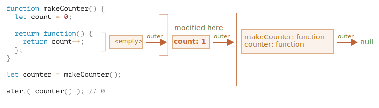

변수의 유효범위와 클로저
======================

##### JS : 함수 지향 언어
- 많은 자유
- 함수 동적 생성
- 생성한 함수
  - 다른 함수 인수 전달
- 생성된 곳 아닌 다른 곳에서 함수 호출

### `{ … }` <sub>(코드 블록)</sub>
- `{ … }` <sub>(코드 블록)</sub> 내 선언 변수
  - 블록 안에서만 사용 가능
```javascript
// 지역 변수 선언 후 몇 가지 조작
// - 그 결과 밖에서 볼 수 없음
{
  let message = "안녕하세요."; // 블록 내에서만 접근 가능

  alert(message); // 안녕하세요.
}

alert(message);   // ReferenceError: message is not defined
```

##### 블록 특징
- 특정 작업 수행 코드 묶는 용도
- 블록 내 작업 수행 전용 변수 생성
```javascript
{
  // 메시지 출력
  let message = "안녕하세요.";
  alert(message);
}

{
  // 또 다른 메시지 출력
  let message = "안녕히 가세요.";
  alert(message);
}
```

 **블록 없으면 에러 발생**

##### 이미 선언된 변수와 동일한 이름 변수
- `{ … }` <sub>(블록)</sub> 없이 선언 시
  - 에러 발생
```javascript
// 메시지 출력
let message = "안녕하세요.";
alert(message);

// 또 다른 메시지 출력
let message = "안녕히 가세요."; // 에러 발생
                               // SyntaxError: Identifier 'message' has already been declared
alert(message);
```

<br />

##### 블록 내 선언 변수
- 블록 안에서만 접근 가능
- `if` · `for` · `while` <sub>(문)</sub>
```javascript
if (true) {
  let phrase = "안녕하세요!";

  alert(phrase); // 안녕하세요!
}

// if (문) 블록 밖 alert (함수)
// - phrase (변수) 접근 X
alert(phrase); // ReferenceError: phrase is not defined
```

##### 변수 유효 범위
- 블록 범위 한정
  - `if` · `for` · `while` <sub>(문)</sub> 유용
```javascript
for (let i = 0; i < 3; i++) {
  // i (변수)
  // - for (문) 안에서만 유효
  alert(i); // 0, 1, 2
}

alert(i); // ReferenceError: i is not defined
```

### 중첩 함수
- 함수 내부 선언 함수
  - 코드 정돈 시 사용
```javascript
function sayHiBye(firstName, lastName) {

  // helper (헬퍼 중첩 함수)
  function getFullName() {
    return firstName + " " + lastName;
  }

  alert( "Hello, " + getFullName() );
  alert( "Bye, " + getFullName() );

}
```
- 객체 프로퍼티 형태 · 중첩 함수 자체
  - 반환 가능한 값
- 반환된 중첩 함수
  - 어디서든 호출해 사용 가능
  - 외부 변수 여전히 접근 가능
```javascript
function makeCounter() {
  let count = 0;

  return function() {
    return count++;
  };
}

let counter = makeCounter();

alert( counter() ); // 0
alert( counter() ); // 1
alert( counter() ); // 2
```

### 렉시컬 환경

#### 단계 1. 변수

##### 렉시컬 환경 <sub>(내부 숨김 연관 객체)</sub> 보유
- 실행 중인 함수
- `{ … }` <sub>(코드 블록)</sub>
- 스크립트 전체

##### 렉시컬 환경 <sub>(객체)</sub> 구성 : 두 부분
- **환경 레코드 <sub>(특수 내부 객체)</sub>**
  - 모든 지역 변수 저장
    - 객체 프로퍼티
  - 기타 정보 저장
    - `this` 값
    - 기타 등등
- **외부 렉시컬 환경 참조**
  - 외부 코드 연관

##### 변수 == 환경 레코드 프로퍼티
- 변수 가져오기 · 변경
  - 환경 레코드 프로퍼티 가져오기 · 변경

##### 스크립트 전체 관련 렉시컬 환경
- 전역 렉시컬 환경
- 외부 참조
  - `null`


- 실행 흐름 진행 시
  - 렉시컬 환경 변화

##### 스크립트 시작 시
1. 스크립트 내 선언 변수
    - 전역 렉시컬 환경 올라감 <sub>(pre-populated)</sub>
    - 상태 : uninitialized <sub>(특수 내부 상태)</sub>
- JS 엔진
  - uninitialized <sub>(상태)</sub> 변수 인지
  - `let` 등장 전까지 변수 참조 X
2. `let phrase` 등장 <sub>(값 할당 전)</sub>
    - 값 : `undefined`
    - `phrase`
      - 이 시점 이후 사용 가능
3. `phrase` 값 할당
4. `phrase` 값 변경


 **렉시컬 환경 : 명세서에만 존재**

##### 명세서 내 동작 방식 설명 위한 이론상 객체
- 직접 렉시컬 환경 얻기 · 조작 불가능

##### JS 엔진들 : 렉시컬 환경 최적화 노력
- 명세서 언급 사항 준수
- 엔진 고유 방법 사용
- 메모리 절약
  - 미사용 변수 버기기
- 다양한 내부 트릭
- 기타 등등

#### 단계 2. 함수 선언문
- 함수 == 값 <sub>(== 변수)</sub>

##### 차이
- 함수 선언문 선언 함수
  - 바로 초기화
  - 렉시컬 환경 생성 즉시 사용 가능
    - 선언 전 함수 사용 가능 이유
- 일반 변수
  - `let` 등장 · 선언 전 사용 X

##### 전역 렉시컬 환경 초기 상태 변화
- 스크립트에 함수 추가 시


##### 함수 선언문 정의 함수에만 적용
- 함수 표현식 <sub>(함수 → 변수 할당)</sub> 해당 X
  - ex&#41; `let say = function(name) …`

#### 단계 3. 내부 · 외부 렉시컬 환경

##### 함수 호출 · 실행 시
- 새 렉시컬 환경 자동 생성
  - 전달 받은 매개변수 저장
  - 함수 지역 변수 저장

##### 함수 호출 중 내부 상태
- <sub>(호출 중인)</sub> 함수 내부 렉시컬 환경
- 함수 외부 렉시컬 환경 <sub>(← 내부 렉시컬 환경 참조)</sub>

##### `say("John")` <sub>(함수)</sub> 호출 시 내부 변화


##### 내부 렉시컬 환경
- `say` <sub>(현재 실행 중 함수)</sub> 상응
- 프로퍼티 1개 보유
  - `name` <sub>(함수 인자)</sub> 유래
  - 값 : `"John"` <sub>(`say("John")` 호출)</sub>
- 외부 렉시컬 환경 참조 보유

##### 외부 렉시컬 환경
- == 전역 렉시컬 환경
- 프로퍼티 2개 보유
  - `phrase` <sub>(변수)</sub>
  - `say` <sub>(함수)</sub>

##### 코드에서 변수 접근 시
1. 검색 범위 설정
    1. 내부 렉시컬 환경
    2. 외부 렉시컬 환경 확장
        - 내부 렉시컬 환경 참조
    3. 전역 렉시컬 환경 확장 때까지 반복
2. 전역 렉시컬 환경 도달 후 변수 부재 시
    - 엄격 모드
      - 에러 발생
    - 비 엄격 모드
      - 새 전역 변수 생성 <sub>(에러 발생 X)</sub>
        - 하위 호환성

##### 예시 정리 :  `alert` <sub>(`say` 내부)</sub>
- `name` <sub>(변수)</sub>
  1. 내부 렉시컬 환경 검색
      - 찾음
      - 상응 프로퍼티 <sub>(`name` )</sub> 존재
- `phrase` <sub>(변수)</sub>
  1. 내부 렉시컬 환경 검색
      - 못 찾음
      - 상응 프로퍼티 <sub>(`phrase` )</sub> 부재
  2. 외부 렉시컬 환경 검색 <sub>(범위 확장)</sub>
      - 찾음


#### 단계 4. 함수 반환하는 함수

##### 모든 함수
- 렉시컬 환경 <sub>(생성 위치)</sub> 기억
  - 호출 장소 상관 X

##### `[[Environment]]` <sub>(숨김 프로퍼티)</sub>
- 렉시컬 환경 <sub>(함수 생성 위치)</sub> 참조 저장
- 함수 생성 시 값 설정 후 변경 X
```javascript
function makeCounter() {
  let count = 0;

  return function() {
    return count++;
  };
}

let counter = makeCounter();
```

##### `makeCounter` 호출 시
- 매번 새 렉시컬 환경 객체 생성
  - 함수 실행 필요 변수들 저장
- 렉시컬 환경 2개 생성


##### `makeCounter` 실행 중
- 중첩 함수 생성 <sub>(실행 X)</sub>
- `counter.[[Environment]]` <sub>(중첩 함수)</sub>
  - 외부 렉시컬 환경 참조 저장
  - `{count: 0}` <sub>(`makeCounter` (함수))</sub>


##### `counter` 호출 시
- 매번 새 렉시컬 환경 생성
- 새 렉시컬 환경 → 외부 렉시컬 환경 참조
  - `counter.[[Environment]]`
  - `{count: 0}` <sub>(`makeCounter` (함수))</sub>


##### 실행 흐름 : 중첩 함수 본문 도달
- `count` <sub>(변수)</sub> 필요
1. 자체 렉시컬 환경 검색
    - 비어있음
- 익명 중첩 함수
  - 지역 변수 X
2. 외부 렉시컬 환경 <sub>(← 자체 렉시컬 환경 참조)</sub> 검색
    - `counter.[[Environment]]`
    - `{count: 0}` <sub>(`makeCounter` (함수))</sub>
      - `count` <sub>(변수)</sub> 발견
3. `count++` 실행 · `count` 값 1 증가
    - 변숫값 갱신
    - 변수 저장된 렉시컬 환경에서 실행



 **클로저**

- 외부 변수 기억 · 접근 가능 함수
- JS 모든 함수
  - 자연스럽게 클로저
- 예외 하나 존재
  - 자세한 내용 new Function 문법

### 가비지 컬렉션

##### 함수 호출 종료 시
- 제거 대상
  - 함수 대응 렉시컬 환경
  - 모든 함수 관련 변수
- 관련 변수 참조 불가능

##### 호출 종료 후 여전히 '도달 가능한' 중첩 함수
- 중첩 함수 `[[Environment]]` <sub>(프로퍼티)</sub>
  - 외부 함수 렉시컬 환경 정보 저장
    - '도달 가능한' 상태
- 함수 호출 종료 후
  - 렉시컬 환경 : 메모리에 유지
```javascript
function f() {
  let value = 123;

  return function() {
    alert(value);
  }
}

// g.[[Environment]]
// - f() 호출 시 생성되는 렉시컬 환경 정보 저장
let g = f();
```
- 중첩 함수 사용 시 주의사항
  - `f()` 다수 호출 후 결과 저장 시
  - 호출 시 생성된 각 렉시컬 환경
    - 모두 메모리에 유지
```javascript
function f() {
  let value = Math.random();

  return function() { alert(value); };
}

// 배열 안 세 함수
// - 각각 f() 호출 시 생성된 환경과 연관 관계 맺음
let arr = [f(), f(), f()];
```
- 렉시컬 환경 객체
  - 도달 불가능 시 메모리에서 삭제
  - 참조 중첩 함수 하나라도 존재 시
    - 제거 X
```javascript
function f() {
  let value = 123;

  return function() {
    alert(value);
  }
}

let g = f(); // g 살아있는 동안 연관 렉시컬 환경 메모리에 유지
g = null;    // 도달할 수 없는 상태
             // - 메모리에서 삭제
```

#### 최적화 프로세스
- 이론
  - 함수 살아있는 동안
    - 모든 외부 변수 메모리에 유지
- 실제
  - JS 엔진 계속 최적화
    - 변수 사용 분석
    - 외부 변수 미사용 판단 시
      -  메모리에서 제거
- 디버깅 시
  - 최적화 과정 중 제거된 변수
    - 사용 불가능
  - V8 엔진 주요 부작용
    - Chrome
    - Opera
```javascript
function f() {
  let value = Math.random();

  function g() {

    // 이론상 value 접근 가능
    // 최적화 대상 되어 에러 발생
    debugger; // Uncaught ReferenceError: value is not defined
  }

  return g;
}

let g = f();
g();
```
- 외부 변수 최적화
  - 흥미로운 디버깅 이슈 유발
```javascript
// 의도한 변수 대신 동명의 다른 외부 변수 출력
let value = "이름 같은 다른 변수";

function f() {
  let value = "가장 가까운 변수";

  function g() {

     // 콘솔 'alert(value);' 입력 시 '이름이 같은 다른 변수' 출력
    debugger;
  }

  return g;
}

let g = f();
g();
```
- V8 부작용 미리 인지 시 유용
  - Chrome · Opera 디버깅 시
    - 언젠간 이슈 접할 수 있음
