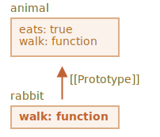

프로토타입 상속
==============

- 기존 기능 가져와 확장
  - JS 언어 고유 기능

### `[[Prototype]]` <sub>(숨김 프로퍼티)</sub>
- 명세서 명명
- JS 객체 보유
- 값
  - 객체 참조
  - `null`
- 타 객체 참조 시 참조 대상
  - 프로토타입 <sub>(prototype)</sub>


#### 프로토타입 동작 방식
- '신비스러운' 면 존재

##### 객체 프로퍼티 접근
- 해당 프로퍼티 부재 시
  - 자동으로 프로토타입에서 프로퍼티 찾음
  - 프로토타입 상속

##### `[[Prototype]]` <sub>(프로퍼티)</sub>
- 내부 · 숨김 프로퍼티
- 다양한 방법 사용해 값 설정 가능
  - ex&#41; `__proto__`
```javascript
let animal = {
  eats: true
};
let rabbit = {
  jumps: true
};

rabbit.__proto__ = animal;
```

 **`__proto__`**

##### `[[Prototype]]` 전용 접근자 프로퍼티
- `getter` <sub>(획득자)</sub>
- `setter` <sub>(설정자)</sub>

##### 여전히 사용 가능
- 하위 호환성

##### 비교적 근래 작성 스크립트
- `__proto__` 대신 함수 사용 가능
- `Object.getPrototypeOf`
  - 획득 <sub>(get)</sub>
- `Object.setPrototypeOf`
  - 설정 <sub>(set)</sub>

##### 명세서 규정
  - 브라우저 환경에서만 지원

##### 실상
  - 모든 호스트 환경 <sub>(server-side 등)</sub> 지원

<br />

```javascript
let animal = {
  eats: true
};
let rabbit = {
  jumps: true
};

// rabbit (자식 객체) 내 프로퍼티 부재 시
// - 자동으로 animal (부모 객체) 에서 프로퍼티 얻음
rabbit.__proto__ = animal;

alert( rabbit.eats );  // true,
                       // [[Prototype]] → animal (부모 객체) 참조
                       // - eats (프로퍼티) 존재
alert( rabbit.jumps ); // true
```


- `rabbit` 프로토타입 : `animal`
  - `rabbit` 은 `animal` 을 상속받음
- 프로토타입에서 상속받은 프로퍼티
  - 상속 프로퍼티
```javascript
let animal = {
  eats: true,
  walk() {
    alert("동물이 걷습니다.");
  }
};

let rabbit = {
  jumps: true,
  __proto__: animal
};

rabbit.walk(); // 동물이 걷습니다.
```


```javascript
let animal = {
  eats: true,
  walk() {
    alert("동물이 걷습니다.");
  }
};

let rabbit = {
  jumps: true,
  __proto__: animal
};

let longEar = {
  earLength: 10,
  __proto__: rabbit
};

// walk (메서드)
// - 프로토타입 체인 통해 상속받음
longEar.walk();       // 동물이 걷습니다.
                      // animal (조부모 객체) 에서 상속받음
alert(longEar.jumps); // true,
                      // rabbit (부모 객체) 에서 상속받음
```


#### 프로토타입 체이닝 제약사항

##### 순환 참조 X
- `__proto__` 이용해 닫힌 형태로 다른 객체 참조
  - 에러 발생

##### `__proto__` 값
- 객체 · `null` 만 가능
- 다른 자료형 무시

##### 객체 내 하나의 `[[Prototype]]` 만 존재
- 객체 2개 상속 X

### 프로토타입 : 읽기 전용
- 프로퍼티 읽을 때만 사용
- 프로퍼티 추가 · 수정 · 삭제
  - 객체에 직접 실행
  - 프로토타입에 실행 X
```javascript
let animal = {
  eats: true,
  walk() {
    // rabbit (자식 객체) : 메서드 사용 X
  }
};

let rabbit = {
  __proto__: animal
};

// rabbit (자식 객체)
// - walk (메서드) 직접 할당
rabbit.walk = function() {
  alert("토끼가 깡충깡충 뜁니다.");
};

/*
 rabbit.walk() 호출 시
 - 프로토타입 메서드 X
 - rabbit (자식 객체) 내 직접 추가한 메서드 실행
*/
rabbit.walk(); // 토끼가 깡충깡충 뜁니다.
```



#### 접근자 프로퍼티 상속

##### `setter` <sub>(값 설정 함수)</sub>
- 값 설정 위해 `setter` <sub>(함수)</sub> 호출 시
  - 조금 다르게 동작
```javascript
let user = {
  name: "John",
  surname: "Smith",

  set fullName(value) {
    [this.name, this.surname] = value.split(" ");
  },

  get fullName() {
    return `${this.name} ${this.surname}`;
  }
};

let admin = {
  __proto__: user,
  isAdmin: true
};

// 프로토타입 getter 함수 실행
alert(admin.fullName); // John Smith

// 프로토타입 setter 함수 실행
// - admin (자식 객체)
//   - name · surname (프로퍼티) 추가
admin.fullName = "Alice Cooper";

alert(admin.fullName); // Alice Cooper
alert(user.fullName);  // John Smith,
                       // 본래 user (부모 객체) 내 있었던 프로퍼티 값
```

##### 자식 객체 : `setter` 할당 연산 <sub>(`set fullName`)</sub>
- 프로토타입 `setter` <sub>(함수)</sub> 호출
- `user` <sub>(부모 객체)</sub> 프로퍼티 추가 X

### `this` 의미

##### `this` : 프로토타입 영향 X
- 메서드 호출 주체 <sub>(객체 · 프로토타입)</sub> 상관 X
  - 언제나 `.` <sub>(점)</sub> 앞 객체
- `setter` <sub>(함수)</sub> 호출 시 `this` 값
  - `admin` <sub>(자식 객체)</sub>
  - `user` <sub>(부모 객체)</sub> X

##### 거대 부모 객체
- 한 객체 내 메서드 다수 구현
  - 여러 객체에서 상속
- 상속받은 메서드 사용 시
  - 객체 자신 상태 수정
  - 프로토타입 수정 X
```javascript
// animal (부모 객체)
// - 다양한 메서드 구현
let animal = {
  walk() {
    if (!this.isSleeping) {
      alert(`동물이 걸어갑니다.`);
    }
  },
  sleep() {
    this.isSleeping = true;
  }
};

let rabbit = {
  name: "하얀 토끼",
  __proto__: animal
};

// rabbit (자식 객체)
// - isSleeping (새 프로퍼티) 추가
rabbit.sleep();

alert(rabbit.isSleeping); // true
alert(animal.isSleeping); // undefined
```


##### 상속받은 객체들
- 프로토타입 구현 메서드 사용 가능

##### 상속받은 메서드 내 `this`
- `.`<sub>(점)</sub> 앞 객체 <sub>(메서드 호출 시점)</sub>
  - 해당 객체 상태 변화
  - 프로토타입 변화 X
- 즉
  - 메서드 공유
  - 객체 상태 공유 X

### `for…in` <sub>(반복문)</sub>
- 상속 프로퍼티
  - 순회대상 포함
```javascript
let animal = {
  eats: true
};

let rabbit = {
  jumps: true,
  __proto__: animal
};

// Object.keys
// - 상속 프로퍼티 배제
alert(Object.keys(rabbit));          // jumps

// for…in
// - 상속 프로퍼티 포함
for(let prop in rabbit) alert(prop); // jumps, eats
```

##### `obj.hasOwnProperty(key)`
- 상속 프로퍼티
  - `false` 반환
- `obj` <sub>(객체)</sub> 내 구현 프로퍼티
  - `true` 반환

##### `obj.hasOwnProperty(key)` 응용
- 상속 프로퍼티 걸러냄
- 상속 프로퍼티 대상 작업 가능
```javascript
let animal = {
  eats: true
};

let rabbit = {
  jumps: true,
  __proto__: animal
};

for(let prop in rabbit) {
  let isOwn = rabbit.hasOwnProperty(prop);

  if (isOwn) {
    alert(`객체 자신의 프로퍼티: ${prop}`); // 객체 자신 프로퍼티
                                          // - jumps
  } else {
    alert(`상속 프로퍼티: ${prop}`);       // 상속 프로퍼티
                                          // - eats
  }
}
```


- `{ … }` <sub>(객체 리터럴)</sub> 방식 선언 시
  - `Object.prototype` 상속
- `Object.prototype` 내 모든 메서드
  - `enumerable: false` 플래그 설정
    - 'non-enumerable'
    - `for…in` 순회 시 배제

 **키 · 값 쌍 순회 메서드 대부분 : 상속 프로퍼티 배제**

- 프로토타입 상속 프로퍼티 배제
- 해당 객체 내 정의 프로퍼티만 포함
- ex&#41;
  - `Object.keys`
  - `Object.values`
  - 기타 등등
