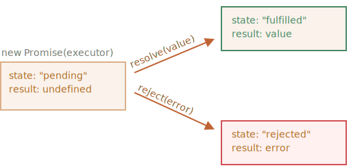
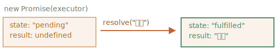

프라미스
=======

- 문법
```javascript
// promise (객체) 생성
let promise = new Promise(function(resolve, reject) {
  // executor
});
```

##### executor <sub>(실행자 · 실행 함수)</sub>
- `new Promise` <sub>(생성자)</sub>
  - 생성자 인수 전달 함수
  - 생성자 실행 시
    - 자동 실행

##### `resolve` · `reject` <sub>(executor 인수)</sub>
- JS 자체 제공 콜백
- 코드 작성 시
  - `resolve` · `reject` 신경 X
  - executor 코드만 작성
- 둘 중 하나 반드시 호출
  - `executor` 결과
    - 언제 얻든 상관 X
- `resolve(value)`
  - 실행 성공 시
    - `value` <sub>(결과)</sub> 함께 호출
- `reject(error)`
  - 에러 발생 시
    - `error` <sub>(에러 객체)</sub> 함께 호출

##### 요약
- executor : 자동 실행
  - 원하는 일 처리
- 처리 종료 시
  - 처리 성공 여부 따라
    - 성공 : `resolve` 호출
    - 실패 : `reject` 호출

##### `promise` 객체
- `new Promise` <sub>(생성자)</sub> 반환 값
- 내부 프로퍼티
  - `state`
  - `result`

||처음|`resolve(value)`|`reject(error)`|
|:---:|---|---|---|
|`state`|`pending` <sub>(보류)</sub>|`fulfilled`|`rejected`|
|`result`|`undefined`|`value`|`error`|

- `executor`
  - `promise` 상태 변화시킴



##### 예시
- `promise` 생성자
- 간단한 `executor` <sub>(함수)</sub>
  - 약간의 시간 걸리도록 구현
    - `setTimeout` 이용
```javascript
let promise = new Promise(function(resolve, reject) {
  /*
   프라미스 생성 후
   - executor 함수 자동 실행
   1초 후
   - 일 성공적으로 끝났다는 신호 전달
   - result → '완료'
   */
  setTimeout(() => resolve("완료"), 1000);
});
```
1. `executor`
    - 자동 · 즉시 호출
      - `new Promise` 에 의해
2. `executor` 인자
    - `resolve` · `reject` <sub>(함수)</sub>
      - JS 엔진 미리 정의
        - 따로 만들 필요 X
      - 둘 중 하나 반드시 호출

<br />

- `executor` 처리 시작 1초 후
  - `resolve("완료")` 호출
    - 결과 생성
- `promise` 객체 상태 변화



- 성공적으로 처리
  - 'fulfilled promise'
- 약속한 작업 거부 경우 <sub>(에러 함께)</sub>
```javascript
let promise = new Promise(function(resolve, reject) {

  // 1초 후 실행 종료 신호 (에러 함께)
  setTimeout(() => reject(new Error("에러 발생!")), 1000);
});
```
- 1초 후 `reject( … )` 호출 시
  - `promise` 상태 → `"rejected"`


##### 요약
- `executor`
  - 보통 시간 걸리는 작업 수행
  - 작업 종료 시
    - `resolve` · `reject` <sub>(함수)</sub> 호출
    - 프라미스 객체 상태 변화
- 처리된 <sub>(settled)</sub> 상태
  - 이행 <sub>(resolved)</sub>
  - 거부 <sub>(rejected)</sub>
- 대기 <sub>(pending)</sub> 상태
  - 미처리 상태

 **프라미스 : 성공 · 실패만 수행**

- `executor`
  - 둘 중 하나 반드시 호출
    - `resolve`
    - `reject`
- 변경된 상태
  - 더 이상 변경 X
- 처리 끝난 프라미스
  - `resolve` · `reject` 호출 시
    - 무시
```javascript
let promise = new Promise(function(resolve, reject) {
  resolve("완료");

  reject(new Error("…"));         // 무시
  setTimeout(() => resolve("…")); // 무시
});
```
- `executor` 의해 처리 끝난 일
  - 결과 · 에러만 가짐
- `resolve` · `reject`
  - 인수 0 ~ 1개만 받음
  - 이외 인수 무시

 **`Error` <sub>(객체)</sub> 함께 거부하기**

##### 무언가 잘못된 경우
- `executor`
  - `reject` 호출
- 인수
  -  모든 타입 가능
  - `resolve` 동일
- 권장 인수
  - `Error` <sub>(객체)</sub>
  - `Error` 상속 객체


 **`resolve` · `reject` <sub>(함수)</sub> 즉시 호출하기**

##### `executor`
- 대개 비동기 수행
- `resolve` · `reject` <sub>(함수)</sub>
  - 약간의 시간 후 호출
  - 즉시 호출도 가능
```javascript
let promise = new Promise(function(resolve, reject) {

  // 일 완료에 시간 소모 X
  resolve(123); // 결과 (123) : 즉시 resolve 전달
});
```
- 어떤 일 시작 후
  - 이미 끝나 저장까지 완료 시
    - 즉시 호출 가능
- 프라미스 상태
  - 즉시 이행

 **`state` · `result` : 내부에 존재**

##### `state` · `result` <sub>(프로퍼티)</sub>
- 내부 프로퍼티
  - 직접 접근 X
- 직접 접근 <sub>(메서드)</sub>
  - `.then` · `.catch` · `.finally`

### 소비자 : `then` · `catch` · `finally`
- 프라미스 객체
  - `executor` · 소비 함수 연결
- 소비 함수
  - 결과 · 에러 받음
  - 등록 · 구독 <sub>(메서드)</sub>
    - `.then`
    - `.catch`
    - `.finally`

#### `then`
- 가장 중요 · 기본
- 문법
```javascript
promise.then(
  function(result) { /* 결과 (result) 처리 */ },
  function(error)  { /* 에러 (error)  처리 */ }
);
```
- 1번째 인수 <sub>(함수)</sub>
  - 프라미스 이행 시 실행
  - 실행 결과 받음
- 2번째 인수 <sub>(함수)</sub>
  - 프라미스 거부 시 실행
  - 에러 받음
- 성공적으로 이행된 프라미스
```javascript
let promise = new Promise(function(resolve, reject) {
  setTimeout(() => resolve("완료!"), 1000);
});

// resolve 함수
// - 1번째 함수 (인수) 실행
promise.then(
  result => alert(result), // 1초 후 "완료!" 출력
  error  => alert(error)   // 실행 X
```
- 거부된 프라미스
```javascript
let promise = new Promise(function(resolve, reject) {
  setTimeout(() => reject(new Error("에러 발생!")), 1000);
});

// reject 함수
// - 2번째 함수 실행
promise.then(
  result => alert(result), // 실행 X
  error  => alert(error)   // 1초 후 "Error: 에러 발생!" 출력
);
```
- 성공적인 이행만 처리 시
  - 인수 하나만 전달
```javascript
let promise = new Promise(resolve => {
  setTimeout(() => resolve("완료!"), 1000);
});

promise.then(alert); // 1초 후 "완료!" 출력
```

### `catch`

##### 에러 발생 경우만 처리 시
- 1번째 인수 `null` 전달
  - `.then(null, func)`
  - `catch(func)` <sub>(동일)</sub>
```javascript
let promise = new Promise((resolve, reject) => {
  setTimeout(() => reject(new Error("에러 발생!")), 1000);
});

// .catch(f)
// - .then(null, f) 동일
promise.catch(alert); // 1초 후 "Error: 에러 발생!" 출력
```
- `.catch(f)`
  - 문법 간결
  - `.then(null, f)`완벽 동일

### `finally`
- 프라미스 처리 <sub>(이행 · 거부)</sub> 후
  - `f` 항상 실행
- `.finally(f)`
  - `.then(f, f)` 유사
- 마무리 필요 시 유용
  - 결과 관계 X
  - ex&#41; 쓸모 없어진 로딩 인디케이터 중단
```javascript
new Promise((resolve, reject) => {

  // 시간 걸리는 어떤 일 수행 후
  // - resolve · reject 호출

})

  // 프라미스 처리 후 실행
  // 성공 · 실패 여부 상관 X
  .finally(() => /* 로딩 인디케이터 중지 */)
  .then(result => /* result · err 표시 */ => /* error 표시 */)
```

##### `finally` · `.then(f, f)`차이점
1. `finally` <sub>(핸들러)</sub>
  - 인수 X
  - 프라미스 이행 · 거부 여부 모름
  - '보편적' 동작 <sub>(절차 마무리)</sub> 수행
    - 성공 · 실패 여부 몰라도 OK
2. 결과 · 에러
  - 다음 핸들러 자동 전달
```javascript
/* result 전달 */
new Promise((resolve, reject) => {
  setTimeout(() => resolve("결과"), 2000)
})
  .finally(() => alert("프라미스가 준비되었습니다."))
  .then(result => alert(result)); // .then : result 처리
```
```javascript
/* error 전달 */
new Promise((resolve, reject) => {
  throw new Error("에러 발생!");
})
  .finally(() => alert("프라미스가 준비되었습니다."))
  .catch(err => alert(err)); // .catch : 에러 객체 처리
```
- 프라미스 결과
  - `finally` 처리 X
  - `finally` 통과
3. `.finally(f)`
    - `f` <sub>(함수)</sub> 중복 X
    - `.then(f, f)` 보다 편리
      - 문법 측면

 **처리된 프라미스 핸들러 : 즉각 실행**

- 핸들러 <sub>(`.then` · `.catch` · .`finally`)</sub>
  - 프라미스 대기 상태
    - 처리 대기
  - 프라미스 처리 완료 상태
    - 즉각 실행
```javascript
// 생성 · 이행
// - 동시 실행
let promise = new Promise(resolve => resolve("완료!"));

promise.then(alert); // "완료!" 바로 출력
```
- 결과 나와 있는 상태
  - 핸들러 등록 시
    - 결과 바로 받음

### 예시 : `loadScript`

##### 콜백 기반 함수
```javascript
function loadScript(src, callback) {
  let script = document.createElement('script');
  script.src = src;

  script.onload  = () => callback(null, script);
  script.onerror = () => callback(new Error(`${src} 로딩 중 에러 발생`));

  document.head.append(script);
}
```

##### 프라미스 함수
- 프라미스 <sub>(객체)</sub> 생성 후 · 반환
  - 객체 : 스크립트 로딩 후 이행
- 외부 코드 : `.then`
  - 핸들러 <sub>(구독 함수)</sub> 추가
```javascript
function loadScript(src) {
  return new Promise(function(resolve, reject) {
    let script = document.createElement('script');
    script.src = src;

    script.onload  = () => resolve(script);
    script.onerror = () => reject(new Error(`${src} 로딩 중 에러 발생`));

    document.head.append(script);
  });
}
```
- 사용법
```javascript
let promise = loadScript("https://cdnjs.cloudflare.com/ajax/libs/lodash.js/4.17.11/lodash.js");

promise.then(
  script => alert(`${script.src}을 불러왔습니다!`),
  error  => alert(`Error: ${error.message}`)
);

promise.then(script => alert('또다른 핸들러...'));
```

|프라미스|콜백|
|---|---|
|자연스러운 흐름|`callback` <sub>(함수 · 함께 호출)</sub> 준비 필수|
|결과 따라 다음 <sub>(`.then`)</sub> 동작 코드 작성|결과 후 동작 미리 알고 있어야 함|
|원하는 만큼 `.then` 호출 가능<br />|콜백 하나만 가능|

###  과제
<hr />

### 두 번 resolve 하기?
- 아래 코드 실행 결과 예측
```javascript
let promise = new Promise(function(resolve, reject) {
  resolve(1);
  setTimeout(() => resolve(2), 1000);
});

promise.then(alert);
```


<br />

- `1` 출력
- 고려 대상
  - 1번째 `resolve` · `reject` 호출
  - 2번째 무시

<hr />

### 프라미스로 지연 만들기
- `setTimeout` <sub>(내장 함수)</sub>
  - 콜백 사용

##### 동일 기능 함수 <sub>(프라미스 기반)</sub> 만들기
- `delay(ms)` <sub>(함수)</sub>
- 프라미스 반환
  - `? ms` 이후 이행
    - `.then` 붙일 수 있도록
```javascript
function delay(ms) {
  /* 여기에 코드 작성 */
}

delay(3000).then(() => alert('3초후 실행'));
```


<br />

```javascript
function delay(ms) {
  return new Promise(resolve => setTimeout(resolve, ms));
}

delay(3000).then(() => alert('3초후 실행'));
```
- `resolve`
  - 인수 없이 호출
- `delay` <sub>(함수)</sub>
  - 지연 확인용
    - 반환 값 필요 X

###  과제
<hr />

### 프라미스로 애니메이션 적용 원 만들기
- `showCircle` <sub>(함수)</sub> 재작성
  - 기존 움직이는 원에서 작성
    - 콜백 이용
- 콜백 받기 X
- 프라미스 반환
- 함수 사용법 형태
```javascript
showCircle(150, 150, 100).then(div => {
  div.classList.add('message-ball');
  div.append("Hello, world!");
});
```
- 움직이는 원 <sub>(콜백 이용)</sub> 참고
  - 콜백 기반 답안


<br />

- [코드](https://plnkr.co/edit/eAP9wNrKyu2LvWLZ?p=preview)
