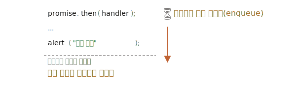

마이크로태스크
=============

##### 프라미스 핸들러 <sub>(`.then` / `.catch` / `.finally`)</sub>
- 항상 비동기적 실행

##### 프라미스 즉시 이행되더라도
- 프라미스 핸들러 아래 코드
  - 핸들러들 실행되기 전 실행
```javascript
let promise = Promise.resolve();

promise.then(() => alert("프라미스 성공!"));

alert("코드 종료");

// 메시지 출력 순서
// 1. "코드 종료"
// 2. "프라미스 성공!"
```

### 마이크로태스크 큐

##### 비동기 작업 처리 : 적절한 관리 필요
- ECMA
  - `PromiseJobs` <sub>(내부 큐)</sub>
- V8 엔진
  - 마이크로태스크 큐 <sub>(선호 용어)</sub>

##### 명세서 설명
- 먼저 들어온 작업 : 먼저 실행
  - first-in-first-out <sub>(FIFO)</sub>
- 실행할 것 아무것도 남아있지 않을 때
  - 마이크로태스크 큐 작업 실행 시작

요약하자면, 어떤 프라미스가 준비되었을 때 이 프라미스의 .then/catch/finally 핸들러가 큐에 들어간다고 생각하시면 됩니다. 이때 핸들러들은 여전히 실행되지 않습니다. 현재 코드에서 자유로운 상태가 되었을 때에서야 자바스크립트 엔진은 큐에서 작업을 꺼내 실행합니다.

위 예시에서 '코드 종료’가 먼저 출력되는 이유가 여기에 있습니다.



