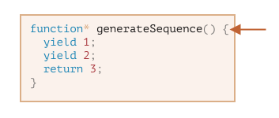

제너레이터
=========

##### 일반 함수
- 0 ~ 1개 값 반환

##### 제너레이터 <sub>(generator)</sub>
- 여러 개의 값
  - 필요에 따라 하나씩 반환 <sub>(yield)</sub>
- 이터러블 <sub>(객체)</sub> 함께 사용
  - 데이터 스트림 쉽게 생성

### 제너레이터 함수
- 문법
  - `function*`
```javascript
function* generateSequence() {
  yield 1;
  yield 2;
  return 3;
}
```
##### 제너레이터 함수 호출
- 코드 실행 X
- '제너레이터 객체' 반환
  - 실행 처리 객체
```javascript
function* generateSequence() {
  yield 1;
  yield 2;
  return 3;
}

// 제너레이터 함수
// - 제너레이터 객체 생성
let generator = generateSequence();
alert(generator); // [object Generator]
```
- 함수 본문 코드
  - 아직 실행 X



#### `next()` <sub>(메서드)</sub>
- 제너레이터 주요 메서드

##### 가장 가까운 `yield <value>` <sub>(문)</sub>
- 만날 때까지 실행 지속
- `value` 생략 시
  - `undefined`

##### `yield <value>` <sub>(문)</sub> 도달 시
- 실행 중단
- `value` <sub>(산출 목표 값)</sub>
  - 바깥 코드 반환

##### 반환 객체 <sub>(프로퍼티 2개)</sub>
- `value`
  - 산출 값
- `done` <sub>(함수 코드)</sub>
  - `true` &nbsp;&nbsp;: 종료
  - `false` : 실행

