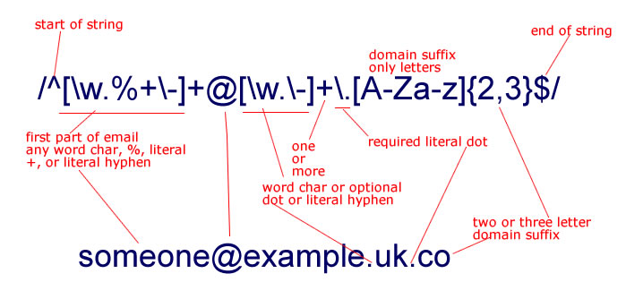

##### 기본

|표현식|뜻|의미|
|---|---|---|
|`^x`|문자열 시작|`x` 로 시작|
|`x$`|문자열 종료|`x` 로 종료|
|`.x`|임의 한 문자 자리수|`x` 로 끝남|
|`x+`|반복|`x` 1번 이상 반복|
|`x?`|존재 여부|`x` 존재 · 부재|
|`x*`|반복 여부|`x` 0번 이상 반복|
|`x\|y`|or|`x` 또는 `y` 존재|
|`(x)`|그룹|`x` : 그룹 처리|
|`(x)(y)`|그룹들 집합|앞에서부터 순서대로 번호 부여 · 관리|
|||`x` · `y` : 각 그룹 데이터로 관리|
|`(x)(?:y)`|그룹들 집합 예외|그룹 집합으로 관리 X|
|`x{n}`|반복|`x` : `n` 번 반복|
|`x{n,}`|반복|`x` : `n` 번 이상 반복|
|`x{n,m}`|반복|`x` : `n` 번 <sub>(최소)</sub> ≤ 반복 ≤ `m` 번 <sub>(최대)</sub>|

##### `[]` <sub>(대괄호)</sub>
- 내부 지정 문자열 범위 중 한 문자만 선택
- 내부 Meta 문자
  - 다른 의미 가지고 동작

|표현식|뜻|의미|
|---|---|---|
|`[xy]`|문자 선택|`x` · `y` 중 하나|
|`[^xy]`|not|`x` · `y` 제외 문자|
|`[x-z]`|range|`x` ~ `z` 사이 문자|
|`\^`|escape|`^` : 문자로 사용|
|`\b`|word boundary|문자 · 공백 사이 문자|
|`\B`|non word boundary|문자 ·공백 사이 아닌 문자|
|`\d`|digit|숫자|
|`\D`|non digit|숫자 아닌 것|
|`\s`|space|공백 문자|
|`\S`|non space|공백 문자 아닌 것|
|`\t`|tab|탭 문자|
|`\v`|vertical tab|수직 탭|
|`\w`|word|알파벳 · 숫자 · `_` 중 하나|
|`\W`|non word|알파벳 · 숫자 · `_` 아닌 문자|

##### 전방 탐색 <sub>(`?=`)</sub>
- `(?=Dae)`
```
seok|Daejin

.(?=Dae)  ------------ seokDaejin
                          ↑
(?=Dae).  ------------ seokDaejin
                           ↑
```

##### 후방 탐색 <sub>(`?<=`)</sub>
- `(?<=Dae)`
```
seokDae|jin

.(?<=Dae)  ------------ seokDaejin
                              ↑
(?<=Dae).  ------------ seokDaejin
                               ↑
```

##### 부정형 <sub>(`?!`)</sub>
- `(?!Dae)`
- `(?<!Dae)`
- 성능 나쁨

##### 예제
- `Dae` 가 포함되지 않은 `chojin` 선택 정규식
```
seokDaejin
kimDaejin
chojin
```
- `(?!Dae).`
  - 화살표 제외 각각 매칭
```
seokDaejin
    ↑
kimDaejin
   ↑
chojin
```
- `((?!Dae).)*`
  - seok
  - aejin

##### `()`
- mark
  - 참조 가능 상태 유지 <sub>(메모리 사용)</sub>

##### `(?:)`
- mark X
  - 성능 이점

##### Flag

|Flag|뜻|의미|
|---|---|---|
|`g`|Global|모든 패턴들 검색|
|`i`|Ignore case|대 · 소문자 식별 X|
|`m`|Multi line|다중 라인 문자열 포함|

### 예제

##### `/[0-9]/g` <sub>(개별 숫자)</sub>
- 전체에서 0 ~ 9 사이 아무 숫자 하나 찾음

##### `/[to]/g` <sub>(개별 문자)</sub>
- 전체에서 `t` · `o` 모두 찾음


##### `/filter/g` <sub>(단어)</sub>
- 전체에서 `'filter'` <sub>(단어)</sub> 매칭 찾음

##### `/\b(?:(?!to)\w)+\b/g` <sub>(단어 제외)</sub>
- 전체에서 `'to'` <sub>(단어)</sub> 빼고 다른 단어 매칭 찾음
  - `"Tutorial"` 제외

##### `\b(?!\bto\b)\w+\b` <sub>(단어 제외)</sub>
- 전체에서 `'to'` <sub>(단어)</sub> 빼고 다른 단어 매칭 찾음
  - `"Tutorial"` 포함

##### `/^[0-9a-zA-Z]([-_\.]?[0-9a-zA-Z])*@[0-9a-zA-Z]([-_\.]?[0-9a-zA-Z])*\.[a-zA-Z]{2,3}$/i` <sub>(이메일)</sub>
1. 시작 : 0 ~ 9 사이 숫자 · a ~ z · A ~ Z 알바펫 아무거나로 시작하고
-  중간에 `-` · `_` · `.` 같은 문자가 있을수도 있고 없을수도 있으며
- 그 후에 0-9 사이 숫자 · a-z A-Z 알바펫중 하나의 문자가 없거나 연달아 나올수 있으며
- `@` 가 반드시 존재하고
- 0-9a-zA-Z 여기서 하나가 있고
- 중간에 `-` · `_` · `.` 같은 문자가 있을수도 있고 없을수도 있으며
- 그 후에 0-9 사이 숫자 · a-z A-Z 알바펫중 하나의 문자가 없거나 연달아 나올수 있으며
- 반드시  `.`  이 존재하고
- \[a-zA-Z\] 의 문자가 2개나 3개가 존재
- 이 모든것은 대소문자 구분안함


##### 전화번호 - `/^\d{3}-\d{3,4}-\d{4}$/`
- 시작을 숫자 3개로하며
- 중간에 하이픈 `-`  하나 존재
- 숫자가 3~4개 존재하며
- 하이픈 하나 존재
- 숫자 4개로 끝남


##### 핸드폰 번호 - `/^01([0|1|6|7|8|9]?)-?([0-9]{3,4})-?([0-9]{4})$/`
- 시작을 숫자 `01`로 시작하며
- 그 후에 `0`,`1`,`6`,`7`,`8`,`9` 중에 하나가 나올수도 있으며
- 하이픈 `-` 하나 존재할수도 있으며
- 숫자 3~4개 이어지고
- 또 하이픈 `-` 하나 존재할수도 있으며
- 숫자 4개가 이어짐


##### URL - `^(https?):\/\/([^:\/\s]+)(:([^\/]*))?((\/[^\s/\/]+)*)?\/?([^#\s\?]*)(\?([^#\s]*))?(#(\w*))?$`
- `^(https?):\/\/`
- `([^:\/\s]+)`
- `(:([^\/]*))?`
- `((\/[^\s/\/]+)*)?\/?([^#\s\?]*)(\?([^#\s]*))?(#(\w*))?$`
