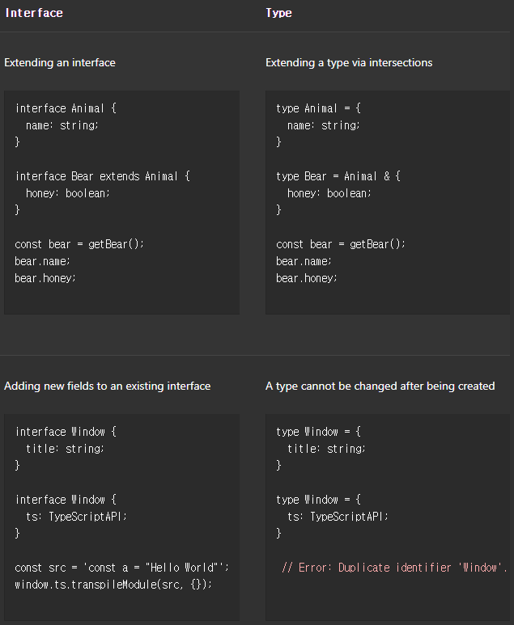

기본 타입
====

## 원시 타입

##### JS 동일 <sub>(3가지)</sub>
- `string` <sub>(문자열)</sub>
- `number` <sub>(숫자)</sub>
- `boolean` <sub>(`true` · `false`)</sub>

<br />

## 배열

##### `type[]`
```ts
//  s: string[]
let s = ['a', 'b', 'c'];

//  n: number[]
let n = [1, 2, 3];

//  b: boolean[]
let b = [true, true, false];
```

<br />

## `any`

##### 타입 부재 의미
- 문법 정상 시 모든 동작 가능 <sub>(JS 유사)</sub>
  - 아무 프로퍼티 <sub>(`any` 타입)</sub> 접근
  - 호출
  - 할당
  - 기타 등등
```ts
let o: any = { x: 0 };

o.foo();
o();
o.a = 100;
o = "hello";
const n: number = o;
```

##### TS 타입 검사 동작 비활성화
- 컴파일 에러 미발생
- 아주 긴 명확한 타입 생략 시 유용

### `noImplicitAny` <sub>(옵션)</sub>

##### 암시적 `any` 에러 간주 여부 설정
- 타입 추론 불가능 시 기본 지정 타입
```ts
// 매개변수 타입 無     → any
// 반환 타입 추론 불가능 → any
function f(a, b) {
  return a + b;
}

↓↓↓

function f(a: any, b: any): any
```

<br />

## 타입 주석

##### 명시적인 타입 지정
```ts
let s: string = "s";
```

##### 생략 시 타입 추론 수행
- 변수 타입 명확 시 보통 생략
```ts
//  s: string
let s = "s";
```

<br />

## 함수

### 매개변수 타입 주석

##### 해당 매개변수 타입 지정
- 해당 인수 타입 검사 수행
- 생략 시 인수 개수만 체크
```ts
function f(s: string) {
  s.toUpperCase();
}

f(42); // 문자열 외 전달 시 에러 (Argument of type 'number' is not assignable to parameter of type 'string'.)
```

### 반환 타입 주석

##### 반환 타입 지정
```ts
function f(): number {
  return 26;
}
```

##### 생략 시 타입 추론 수행
- 반환 타입 명확 시 보통 생략
```ts
function f() {
  return 26;
}

↓↓↓

function f(): number
```

##### 함수 내 타입 주석 주요 용도
- 문서화
- 실수 방지
- 취향

##### 비동기 <sub>(`Promise` 객체 반환)</sub> 함수
- `Promise<T>` <sub>(반환 타입)</sub> 지정 필수
```ts
async function f(): Promise<number> {
  return 26;
}
```

### 익명 함수

##### 문맥적 타입 지정 수행
- 타입 추론 시 주변 문맥 정보 이용
```ts
//    sArr: string[]
const sArr = ["a", "b", "c"];

// 전달 함수 내 인수 (s) 타입 추론
// - 배열 · 메서드 타입 정보 이용
sArr.forEach(function (s) { // s: string
  s.toUpperCase();
});

// 화살표 함수 동일 원리 적용
sArr.forEach((s) => { // s: string
  s.toUpperCase();
});
```

<br />

## 객체 타입

##### 타입 정의
- 프로퍼티 · 타입 순차 나열
- 구분자 필요 <sub>(끝 생략 가능)</sub>
  - `,` <sub>(콤마)</sub>
  - `;` <sub>(세미콜론)</sub>
- 타입 주석 생략 시 `any`
```ts
// 객체 타입 매개변수
function f(o: { x: number; y: number }) {
  `[${o.x}, ${o.y}]`;
}

// 객체 타입 인수 전달
f({ x: 3, y: 7 });
```

### 선택 프로퍼티

##### 생략 가능 프로퍼티 정의 가능
- `prop?[: type]`
```ts
function f(o: { a: string; b?: string }) {
  // …
}

f({ a: "a" });
f({ a: "a", b: "b" });
```

##### 접근 시 `undefined` 여부 확인 필수
```ts
function f(o: { a: string; b?: string }) {

  // undefined 여부 미확인 시 에러
  o.b.toUpperCase(); // 'o.b' is possibly 'undefined'.

  /* undefined 여부 확인 후 사용 가능 */
  // if (문)
  if (o.b !== undefined) {
    o.b.toUpperCase();
  }

  // `?.` (선택적 체이닝)
  o.b?.toUpperCase();
}
```

<br />

## `union`

### 타입 정의

##### 2개 이상 기존 타입 <sub>(요소)</sub> 구성
```ts
//         a:   숫자  |  문자열
function f(a: number | string) {
  a;
}

f(101);   // 숫자  (타입 요소) 전달
f("abc"); // 문자열 (타입 요소) 전달

// 숫자 · 문자열 (타입 요소) 외 전달 시 에러
f({ n: 22342 }); // Argument of type '{ n: number; }' is not assignable to parameter of type 'string | number'.
```

**타입 요소 앞 구분자 <sub>(`|`)</sub> 사용 가능**

##### 모든 타입 요소 동일 구조 유지 가능
```ts
function f(a:
  | number
  | string
  | boolean
) {
  a;
}
```

### 사용법

##### 모든 타입 요소 부합 필수 <sub>(기본)</sub>
- ex \) `number | string`
  - `toUpperCase` <sub>(메서드)</sub> 사용 불가능
    - `number` 부적합
```ts
function f(a: number | string) {
  a.toUpperCase(); // 에러 (Property 'toUpperCase' does not exist on type 'string | number'.
                   //      Property 'toUpperCase' does not exist on type 'number'.)
}
```

#### '범위 축소'

##### 부합 조건 축소 <sub>(더 구체적인 일부 타입 요소)</sub>
- 코드 구조 기반 타입 추론 수행
  - 연산자 <sub>(`typeof` 등)</sub>
  - 함수 <sub>(`Array.isArray` 등)</sub>
  - 기타 등등
```ts
function f1(a: number | string) {
  if (typeof a === "string") { // a: string
    a.toUpperCase();
  } else { // a: number
    a;
  }
}

function f2(a: string[] | string) {

  if (Array.isArray(a)) { // a: string[]
    a.join("-");
  } else { // a: string
    a.toUpperCase();
  }
}
```

##### 진행 시 타입 요소 범위 ↓
- 이전 단계 타입 확인 불필요
```ts
function f(a: string[] | string | number) {

  // a: string[] | string | number

  if (Array.isArray(a)) { // a: string[]
    a.join("-");

  // a: string | number

  } else if (typeof a === "string") { // a: string
    a.toUpperCase();

  // a: number

  } else { // a: number
    a;
  }
}
```

##### 타입 요소 내 공통 프로퍼티 · 메서드
- 사용 시 범위 축소 생략 가능
```ts
function f(a: number[] | string) {
  return a.slice(0, 3);
}

//  b: number[] | string
let b = f(…);
```

<br />

## 타입 별칭

##### 임의 타입명 생성
- 모든 타입 적용 가능
```ts
type NS = number | string;

let n: NS = 1;
let s: NS = "s";
let b: NS = true; // 에러

type NN = {
  x: number;
  y: number;
};

function f(o: NN) {
  `[${o.x}, ${o.y}]`;
}

f({ x: 100, y: 100 });
```

##### 고유 타입 생성 X
- 타입명 <sub>(별칭)</sub> 만 생성
```ts
type string2 = string;

function f(s: string): string2 {
  return f(s);
}

//  s2: string2
let s2 = f(…); // string2 할당
    s2 = "s";  // string  할당
```

<br />

## 인터페이스

##### 임의 객체 타입명 생성
```ts
interface NN {
  x: number;
  y: number;
}

function f(o: NN) {
  `[${o.x}, ${o.y}]`;
}

f({ x: 100, y: 100 });
```

### 타입 별칭 vs 인터페이스

||타입 별칭|인터페이스|
|:---:|:---:|:---:|
|확장|`&`|`extends` <sub>(상속)</sub>|
|중복 선언|에러|확장|



##### 취사선택
- 자기 발견적 코딩 시 인터페이스 권장

<br />

## 타입 주장

##### 더 · 덜 구체적인 연관 타입 강제 변환
- a. `as` <sub>(키워드)</sub>
```ts
//    e: HTMLElement
const e = document.getElementById(…);

//    c: HTMLCanvasElement
const c = e as HTMLCanvasElement;
```
- b. `<>` <sub>(꺽쇠괄호)</sub>
  - `.tsx` <sub>(파일)</sub> 내 사용 불가능
```ts
//    e: HTMLElement
const e = document.getElementById(…);

//    c: HTMLCanvasElement
const c = <HTMLCanvasElement>e;
```

##### 연관 없는 타입 간 변환 불가능
```ts
// string → number 변환 불가능 (에러)
const a = "a" as number; // Conversion of type 'string' to type 'number' may be a mistake because neither type sufficiently overlaps with the other. If this was intentional, convert the expression to 'unknown' first.
```

**주의**
- 컴파일 시 제거
  - 런타임 내 타입 검사 X
- 부적절한 타입 주장
  - 에러 · `null` 반환 X

##### 규칙 <sub>(타입 연관성)</sub> 우회 가능
- `T1` → `any` · `unknown` → `T2`
  - `T1 as any as T2`
- 우회 이유
  - 너무 보수적인 규칙
  - 복잡하지만 유효한 연관 타입
  - 기타 등등
```ts
//    a: T
const a = …표현식… as any as T;
```

<br />

## 리터럴 타입

##### 특정 문자 · 숫자 값 → 타입 지정
- `const` 변수 동일 기능
```ts
//  ls: string
let ls = "Hello World";
ls = "Olá Mundo";

//    cs:  "Hello World" (리터럴 타입)
const cs = "Hello World";
cs = "Olá Mundo"; // 에러
```

##### 단독 사용 시 유용성 ↓
```ts
let s: "hello" = "hello";
s = "hello";
s = "howdy"; // 에러 (Type '"howdy"' is not assignable to type '"hello"'.)
```

##### `union` 함께 사용 시 유용
- 문자열 리터럴 타입
```ts
function f(a: string, b: "X" | "Y" | "Z") {
  // …
}

f("a", "X");
f("b", "W"); // 에러 (Argument of type '"W' is not assignable to parameter of type '"X" | "Y" | "Z"'.)
```
- 숫자 리터럴 타입
```ts
function f(a: string, b: string): -1 | 0 | 1 {
  return a === b ? 0 : a > b ? 1 : -1;
}
```
- 리터럴 타입 외 타입 조합
```ts
interface N {
  n: number;
}

function f(a: N | "M") {
  // …
}

f({ n: 100 });
f("M");
f("x"); // 에러 (Argument of type '"x"' is not assignable to parameter of type 'N | "M"'.)
```
- `boolean` 리터럴 타입
  - `true` · `false`
  - `boolean` == `true | false`
```ts
let b1: boolean      = …;
let b2: true | false = …;
```

### 리터럴 추론

#### 객체 리터럴 내 프로퍼티 타입

##### 리터럴 타입 X
- 수정 가능
```ts
//    n: 0
//let n: 0 = 0;
const n    = 0; // 리터럴 타입

if (…) {
  n = 1; // 에러 (Type '1' is not assignable to type '0'.)
}

         // n: number
const o = { n: 0 };

if (…) {
  o.n = 1; // 정상 실행
}
```
- 리터럴 타입 요구 시 그대로 사용 불가능
  - 사용 전 값 변경 가능성 有
```ts
//                    b: 리터럴 타입 | 리터럴 타입
function f(a: string, b: "B1" | "B2") {
  …
}

//                  b: string
const o = { a: "a", b: "B1" };

// o.b = "타 문자열"; // 값 변경 가능

// string → "B1" | "B2" 할당 불가능
//     o.b: string
f(o.a, o.b); // 에러 (Argument of type 'string' is not assignable to parameter of type '"B1" | "B2"'.)
```

##### 리터럴 타입 적용 방법 <sub>(2가지)</sub>
- a. 타입 주장
  - a. 객체 내 적용
  - b. 사용 전 적용
```ts
// ⓐ 객체 내 적용 (객체 내 항상 리터럴 타입 유지 · 타 문자열 할당 불가능)
//                  b: "B1"
const o = { a: "a", b: "B1" as "B1" };

// ⓑ 사용 전 적용 (함수 실행 중 리터럴 타입 유지)
//     o.b: "B1"
f(o.a, o.b as "B1");
```
- b. `as const` <sub>(접미사)</sub>
  - 객체 내 전체 리터럴 타입 적용
```ts
//          a: "a", b: "B1"
const o = { a: "a", b: "B1" } as const;

f(o.a, o.b);
```

<br />

## `null` · `undefined`

##### JS 동일
- `null`
  - 
- `undefined`
|타입|의미|
|:---:|:---:|
|`null`|부재 · 빈 상태|
|`undfined`|미할당 <sub>(초기화 X)</sub> 상태|

##### `strictNullChecks` <sub>(옵션)</sub>
- `null` · `undefined` 할당 가능 변수
  - TS 행동 결정

### [`strictNullChecks`](https://www.typescriptlang.org/tsconfig/#strictNullChecks) off

##### 일반적인 접근 · 할당 <sub>(모든 타입)</sub> 허용
- 권장 X

### [`strictNullChecks`](https://www.typescriptlang.org/tsconfig/#strictNullChecks) on

##### 사용 전 체크 강제
- 타입 좁히기 <sub>(narrowing)</sub> 사용
```ts
function doSomething(x: string | null) {
  if (x === null) {
    // 작업 X
  } else {
    console.log("Hello, " + x.toUpperCase());
  }
}
```

### `!` <sub>(Postfix · Non-null 주장 연산자)</sub>

##### `null` · `undefined` 가능성 제거
- 명시적인 타입 체크 X
- 표현식 가장 끝에 추가
- 런타임 행동 변화 · 체크 X
  - 사용 시 주의
```ts
function liveDangerously(x?: number | null) {

  // 에러 미발생
  console.log(x!.toFixed());
}
```

<br />

## `Enum`

##### 상숫값 표현
- 그룹 내 다수 기명 상수 값 중 하나

<br />

## 덜 중요한 원시값

### `bigint`

##### 큰 숫자 표현
```ts
// BigInt (함수)
const oneHundred: bigint = BigInt(100);

// 리터럴 문법
const anotherHundred: bigint = 100n;
```

### `symbol`

##### 유일무이 참조값
```ts
// Symbol (함수)
const firstName = Symbol("name");
const secondName = Symbol("name");

// 에러 발생 (무의미한 비교)
// - This comparison appears to be unintentional because the types 'typeof firstName' and 'typeof secondName' have no overlap.
if (firstName === secondName) { … }
```
