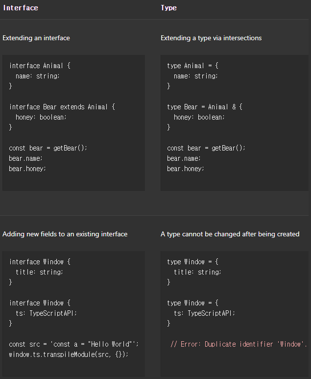

Everyday Types
==============

## 원시 타입
- `string`
- `number`
- `boolean`

## `Array` <sub>(배열)</sub>

##### `string[]` · `number[]` · `boolean[]`
- `['a', 'b', 'c']`
- `[1, 2, 3]`
- `[true, true, false]`

## `any`

##### 특정 타입 한정 X
- 아무 프로퍼티 <sub>(`any` 타입)</sub> 접근 가능
  - 타입 체크 X
  - 컴파일 에러 X
- 아주 명확한 긴 타입 생략
```ts
let obj: any = { x: 0 };

obj.foo();
obj();
obj.bar = 100;
obj = "hello";
const n: number = obj;
```

### `noImplicitAny`

##### 타입 생략 시
- 타입 추론 X
  - `any` 결론
- 암시적 `any`
  - 에러 간주
```ts
// 함수
function add(a, b) {
  return a+b;
}

// 타입 추론
// - 암시적 any
function add(a: any, b: any): any
```

## 함수

### 매개변수 타입 어노테이션
```ts
function greet(name: string) {
  console.log("Hello, " + name.toUpperCase() + "!!");
}

// 에러 발생
// - Argument of type 'number' is not assignable to parameter of type 'string'
greet(42);
```

##### 생략 시
- 함수 전달 인수 개수 체크

### 반환 타입 어노테이션

##### 함수 반환 타입
- 명시 불필요 경우 多
  - 타입스크립트 추론
- 용도
  - 레퍼런스 문서
  - 취향
```ts
function getFavoriteNumber(): number {
  return 26;
}
```

#### `Promise` 반환 함수
```ts
async function getFavoriteNumber(): Promise<number> {
  return 26;
}
```

### 무기명 함수

##### Contextual typing
- 함수 호출 방식 명확 시
  - 함수 매개변수 타입 자동 부여
- 주변 컨텍스트에서 추론

```ts
const names = ["Alice", "Bob", "Eve"];

// 문자열 타입 부여
// - 배열 · 메서드 타입 추론
names.forEach(function (s) {
  console.log(s.toUpperCase());
});

// 화살표 함수 동일 적용
names.forEach((s) => {
  console.log(s.toUpperCase());
});
```

## 객체 타입

##### 객체 타입 정의
- 프로퍼티 · 타입 단순 나열

##### 구분 <sub>(마지막 생략 가능)</sub>
- `,` <sub>(콤마)</sub>
- `;` <sub>(세미콜론)</sub>

##### 타입 어노테이션
- 생략 가능
  - `any`
```ts
// 객체 타입 매개변수
function printCoord(pt: { x: number; y: number }) {
  console.log("The coordinate's x value is " + pt.x);
  console.log("The coordinate's y value is " + pt.y);
}
printCoord({ x: 3, y: 7 });
```

### 선택적 프로퍼티

##### `prop?: type`
```ts
function printName(obj: { first: string; last?: string }) {
  // …
}

printName({ first: "Bob" });
printName({ first: "Alice", last: "Alisson" });
```

##### 선택적 프로퍼티 읽기
- `undefined` 체크 필수
```ts
function printName(obj: { first: string; last?: string }) {

  // 선택적 프로퍼티 미전달 시 에러
  // - 'obj.last' is possibly 'undefined'
  console.log(obj.last.toUpperCase());

  // undefined 체크
  if (obj.last !== undefined) {
    console.log(obj.last.toUpperCase());
  }

  // 모던 자바스크립트 방식 체크
  console.log(obj.last?.toUpperCase());
}
```

## Union 타입

### Union 타입 정의하기

##### 2개 이상 타입 구성
- 값 표현
  - 구성 타입 중 하나
```ts
function printId(id: number | string) {
  console.log("Your ID is: " + id);
}
printId(101);
printId("202");

// 에러 발생
// - Argument of type '{ myID: number; }' is not assignable to parameter of type 'string | number'
printId({ myID: 22342 });
```

### Union 타입 작업

##### 모든 타입 부합 필요
- ex\) `string | number`
  - `toUpperCase` <sub>(메서드)</sub> X
    - `number` 부적합
```ts
function printId(id: number | string) {

  // 에러 발생
  // - Property 'toUpperCase' does not exist on type 'string | number'
  // - Property 'toUpperCase' does not exist on type 'number'
  console.log(id.toUpperCase());

}
```

##### 범위 좁혀가기
- 더 구체적인 타입 추론
  - 코드 구조 기반

##### `typeof` <sub>(연산자)</sub>
- ex\) `typeof string`
  - `"string"`
```ts
function printId(id: number | string) {

  // 문자열 타입
  if (typeof id === "string") {
    console.log(id.toUpperCase());

  // 숫자 타입
  } else {
    console.log(id);
  }
}
```

##### 함수 사용
- ex\) `Array.isArray`
```ts
function welcomePeople(x: string[] | string) {

  // string[] 타입
  if (Array.isArray(x)) {
    console.log("Hello, " + x.join(" and "));

  // 문자열 타입
  } else {
    console.log("Welcome lone traveler " + x);
  }
}
```

##### `else` <sub>(절)</sub>
- 타입 체크 불필요
  - 앞 `if` <sub>(절)</sub> 결과 이용

##### 공통 프로퍼티 · 메서드
- 타입 좁히기 없이 사용 가능
  - ex\) 배열 · 문자열
    - `slice` <sub>(메서드)</sub>

## 타입 별칭

##### 타입명 지정
```ts
type Point = {
  x: number;
  y: number;
};

function printCoord(pt: Point) {
  console.log("The coordinate's x value is " + pt.x);
  console.log("The coordinate's y value is " + pt.y);
}

printCoord({ x: 100, y: 100 });
```

##### 모든 타입 대상 가능
```ts
type ID = number | string;
```

##### 상이 · 고유 유형 <sub>(동일 타입)</sub> 생성 X
- 별칭일 뿐
```ts
type UserInputSanitizedString = string;

function sanitizeInput(str: string): UserInputSanitizedString {
  return sanitize(str);
}

let userInput = sanitizeInput(getInput());
userInput = "new input";
```

## `interface`

##### 객체 타입명 지정
```ts
interface Point {
  x: number;
  y: number;
}

function printCoord(pt: Point) {
  console.log("The coordinate's x value is " + pt.x);
  console.log("The coordinate's y value is " + pt.y);
}

printCoord({ x: 100, y: 100 });
```

### 타입 별칭 vs 인터페이스

||차이|
|---|:---:|
|타입 별칭|내부 변경 X|
|인터페이스|항상 확장 가능|



##### 취향 따라 사용
- 시행착오 선호 시
  - `interface` 사용

## 타입 주장

##### 특정 타입 정보
- Typescript 인지 X
- 개발자 인지

##### ex\) `document.getElementById`
- TypeScript
  - `HTMLElement` 종류
- 개발자
  - 항상 `HTMLCanvasElement`
  - 타입 주장 사용 <sub>(Type Assertion)</sub>
- In this situation, you can use a type assertion to specify a more specific type:
```ts
const myCanvas = document.getElementById("main_canvas") as HTMLCanvasElement;
```
Like a type annotation, type assertions are removed by the compiler and won’t affect the runtime behavior of your code.

You can also use the angle-bracket syntax (except if the code is in a `.tsx` file), which is equivalent:
```ts
const myCanvas = <HTMLCanvasElement>document.getElementById("main_canvas");
```

Reminder: Because type assertions are removed at compile-time, there is no runtime checking associated with a type assertion. There won’t be an exception or null generated if the type assertion is wrong.

TypeScript only allows type assertions which convert to a more specific or less specific version of a type. This rule prevents “impossible” coercions like:
```ts
const x = "hello" as number;
// Conversion of type 'string' to type 'number' may be a mistake because neither type sufficiently overlaps with the other. If this was intentional, convert the expression to 'unknown' first.
```
Sometimes this rule can be too conservative and will disallow more complex coercions that might be valid. If this happens, you can use two assertions, first to `any` (or `unknown`, which we’ll introduce later), then to the desired type:
```ts
const a = expr as any as T;
```

## 상수 타입